# Nexus OMS — Entity Relationship Diagram (ER)

> The authoritative catalog of the ~180 JPA entities in `nexus-oms-backend`. Diagrams use **Mermaid** (`erDiagram`). Relationships below are **logical FKs** — in this codebase most associations are plain `UUID` columns (e.g. `customerId`, `warehouseId`, `tenantId`) rather than JPA `@ManyToOne` object graphs (only ~6 JPA associations exist). Foreign keys are enforced at the application layer; `tenant_id` is present on every tenant-scoped table.

---

## 0. Reading Guide

- `PK` — `UUID` (Hibernate `GenerationType.UUID`) unless noted.
- `tenant_id` — multi-tenancy scope column (present on virtually every table).
- All timestamps `LocalDateTime`; money `BigDecimal`; flexible payloads `jsonb`.
- Three tables use a legacy casing `nxFreight_*` (kept for schema stability; **do not rename without a migration**).
- Naming convention: `nx_<domain>` (orders, inventory, warehouses, waves, …), `ai_*` (AI platform), `import_*` (import/export engine).

---

## 1. Domain Catalog (all ~180 tables)

### Core commerce & customers
`nx_customers` · `nx_addresses` · `nx_contacts` · `products` · `nx_product_mappings` · `nx_promotions` · `nx_promotion_usage` · `nx_payments` · `nx_invoices` · `nx_invoice_items` · `nx_credit_memos`

### Orders & order lifecycle
`nx_orders` · `nx_order_items` · `nx_order_allocations` · `nx_order_approvals` · `nx_order_rejections` · `nx_rejection_reasons` · `nx_parked_orders` · `nx_brokering_queue` · `nx_brokering_runs` · `nx_routing_config` · `nx_routing_rules` · `nx_routing_log` · `nx_endless_aisle_orders` · `nx_pickup_orders` · `nx_pickup_order_items`

### Inventory & network
`nx_inventory` · `nx_inventory_receipts` · `nx_nodes` · `nx_warehouses` · `nx_warehouse_zones` · `nx_warehouse_bins` · `nx_warehouse_equipment` · `nx_warehouse_staff` · `nx_cycle_counts` · `nx_atp_rules` · `nx_atp_snapshots` · `nx_transfer_orders` · `nx_transfer_order_items` · `nx_replenishment_rules` · `nx_replenishment_suggestions`

### Fulfillment (wave → pick → pack → ship)
`nx_waves` · `nx_wave_rules` · `nx_picklists` · `nx_picklist_items` · `nx_pickers` · `nx_picker_assignments` · `nx_packages` · `nx_shipments` · `nx_shipping_labels` · `nx_manifests` · `nx_manifest_shipments` · `nx_tracking_events` · `nx_proof_of_delivery` · `nx_fulfillment_exceptions` · `nx_fulfillment_limits` · `nx_fulfillment_capacity_log`

### Slotting, engineering & labor
`nx_slotting_rules` · `nx_slotting_assignments` · `nx_slotting_audits` · `nx_engineered_standards` · `nx_workload_rules` · `nx_labor_entries` · `nx_productivity_log` · `nx_shift_schedules`

### Shipping, carriers & yard
`nx_carriers` · `nx_carrier_accounts` · `nx_carrier_rates` · `nx_carrier_zones` · `nx_rate_shopping_log` · `nx_trailers` · `nx_trailer_events` · `nx_yard_locations` · `nx_dock_doors` · `nx_appointments` · `nxFreight_invoices` · `nxFreight_invoice_lines` · `nxFreight_audit_logs`

### Returns (RMA)
`nx_returns` · `nx_return_items`

### Procurement & suppliers
`nx_purchase_requests` · `nx_purchase_request_items` · `nx_purchase_orders` · `nx_purchase_order_items` · `nx_rfqs` · `nx_rfq_responses` · `nx_suppliers` · `nx_supplier_contacts` · `nx_supplier_contracts` · `nx_approval_rules` · `nx_order_approvals`

### Automation & alerting
`nx_automation_systems` · `nx_automation_commands` · `nx_automation_logs` · `nx_automation_alerts` · `nx_alert_rules`

### Integrations hub
`nx_integration_stores` · `nx_integration_store_settings` · `nx_integration_flows` · `nx_integration_flow_steps` · `nx_integration_messages` · `nx_integration_endpoints` · `nx_integration_import_jobs` · `nx_integration_export_jobs` · `nx_integration_sync_configs` · `nx_integration_dlq` · `nx_integration_cdc_events` · `nx_integration_audit_log` · `nx_integration_transform_mappings` · `nx_integration_validation_rules` · `nx_sync_logs` · `nx_shopify_webhooks` · `nx_bigcommerce_config` · `nx_bigcommerce_webhooks` · `nx_email_ingestion_config` · `nx_email_parsed_orders`

### EDI & bulk import/export
`nx_edi_partners` · `nx_edi_documents` · `import_history` · `import_record_log`

### AI platform
`ai_models` · `ai_model_versions` · `ai_model_metrics` · `ai_training_jobs` · `ai_datasets` · `ai_feature_definitions` · `ai_feature_values` · `ai_experiments` · `ai_deployments` · `ai_gateway_routes` · `ai_inference_logs` · `ai_prompts` · `ai_knowledge_bases` · `ai_knowledge_documents` · `ai_rule_fallbacks` · `ai_calibrations` · `ai_cost_logs` · `ai_compute_resources`

### Identity, RBAC & tenancy
`nx_users` · `nx_user_roles` · `nx_role_permissions` · `nx_teams` · `nx_company_settings` · `nx_audit_log`

### Platform & workflow
`nx_workflows` · `nx_workflow_steps` · `nx_workflow_executions` · `nx_notification_templates` · `nx_notification_logs` · `nx_documents` · `nx_document_versions`

---

## 2. Core Commerce ER

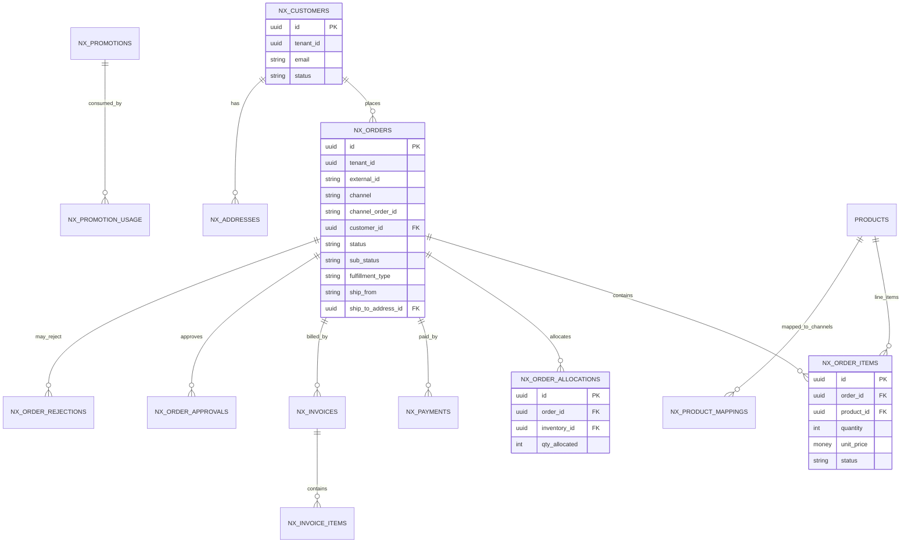

**Key columns (logical FKs):** `NxOrder.customerId`, `NxOrder.shipToAddressId` (JPA `@ManyToOne` → `Address`), `NxOrderItem.orderId`, `NxOrderItem.productId`, `NxOrderAllocation.orderId` + `inventoryId`, `NxInvoice.orderId`.

---

## 3. Inventory & Network ER

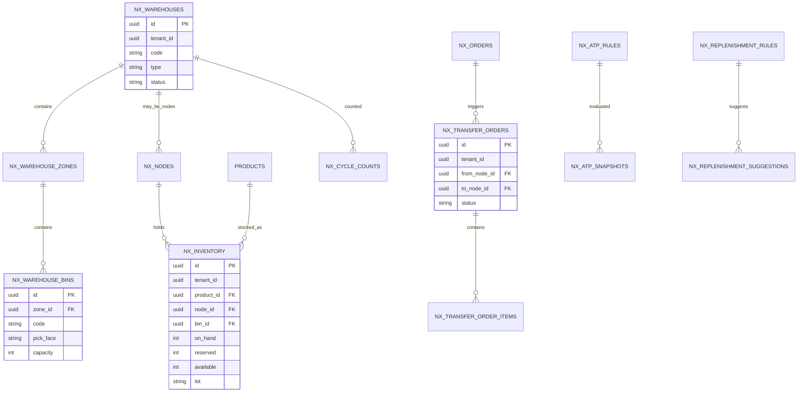

**Key columns:** `NxInventory.productId`, `NxInventory.nodeId`, `NxInventory.binId`, `NxWarehouseBin.zoneId`, `NxTransferOrder.fromNodeId`/`toNodeId`, `NxTransferOrderItem.transferOrderId`.

---

## 4. Fulfillment ER (Wave → Ship)

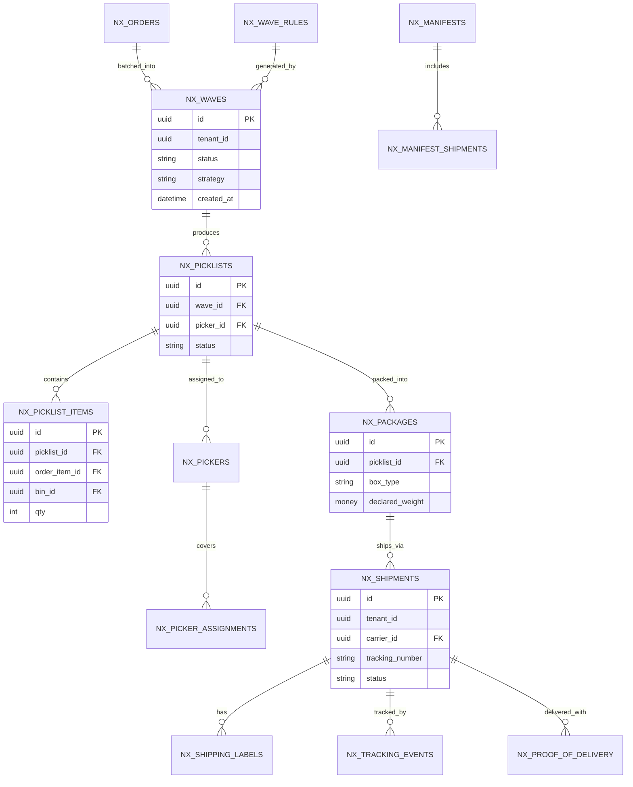

**Key columns:** `NxWave` status/strategy; `NxPicklist.waveId`, `NxPicklist.pickerId`; `NxPicklistItem.picklistId`/`orderItemId`/`binId`; `NxPackage.picklistId`; `NxShipment.carrierId`; `NxManifestShipment.manifestId`/`shipmentId`.

---

## 5. Shipping, Carriers & Yard ER

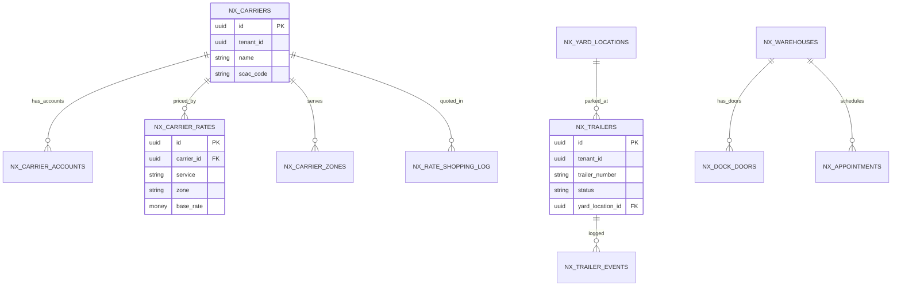

**Key columns:** `NxCarrierRate.carrierId`, `NxTrailer.yardLocationId`, `NxTrailerEvent.trailerId`, `NxManifestShipment.shipmentId`, `NxFreightInvoiceLine.freightInvoiceId`.

---

## 6. Returns (RMA) ER

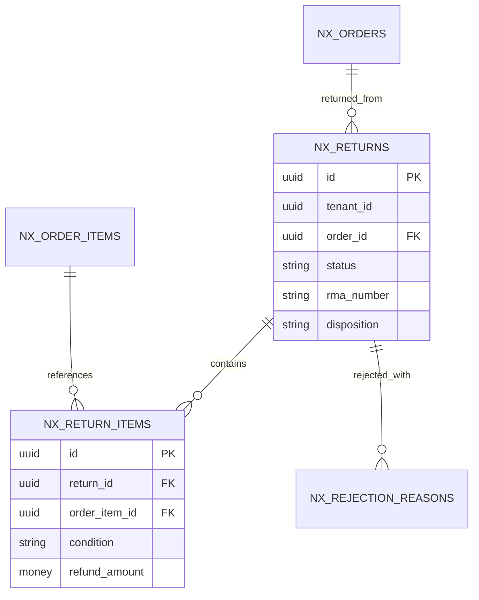

---

## 7. Procurement & Suppliers ER

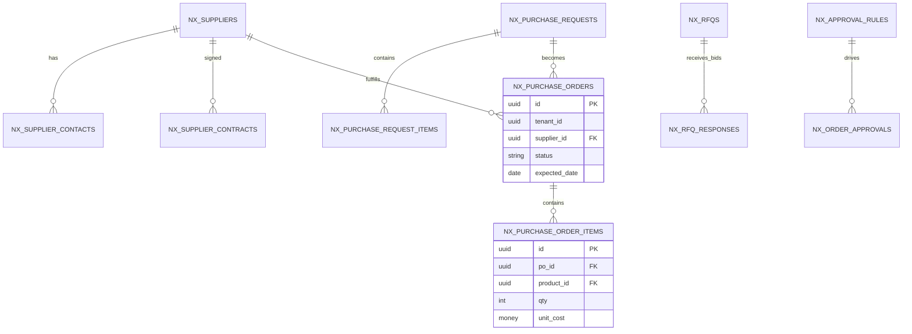

---

## 8. Automation & Alerting ER

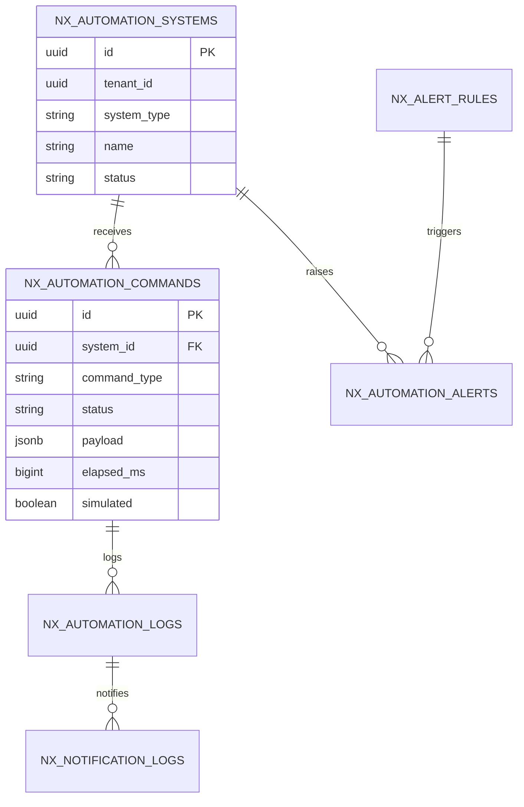

**Honesty note:** `NxAutomationCommand` carries `elapsed_ms` (real `Duration` since Phase 2.5) and an explicit `simulated` flag — see `FIX_LOG.md` Phase 2.5.

---

## 9. Integrations Hub ER

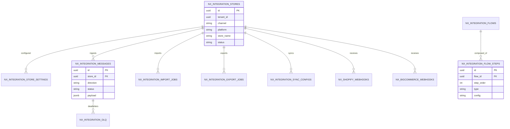

---

## 10. AI Platform ER

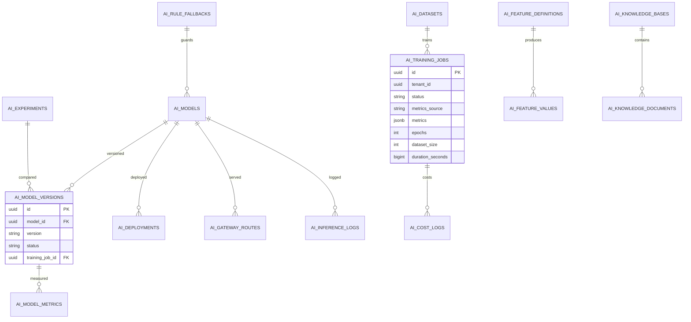

**Honesty note:** `AiTrainingJob.metricsSource` (`REAL` / `NO_METRICS`) added in migration `V52` — a model version is created only when the job produces real metrics.

---

## 11. Identity, RBAC & Tenancy ER

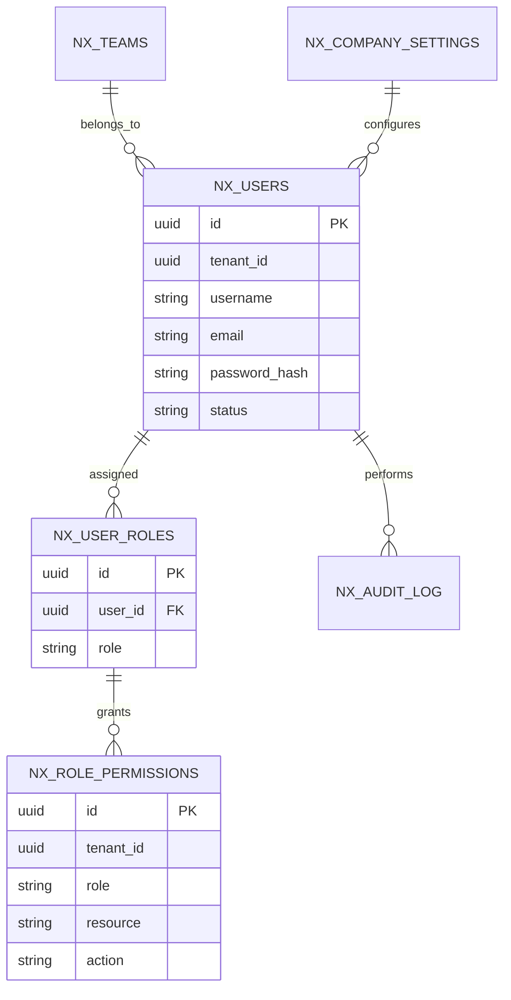

---

## 12. Workflow & Platform ER

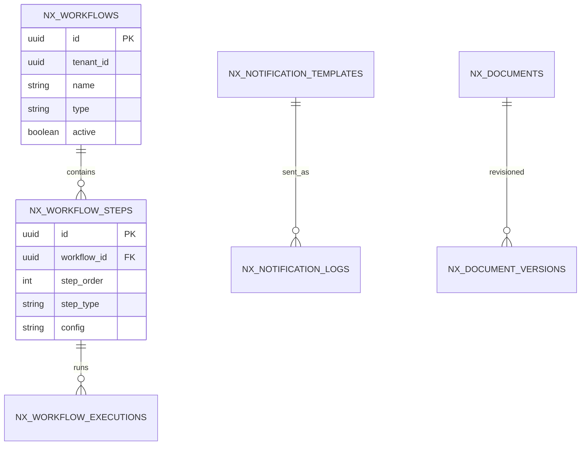

---

## 13. Entity Health Notes

| Aspect | Status |
|---|---|
| JPA object-graph associations | **Minimal** (6 `@ManyToOne`/`@OneToMany` uses) — most links are UUID columns |
| `@JoinColumn` with `insertable/updatable=false` | Used for read-only navigation (e.g. `NxOrder → Address`) |
| jsonb columns | Present on workflow/config/integration payload tables |
| Tenant scoping | `tenant_id` on all tenant tables; enforced in services |
| Schema migrations | 44 Flyway files `V1…V52` (idempotent `IF NOT EXISTS` patterns in later versions) |
| Legacy naming | `nxFreight_*` casing anomaly (3 tables) — requires migration to normalize |

---

*Next: [`04-USE-CASES.md`](./04-USE-CASES.md) — the complete use-case catalogue, and [`features/`](./features/) for per-module ER + flows.*
