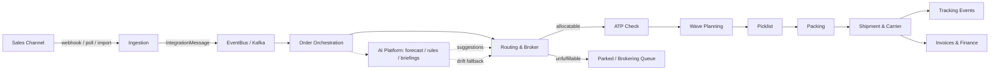
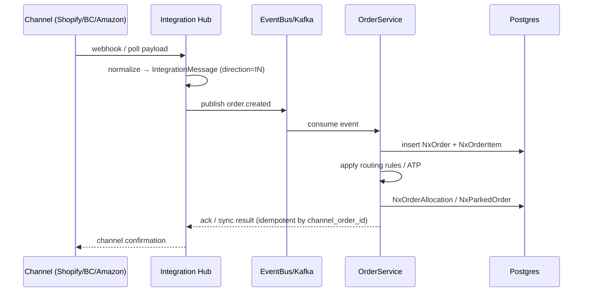
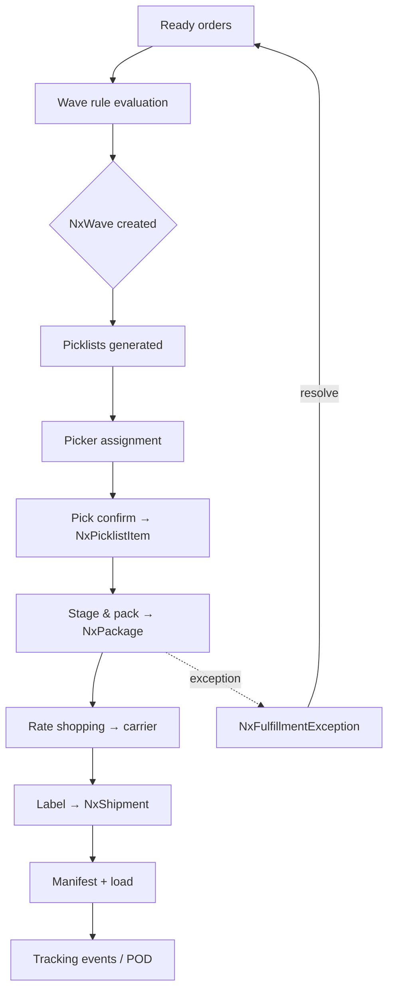
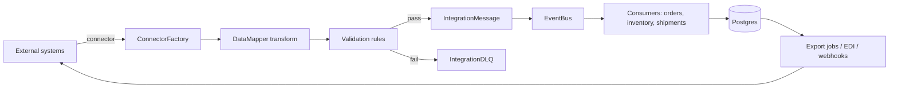
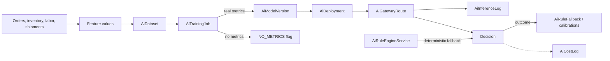
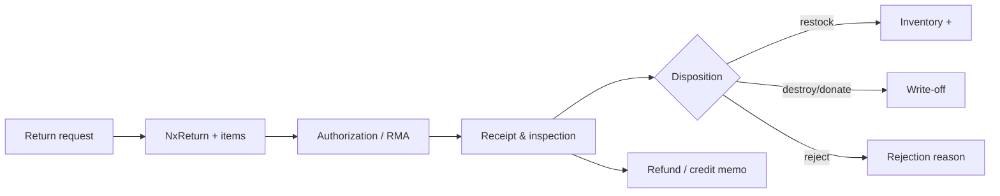
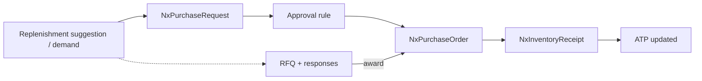
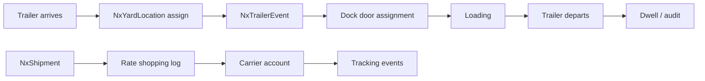

# Nexus OMS — Data Flow

> End-to-end data movement: ingestion, orchestration, fulfillment, integration and AI. Mermaid notation. See [`02-TECHNICAL-ARCHITECTURE.md`](./02-TECHNICAL-ARCHITECTURE.md) and [`features/`](./features/) for per-module flows.

---

## 0. Start Here — What is a "data flow"? 🚿

A data flow is the **path a piece of information travels**, like water through pipes. Real-life example:

> 🛍️ **Mia buys a hoodie at 9:04 pm.** Follow the hoodie's journey:
> 1. Shopify sends "order #1001" → Nexus (ingestion)
> 2. Nexus checks stock (ATP) → reserves 1 hoodie
> 3. Nexus groups it into tomorrow's wave → picklist
> 4. A picker picks it → packed → shipped → tracked
> 5. A receipt (invoice) is created → analytics updated

Each arrow below is one of those steps. **The diagrams are the plumbing map.**

---

## 1. The Big Picture (order → dispatch → analytics)

> 🧒 **Kid translation of the big picture:** A ball (the order) rolls down a slide: **in the front door (channel) → into the sorter (orchestration) → through the stock checker (ATP) → into the basket (wave) → picked → packed → shipped → billed → counted.** If the sorter can't handle it, the ball goes into the "waiting bin" (parked) instead of getting lost.

---

## 2. Order Intake Flow

**Idempotency:** orders keyed by `channel_order_id` + store; duplicate webhooks are skipped.
> 🧒 **Kid translation of idempotency:** If the doorbell rings twice, you don't cook two pizzas. Same order message twice = still one order.

---

## 3. Fulfillment Flow (wave → ship)

> 🏭 **Real life example — the warehouse morning:**
> - **6:30 am** — Nexus groups 200 orders by aisle (a wave).
> - **7:00** — Pickers get picklists; each walks one aisle once.
> - **9:30** — Packers box everything; Nexus picks the cheapest carrier per box.
> - **11:00** — A truck leaves with 180 packages; customers get tracking numbers.
> - Meanwhile one box was short — the exception path flagged it at 9:35, a manager fixed it by 10:00.

---

## 4. Integration Hub Data Flow (iPaaS)

**Supporting stores:** `NxIntegrationFlow` + steps, `NxIntegrationSyncConfig`, `NxIntegrationAuditLog`, `IntegrationCDCEvent`.

> 📬 **Real life analogy — the mail room:**
> Every store's messages are letters. The mail room (hub) opens them (connector), translates them (DataMapper), checks the address (validation). Good letters go to the kitchen (EventBus). Bad letters go to the "can't read" bin (DLQ) — **never thrown away**, so ops can fix and resend.

---

## 5. AI Platform Data Flow

**Honesty guarantees (Phase 2.5):**
- Training metrics are stored only when real (`metricsSource=REAL`), else `NO_METRICS` + null metrics.
- Rule evaluation is deterministic from config + order input.
- Automation results carry real `elapsed_ms` and explicit `simulated` flags.

> 🎓 **Real life example — the robot gets a grade:**
> The robot studies 12 months of sales (`AiDataset`). After training (`AiTrainingJob`), we grade it on data we held back. If we have held-back real data → report card shows REAL metrics and a model version is born. If we have no test data → the card honestly says `NO_METRICS`. We never invent a grade.

---

## 6. Returns Data Flow

> 🎁 **Real life example — the stained hoodie:**
> Mia returns the hoodie (request) → gets RMA #88 → warehouse receives it and inspects (stain!) → disposition = **destroy** → Nexus posts a write-off and tells Finance → Finance issues a partial refund. Every step recorded.

---

## 7. Procurement Data Flow

> 🏗️ **Real life example — the hoodie shortage:**
> AI notices hoodies sell out every winter → suggestion "buy 120" → request "over $500 needs approval" → approved → PO sent to CottonCo → hoodies arrive → receiving adds them → customers can order again.

---

## 8. Yard & Shipping Data Flow

> 🚚 **Real life example — truck at the dock:**
> Truck T-7 arrives 8:00 → parked at Yard Spot 2 (event logged) → dock 3 free → assigned → loaded by 10:30 → departs 11:00 (dwell = 3h). Meanwhile the shipment got its rate-shop + label + tracking. All visible on one screen.

---

## 9. Cross-cutting concerns in every flow

| Concern | Mechanism | Plain-English |
|---|---|---|
| **Tenancy** | Every query scoped by `tenant_id` | Your data stays in your locker |
| **Authorization** | `PermissionAuthorizationFilter` (39 mappings) | The guard checks badges |
| **Audit** | `NxAuditLog`, `IntegrationAuditLog` | The logbook records who did what |
| **Idempotency** | `channel_order_id` keys, import tokens, sync state | No double-cooking pizzas |
| **Resilience** | Kafka retries + Resilience4j breakers | Seatbelts so one failure doesn't crash everything |
| **Observability** | Micrometer/Prometheus, logstash JSON | Cameras on every pipe |

---

*Next: [`06-BUSINESS-FLOW-RBAC.md`](./06-BUSINESS-FLOW-RBAC.md) — who can touch what at each stage, and [`features/`](./features/) for per-module data flows.*
