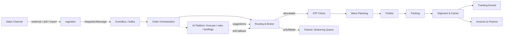
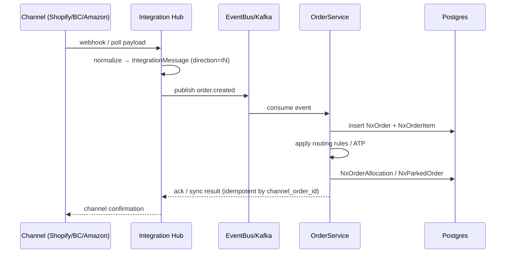
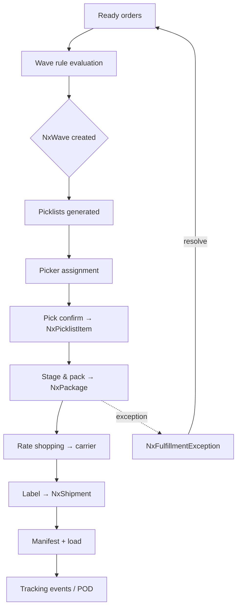
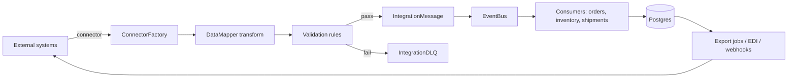
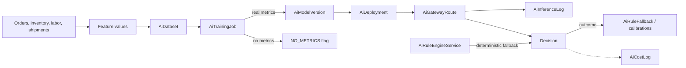
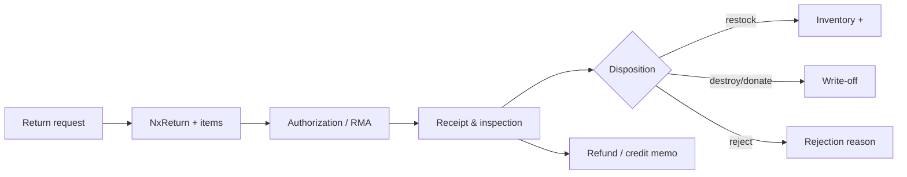
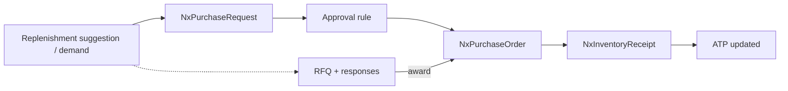
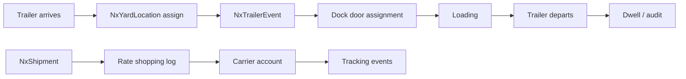

# Nexus OMS — Data Flow

> End-to-end data movement across the platform: ingestion, orchestration, fulfillment, integration and AI. Mermaid `sequenceDiagram`/`flowchart` notation. See [`02-TECHNICAL-ARCHITECTURE.md`](./02-TECHNICAL-ARCHITECTURE.md) for infrastructure and [`features/`](./features/) for per-module flows.

---

## 1. The Big Picture (order → dispatch → analytics)

---

## 2. Order Intake Flow

**Idempotency:** orders keyed by `channel_order_id` + store; duplicate webhooks are skipped.

---

## 3. Fulfillment Flow (wave → ship)

---

## 4. Integration Hub Data Flow (iPaaS)

**Supporting stores:** `NxIntegrationFlow` + steps (transform/validation), `NxIntegrationSyncConfig`, `NxIntegrationAuditLog`, `IntegrationCDCEvent` for change-data-capture.

---

## 5. AI Platform Data Flow

**Honesty guarantees (Phase 2.5):**
- Training metrics are stored only when real (`metricsSource=REAL`), else `NO_METRICS` + null metrics.
- Rule evaluation is deterministic from config + order input.
- Automation results carry real `elapsed_ms` and explicit `simulated` flags.

---

## 6. Returns Data Flow

---

## 7. Procurement Data Flow

---

## 8. Yard & Shipping Data Flow

---

## 9. Cross-cutting concerns in every flow

| Concern | Mechanism |
|---|---|
| **Tenancy** | Every entity query scoped by `tenant_id` |
| **Authorization** | `PermissionAuthorizationFilter` path→resource→permission (39 mappings) |
| **Audit** | `NxAuditLog` writes on sensitive actions; `IntegrationAuditLog` on syncs |
| **Idempotency** | `channel_order_id` keys, import tokens, sync-state tracking |
| **Resilience** | Kafka retries + Resilience4j circuit breakers |
| **Observability** | Micrometer/Prometheus counters per flow stage; logstash JSON |

---

*Next: [`06-BUSINESS-FLOW-RBAC.md`](./06-BUSINESS-FLOW-RBAC.md) — who can touch what at each stage, and [`features/`](./features/) for per-module data flows.*
