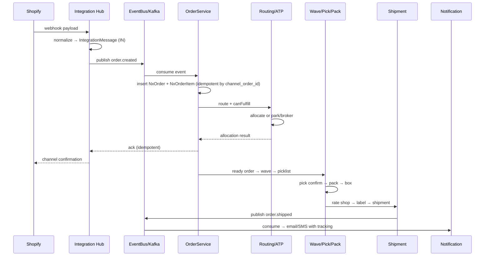

# Nexus OMS — Master Onboarding & Architectural Guide

> **For Interns & Junior Developers.** Read this over 1–2 days and you will be ready to contribute real code to Nexus.
>
> Companion docs: [`README.md`](./README.md) (index) · [`02-TECHNICAL-ARCHITECTURE.md`](./02-TECHNICAL-ARCHITECTURE.md) · [`03-ER-DIAGRAM.md`](./03-ER-DIAGRAM.md) · [`05-DATA-FLOW.md`](./05-DATA-FLOW.md) · [`NEXUS-COMPLETE-GUIDE.md`](./NEXUS-COMPLETE-GUIDE.md)

---

## Table of Contents

1. [Welcome — How to Use This Guide](#welcome--how-to-use-this-guide)
2. [Part 1 — SCM & OMS 101: The Business You Are Building](#part-1--scm--oms-101-the-business-you-are-building)
   - [1.1 What is an OMS and why does it exist?](#11-what-is-an-oms-and-why-does-it-exist)
   - [1.2 OMS vs WMS vs TMS vs ERP vs POS](#12-oms-vs-wms-vs-tms-vs-erp-vs-pos)
   - [1.3 Available to Promise (ATP) math](#13-available-to-promise-atp-math)
   - [1.4 Distributed Order Management (DOM) routing strategies](#14-distributed-order-management-dom-routing-strategies)
   - [1.5 Wave & Batch Picking](#15-wave--batch-picking)
   - [1.6 BOPIS (Buy Online, Pick Up In Store)](#16-bopis-buy-online-pick-up-in-store)
   - [1.7 Endless Aisle](#17-endless-aisle)
   - [1.8 Inbound PO / ASN Putaway](#18-inbound-po--asn-putaway)
   - [1.9 RMA Reverse Logistics](#19-rma-reverse-logistics)
   - [1.10 3PL Multi-Client Billing](#110-3pl-multi-client-billing)
   - [1.11 EDI Standard Formats (850, 856, 810)](#111-edi-standard-formats-850-856-810)
3. [Part 2 — Technology Stack Deep-Dive](#part-2--technology-stack-deep-dive)
   - [2.1 Java 17 & Spring Boot 3](#21-java-17--spring-boot-3)
   - [2.2 PostgreSQL 16 & pgvector](#22-postgresql-16--pgvector)
   - [2.3 Redis 7 & Apache Kafka](#23-redis-7--apache-kafka)
   - [2.4 React 19, TypeScript, Vite & Tailwind CSS](#24-react-19-typescript-vite--tailwind-css)
   - [2.5 Python & ONNX / MCP](#25-python--onnx--mcp)
4. [Part 3 — End-to-End System & Sequence Flows](#part-3--end-to-end-system--sequence-flows)
   - [3.1 The Big Picture](#31-the-big-picture)
   - [3.2 Trace: Shopify Order → Customer Notification](#32-trace-shopify-order--customer-notification)
   - [3.3 Trace: Inbound ASN → Putaway](#33-trace-inbound-asn--putaway)
   - [3.4 Trace: Return (RMA) → Refund](#34-trace-return-rma--refund)
   - [3.5 Trace: EDI 850 → Order → EDI 855/997](#35-trace-edi-850--order--edi-855997)
5. [Part 4 — Backend Class Map & Frontend Directory Guide](#part-4--backend-class-map--frontend-directory-guide)
   - [4.1 Backend package map](#41-backend-package-map)
   - [4.2 Key services by domain](#42-key-services-by-domain)
   - [4.3 Key controllers by domain](#43-key-controllers-by-domain)
   - [4.4 Frontend directory guide](#44-frontend-directory-guide)
   - [4.5 RF (mobile) app](#45-rf-mobile-app)
6. [Part 5 — Local Dev Quickstart](#part-5--local-dev-quickstart)
   - [5.1 Prerequisites](#51-prerequisites)
   - [5.2 Start infrastructure (Docker)](#52-start-infrastructure-docker)
   - [5.3 Start the backend](#53-start-the-backend)
   - [5.4 Start the frontend](#54-start-the-frontend)
   - [5.5 Run the test suites](#55-run-the-test-suites)
   - [5.6 Database migrations](#56-database-migrations)
   - [5.7 First contribution checklist](#57-first-contribution-checklist)
7. [Part 6 — Junior Developer & Intern Onboarding Guide](#part-6--junior-developer--intern-onboarding-guide)
   - [6.1 Day 1 — Environment & Orientation](#61-day-1--environment--orientation)
   - [6.2 Day 2 — Read the Code](#62-day-2--read-the-code)
   - [6.3 Day 3+ — First Tasks](#63-day-3--first-tasks)
   - [6.4 How to debug a failing test](#64-how-to-debug-a-failing-test)
   - [6.5 How to add a new endpoint](#65-how-to-add-a-new-endpoint)
   - [6.6 How to add a new Flyway migration](#66-how-to-add-a-new-flyway-migration)
   - [6.7 How to add a new frontend page](#67-how-to-add-a-new-frontend-page)
   - [6.8 Coding conventions & review checklist](#68-coding-conventions--review-checklist)
   - [6.9 Glossary of terms you will hear](#69-glossary-of-terms-you-will-hear)

---

# Welcome — How to Use This Guide

This guide is the **single document** that takes you from "I know a bit of Java" to "I can ship a feature on Nexus."

**Who this is for:** A 3rd-year B.Tech student, an intern, or a junior developer with basic Java knowledge. You do **not** need supply-chain experience — Part 1 teaches you the business. You do **not** need deep Spring experience — Part 2 teaches you the stack as Nexus uses it.

**How to read it:**

| Day | What to read | Outcome |
|---|---|---|
| Day 1 (morning) | Part 1 (SCM/OMS 101) | You can explain ATP, DOM, waves, BOPIS, ASN, RMA, EDI to anyone |
| Day 1 (afternoon) | Part 2 (Tech stack) | You know *why* each technology exists in Nexus |
| Day 2 (morning) | Part 3 (Flows) + Part 4 (Class map) | You can trace a request from browser to database and back |
| Day 2 (afternoon) | Part 5 (Quickstart) | Your machine runs the full stack |
| Day 3+ | Part 6 (Onboarding) | You are writing and shipping code |

**Conventions used in this guide:**

- 🧒 **Kid translation** — a one-line plain-English version of a concept.
- 🛍️ **Real life example** — a concrete story you can picture.
- 💻 **Code** — real Nexus code, abbreviated where useful.
- 🔗 **Links** — relative links into the repo and docs.

> **The single most important sentence in this guide:** Nexus is a **multi-tenant order management system** — it takes an order from *any* sales channel, decides *where* it can be fulfilled from, and drives it through *warehouse execution* (pick/pack/ship) to *dispatch*, while handling *returns*, *procurement*, *billing*, and *AI* — all with strict per-tenant security.

---

# Part 1 — SCM & OMS 101: The Business You Are Building

> **Goal of this part:** By the end, you can explain *why* Nexus exists and what problem each module solves — in plain English, with numbers.

---

## 1.1 What is an OMS and why does it exist?

### The problem it solves

Before OMS software, a retailer selling on **five channels** (website, Amazon, eBay, a physical store, and a wholesale catalog) had **five separate piles of orders**. Each pile had its own format, its own stock count, and its own way of shipping. The result:

- The website says "in stock" but the store already sold the last unit → **oversell**.
- An order placed on Amazon is typed manually into the warehouse system → **delay and typos**.
- Nobody knows the *true* inventory across all locations → **bad promises to customers**.

An **Order Management System (OMS)** is the **single brain** that:

1. **Ingests** orders from every channel (webhook, API, EDI, email, CSV, manual).
2. **Normalizes** them into one internal format (`NxOrder` + `NxOrderItem`).
3. **Routes** each order to the best fulfillment location (warehouse, store, 3PL).
4. **Allocates** real inventory (ATP) so you never oversell.
5. **Orchestrates** fulfillment (wave → pick → pack → ship) and tracks status.
6. **Settles** the financial side (invoices, payments, refunds).
7. **Handles exceptions** honestly (parked orders, brokering queues, rejections) instead of silently dropping.

> 🧒 **Kid translation:** An OMS is the *air-traffic controller* for orders. Every plane (order) from every airline (channel) gets one controller who decides the runway (warehouse), checks the fuel (stock), and watches it land (deliver).

> 🛍️ **Real life example:** Mia buys a hoodie on your Shopify store at 9:04 pm. The OMS receives the order, checks that the downtown store has 3 hoodies, reserves one, routes the order to the store, and tells Shopify "confirmed." At 9:05 the store's picker sees the task. That is an OMS in one paragraph.

### Why does Nexus exist?

Nexus exists to be that brain **for small and mid-market brands** that would otherwise need to buy Manhattan Associates (enterprise, expensive) or stitch together five point solutions. Nexus is:

- **AI-native** — demand forecasting, AI-assisted routing, autonomous agents (MCP).
- **Multi-tenant** — one deployment serves many client companies, with strict data isolation (row-level security).
- **Open** — self-hostable, no per-seat license, full control of your data.
- **Broad** — commerce → inventory → fulfillment → shipping → returns → procurement → finance → AI, all in one codebase.

### The order lifecycle (the spine of the whole system)

Every order in Nexus travels this state machine:

```
NEW → ROUTED → ALLOCATED → WAVE → PICK → PACK → SHIPPED → DELIVERED
        │          │
        ▼          ▼
     PARKED    APPROVAL
        │          │
        ▼          ▼
     (re-route)  REJECTED / CANCELLED
```

| State | Meaning | Who acts |
|---|---|---|
| `NEW` | Order ingested, not yet processed | System |
| `ROUTED` | A fulfillment path was chosen | `OrderRoutingService` |
| `ALLOCATED` | Inventory reserved (ATP) | `ATPCalculationEngine` |
| `WAVE` | Batched into a wave for picking | `WaveController` |
| `PICK` | Picker is collecting items | `PickingService` |
| `PACK` | Items boxed, label generated | `PackingService` |
| `SHIPPED` | Handed to carrier, tracking issued | `ShipmentController` |
| `DELIVERED` | Customer received it | Tracking events |
| `PARKED` | Could not be fulfilled now — visible queue | `ParkedOrderService` |
| `APPROVAL` | Needs human approval | `OrderApprovalService` |
| `REJECTED` | Rejected with a reason | `RejectionService` |

> 💻 **Where this lives in code:** `OrderController.java`, `OrderService.java`, and the `nx_orders.status` column. The state machine is enforced in service code, not just the database.

---

## 1.2 OMS vs WMS vs TMS vs ERP vs POS

These five acronyms describe **different layers** of a retail/supply-chain operation. A large company runs all of them; a small one runs a few. Nexus is primarily an **OMS** with **WMS-lite** and **TMS-lite** capabilities built in.

| System | Full name | What it does | Analogy | Does Nexus do this? |
|---|---|---|---|---|
| **OMS** | Order Management System | Decides *what* to fulfill, *where* from, and *when*; the order brain | Air-traffic controller | ✅ **Yes — this is Nexus's core** |
| **WMS** | Warehouse Management System | Executes *inside* the warehouse: receiving, putaway, picking, packing, shipping, cycle counts | The warehouse floor manager | ✅ **Yes (lite)** — waves, picklists, packing, receiving, slotting |
| **TMS** | Transportation Management System | Plans and executes *shipment movement*: carrier selection, rate shopping, tracking, freight audit | The logistics dispatcher | ✅ **Yes (lite)** — carrier rate shopping, manifests, yard/dock, freight audit |
| **ERP** | Enterprise Resource Planning | The company-wide system of record: finance, HR, procurement, manufacturing, accounting | The company's central ledger | ⚠️ **Partial** — invoicing, payments, procurement exist; not a full ERP |
| **POS** | Point of Sale | The checkout terminal in a physical store | The cash register | ⚠️ **Integrates with** POS systems; not a POS itself |

### How they talk to each other (in a typical company)

```
Customer buys on website
        │
        ▼
   [POS / eCommerce] ──order──▶ [OMS] ──fulfillment instruction──▶ [WMS]
                                     │                                 │
                                     │                                 ▼
                                     │                            (pick/pack)
                                     │                                 │
                                     ▼                                 ▼
                                [ERP] ◀──invoice/payment──        [TMS] ──ship──▶ Carrier
```

> 🧒 **Kid translation:** POS is the cash register, OMS is the manager who decides which store fills the order, WMS is the shelf-stocker who grabs the item, TMS is the driver who delivers it, and ERP is the accountant who bills it. Nexus plays manager + shelf-stocker + driver + part-time accountant.

### Why Nexus combines them

For a mid-market brand, buying five systems is overkill. Nexus gives you the **order brain** (OMS) plus enough **warehouse execution** (WMS-lite) and **shipping** (TMS-lite) to run a real operation out of the box — and it **integrates** with the big systems (SAP, QuickBooks, Shopify, FedEx, etc.) when you outgrow it.

---

## 1.3 Available to Promise (ATP) math

### The concept

**Available to Promise (ATP)** answers one question: **"How many units can I promise to a customer, right now, from this location?"**

The naive answer is "whatever the shelf count is." The *correct* answer subtracts everything that is already spoken for:

```
ATP = OnHand
    - Reserved (allocated to existing orders)
    - SafetyStock (buffer you refuse to dip below)
    - InTransit commitments (already promised)
    + Inbound (PO/ASN expected to arrive before the promise date)
    - FulfillmentLimit (max you'll promise from this node)
```

### The Nexus implementation

Nexus models this with three entities (see `V34__create_atp_tables.sql`):

- `nx_atp_rules` — per-node configuration: safety stock %, reservation limits, enabled flags.
- `nx_atp_snapshots` — computed ATP per node at a point in time.
- `nx_order_allocations` — the actual reservations against inventory.

The engine is `ATPCalculationEngine.java`. The flow:

1. A demand comes in (an order line, or an endless-aisle check).
2. The engine loads the node's rules and current on-hand.
3. It subtracts reservations and safety stock.
4. It returns the promiseable quantity.

> 💻 **API:** `GET /api/v1/atp/nodes?min=50` returns nodes with at least 50 ATP units. `POST /api/v1/atp/reserve` and `/release` move inventory in and out of reservation.

> 🧒 **Kid translation:** ATP is the "how many can I actually sell?" number. If the shelf has 10 and 3 are already promised to other customers and 2 are the emergency buffer, ATP = 5. You can promise 5, not 10.

> 🛍️ **Real life example:** Support gets a call: "Can I get 12 of these by Friday?" The agent checks ATP: 14 on hand, 2 reserved, safety stock 0 → ATP = 12. "Yes." If the answer had been 11, the agent would say "I can do 11 today, or 12 by Tuesday when the inbound shipment lands."

### Why ATP matters

- **Prevents overselling** — the #1 customer trust killer.
- **Enables honest promises** — "in stock" means *actually* available.
- **Drives routing** — an order routes to the node that can actually fulfill it.

---

## 1.4 Distributed Order Management (DOM) routing strategies

### The concept

**Distributed Order Management (DOM)** is the part of the OMS that decides **which fulfillment node** (warehouse A, warehouse B, store C, 3PL D) should fulfill a given order. It's the "air-traffic controller" deciding the runway.

### Routing strategies in Nexus

Nexus supports three modes (see `OrderRoutingService.java` and `V14__order_routing_ai.sql`):

| Strategy | How it works | When to use |
|---|---|---|
| **Deterministic (rule-based)** | Evaluate `nx_routing_rules` in priority order: cheapest shipping, closest node, least-loaded node, preferred node, etc. | Default; predictable and auditable |
| **AI-assisted** | The AI platform scores nodes using forecast + historical performance, and suggests a route; a human or rule approves | When you want optimization beyond simple rules |
| **Hybrid** | Rules run first; AI breaks ties or overrides within guardrails | Best of both worlds |

### The routing decision

```
Order arrives
    │
    ▼
Evaluate routing rules (priority order)
    │
    ├── canFulfill(node)?  ← ATP check against the node
    │        │
    │        ├── YES → allocate at that node → order ALLOCATED
    │        │
    │        └── NO  → try next node
    │
    ├── No node can fulfill → PARKED (visible queue) or BROKERED (brokering queue)
    │
    └── fulfillmentType honored: SHIP vs BOPIS (pickup)
```

Key concepts:

- **`canFulfill`** — a demand check: does this node have the ATP for these lines?
- **`fulfillmentType`** — `SHIP` (send it) vs `BOPIS` (hold for pickup). Honored end-to-end.
- **Auto-allocation** — orders auto-allocate on confirmation.
- **Brokering** — when no node can fulfill, the order enters `nx_brokering_queue` for later resolution (e.g., when stock arrives).

> 🧒 **Kid translation:** DOM is the manager deciding *which store* gets the job. If the mall store has the hoodie and the downtown store doesn't, the order goes to the mall — and if *no* store has it, the order goes into the "waiting bin" (parked/brokered) instead of being lost.

> 🛍️ **Real life example:** A customer orders a blue hoodie. Warehouse A has 0, Warehouse B has 5, Store C has 2. The rule "cheapest shipping" says ship from the closest node to the customer — Store C. `canFulfill(Store C)` passes (2 ≥ 1), so the order allocates at Store C and the store's picker gets the task.

---

## 1.5 Wave & Batch Picking

### The concept

**Wave picking** is the warehouse technique of **grouping many orders into one "wave"** so pickers walk the aisles fewer times. Instead of 50 pickers each walking the whole warehouse for one order, one picker walks one aisle once and collects items for 20 orders.

### The Nexus implementation

Entities (see `V12__fulfillment_pick_pack_ship.sql` and `V56__wes_tables.sql`):

- `nx_wave_rules` — the strategy: FIFO, priority, ship-by date, zone.
- `nx_waves` — a batch of orders.
- `nx_picklists` — generated from a wave; assigned to a picker.
- `nx_picklist_items` — one line per item to pick (bin + quantity).
- `nx_pickers` / `nx_picker_assignments` — who is picking what.
- `nx_fulfillment_limits` / `nx_fulfillment_capacity_log` — prevent oversubscribed waves.

### The flow

```
Ready orders
    │
    ▼
Wave rule evaluation (FIFO / priority / ship-by / zone)
    │
    ▼
NxWave created
    │
    ▼
Picklists generated (grouped by zone/aisle)
    │
    ▼
Picker assignment
    │
    ▼
Pick confirm → NxPicklistItem updated
    │
    ▼
Stage & pack → NxPackage
    │
    ▼
Exception? → NxFulfillmentException → resolve (reallocate/replace/cancel)
```

> 🧒 **Kid translation:** A wave is a *group trip*. Instead of everyone running to the fridge one at a time, the kitchen sends one person to grab everything for the whole table at once.

> 🛍️ **Real life example — the warehouse morning:**
> - **6:30 am** — Nexus groups 200 orders by aisle → one wave.
> - **7:00** — Pickers get picklists; each walks one aisle *once*.
> - **9:30** — Packers box everything; Nexus picks the cheapest carrier per box.
> - **11:00** — A truck leaves with 180 packages; customers get tracking numbers.
> - One box was short — the exception path flagged it at 9:35, a manager fixed it by 10:00.

### Why waves matter

- **Throughput** — fewer walks = more picks per hour.
- **Fairness** — capacity limits stop a 10,000-item wave for 2 pickers.
- **Auditability** — every pick is logged against a picker.

---

## 1.6 BOPIS (Buy Online, Pick Up In Store)

### The concept

**BOPIS** = **B**uy **O**nline, **P**ick **U**p **I**n **S**tore. The customer orders on the website but collects the item at a physical store — no shipping, instant gratification, and it drives foot traffic.

### The Nexus implementation

Entities (see `V37__create_bopis_tables.sql`):

- `nx_pickup_orders` — the pickup order (linked to the source order).
- `nx_pickup_order_items` — the lines to pick.
- `nx_pickup_order_status` — the lifecycle.

### The BOPIS lifecycle

```
Order placed with fulfillmentType = BOPIS
    │
    ▼
Assign picker (STORE_MANAGER / BOPIS_OWNER)
    │
    ▼
Pick items (with substitution / short handling)
    │
    ▼
Pack
    │
    ▼
Ready for handoff  →  customer notified
    │
    ▼
Handoff (customer collects) → POD (proof of delivery) collected
    │
    ▼
No-show timeout → auto-cancel
```

Key features:

- **Substitution/short handling** — picker can substitute an item or mark it short.
- **POD collection** — proof of delivery captured at handoff.
- **No-show timeout + auto-cancel** — if the customer never shows, the order auto-cancels and stock returns.
- **Pickup KPIs** — pickup rate, no-show rate, handoff time.
- **BOPIS shipping labels** — generated server-side for the handoff label.

> 🧒 **Kid translation:** BOPIS is "order online, grab in store." The store worker picks your items, puts them in a bag with your name, and you walk in and grab them — no delivery truck needed.

> 🛍️ **Real life example:** Mia orders a hoodie online and chooses "pick up at the downtown store." The store's BOPIS owner assigns a picker, the picker grabs the hoodie, packs it, and Nexus prints a handoff label. Mia gets a text: "Ready for pickup!" She shows up, signs, and leaves with the hoodie in 2 minutes.

---

## 1.7 Endless Aisle

### The concept

**Endless Aisle** is the retail trick of **selling inventory that isn't physically in the store**. The customer stands in the store (or browses the store's online catalog) and orders an item that lives in another store or a warehouse. The store "never runs out" because the catalog is endless.

### The Nexus implementation

Entities (see `V47__create_endless_aisle_tables.sql`):

- `nx_endless_aisle_orders` — the endless-aisle order.
- `nx_endless_aisle_order_items` — the lines.
- Fulfillment node = the store/warehouse that actually holds the stock.

### The flow

```
Customer orders an item not in this store
    │
    ▼
Nexus finds a node that has it (ATP check across nodes)
    │
    ▼
Order created with the fulfilling node = the node with stock
    │
    ▼
Transfer-out: REAL inventory deduction at the fulfilling node
    │
    ▼
Item ships to the store (or directly to the customer)
    │
    ▼
Store receives; customer notified
```

Key point: **real inventory deduction** at the fulfilling node on transfer-out — verified at the warehouse level. No phantom stock.

> 🧒 **Kid translation:** Endless Aisle is "the store that never runs out." If the downtown store doesn't have your size, the system finds it at the mall store and ships it over — the store's shelves look endless.

> 🛍️ **Real life example:** A customer in the downtown store wants a size L jacket. The store only has M. Nexus checks the mall store: 4 in L. The order is created, the mall store's inventory is decremented by 1 (real deduction), and the jacket ships to the downtown store for pickup.

---

## 1.8 Inbound PO / ASN Putaway

### The concept

When a warehouse receives goods, two documents matter:

- **PO (Purchase Order)** — what you *ordered* from the supplier.
- **ASN (Advance Shipping Notice)** — what the supplier *says they shipped* (sent in advance, often via EDI 856).

**Putaway** is the decision of *where in the warehouse* each received item goes (which bin).

### The Nexus implementation

Entities (see `V57__asn_inbound.sql`, `V58__asn_dock_appointment_link.sql`):

- `nx_asn` / `nx_asn_lines` — the advance shipping notice.
- `nx_inventory_receipts` — each receive action posts a receipt.
- `nx_putaway` — putaway recommendations + audit.
- `nx_bin_locations` — where things live.

### The inbound flow

```
Supplier ships → sends ASN (manual or EDI 856 auto-ASN)
    │
    ▼
ASN created (EDI 856: LIN/SN1 line extraction)
    │
    ▼
Truck arrives → dock appointment (linked to ASN)
    │
    ▼
Receive against ASN (10% over-receipt tolerance)
    │
    ▼
Each receive posts an inventory receipt
    │
    ▼
Putaway recommendation (slotting):
    existing bin → available storage bin → empty bin → any bin
    │
    ▼
PUTAWAY audit recorded
    │
    ▼
All lines received → ASN auto-COMPLETEs
```

Key features:

- **EDI 856 auto-ASN** — an inbound EDI 856 creates the ASN automatically.
- **Over-receipt tolerance** — default 10%; receiving more than the ASN allows is blocked.
- **Putaway recommendation** — slotting picks the best bin: existing bin → available storage bin → empty bin → any bin.
- **Auto-complete** — when all lines are received, the ASN completes itself.
- **PO receiving** — carries the same tolerance control + putaway.

> 🧒 **Kid translation:** The ASN is the supplier's "heads up: a truck is coming with these boxes." Putaway is "where do these boxes go on the shelves?" Nexus reads the heads-up, checks the boxes in, and tells the worker exactly which shelf to use.

> 🛍️ **Real life example:** A supplier ships 50 boxes of pens and sends an EDI 856. Nexus creates the ASN automatically. The truck arrives at dock door 3 (appointment linked to the ASN). The loader scans each box against the ASN — 51 boxes arrive, but the 10% tolerance allows it. Nexus recommends "put these on Shelf B, bin B4" and logs the putaway.

---

## 1.9 RMA Reverse Logistics

### The concept

**RMA** = **R**eturn **M**erchandise **A**uthorization. It's the process of handling a customer's return: authorize it, receive the item back, inspect it, decide what to do with it (restock, destroy, donate, refund), and process the refund.

### The Nexus implementation

Entities (see `V13__returns_enhancement.sql`, `V64__returns_financial_reconciliation.sql`):

- `nx_returns` — the return request.
- `nx_return_items` — the lines being returned.
- `nx_return_reasons` — why (defective, wrong size, changed mind…).
- `nx_return_inspections` — the inspection result.
- `nx_return_dispositions` — restock / destroy / donate / refund.
- `nx_refunds` — the financial side (linked to disposition).
- `nx_proof_of_delivery` — POD for the return shipment.

### The RMA flow

```
Customer requests return
    │
    ▼
Return request created (with reason)
    │
    ▼
Return authorized (RMA number issued)
    │
    ▼
Item received back → inspection
    │
    ▼
Disposition decided: restock / destroy / donate / refund
    │
    ▼
Refund disposition → linked refund created (refundStatus tracked)
    │
    ▼
Idempotent processRefund → money back (QuickBooks push, deduped)
```

Key features:

- **RMA ↔ order/line traceability** — return lines link to original order lines.
- **Refund disposition → linked refund** — inspection disposition creates the refund with a tracked `refundStatus`.
- **Idempotent refunds** — `processRefund` is safe to retry; the QuickBooks connector dedupes on `nexus-refund-{refundId}` + `Idempotency-Key` so a retry never double-posts.

> 🧒 **Kid translation:** RMA is the "I want to give this back" process. The system tracks the return from "customer asked" to "money is back in their account" — and if the refund message gets sent twice by accident, the customer still only gets one refund.

> 🛍️ **Real life example:** Mia's hoodie is too small. She requests a return, prints the RMA label, ships it back. The warehouse inspects it: "like new." Disposition: restock + refund. Nexus creates the refund, pushes it to QuickBooks (idempotently), and Mia sees the money in 3 days.

---

## 1.10 3PL Multi-Client Billing

### The concept

A **3PL** (third-party logistics provider) runs warehouses for **multiple client companies**. Each client has different pricing. **Multi-client billing** is the system that charges each client correctly for the services used — per order, per line, per pick, per storage.

### The Nexus implementation

Entities (see `V54__multi_client_billing.sql`):

- `nx_rate_cards` — per-client pricing: per-order / per-line / picking / storage.
- `nx_billing_statements` — itemized statements with totals.
- KPIs: outstanding / collected.

### The flow

```
Client's orders flow through the warehouse
    │
    ▼
Each fulfillment action (order, line, pick, storage) is a billable event
    │
    ▼
Rate card for that client is applied
    │
    ▼
Billing statement generated (itemized lines + totals)
    │
    ▼
Outstanding / collected KPIs tracked
    │
    ▼
Client portal shows the client their numbers
```

> 🧒 **Kid translation:** A 3PL is a landlord who rents warehouse space to many shops. Multi-client billing is the "who owes what" ledger — each shop pays for exactly what it used, at its own agreed price.

> 🛍️ **Real life example:** Client A pays $1.50 per order + $0.10 per line. Client B pays $2.00 per order flat. In a month, Client A had 1,000 orders (4,000 lines) → $1,500 + $400 = $1,900. Client B had 500 orders → $1,000. Nexus generates both statements automatically and the client portal shows each client their own numbers.

---

## 1.11 EDI Standard Formats (850, 856, 810)

### The concept

**EDI** = **E**lectronic **D**ata **I**nterchange. It's the standardized way businesses exchange documents electronically — the "paper forms" of B2B commerce, digitized. The **X12** standard (ANSI) defines document types by number.

### The three you must know

| EDI doc | Name | Direction | What it is | Nexus support |
|---|---|---|---|---|
| **850** | Purchase Order | Buyer → Seller | "I want to buy these items" | ✅ Inbound → creates order |
| **856** | Advance Shipping Notice (ASN) | Seller → Buyer | "Here's what I shipped" | ✅ Inbound → auto-ASN |
| **810** | Invoice | Seller → Buyer | "Here's what you owe" | ✅ Inbound parsing |
| 855 | PO Acknowledgment | Seller → Buyer | "Got your PO" | ✅ Auto-generated on inbound 850 |
| 997 | Functional Acknowledgment | Either | "Got your EDI file, it parsed OK" | ✅ Auto-generated on inbound EDI |

### What an X12 document looks like

```
ISA*00*          *00*          *ZZ*SENDERID       *ZZ*RECEIVERID     *240101*1200*U*00401*000000001*0*P*>~
GS*PO*SENDERID*RECEIVERID*20240101*1200*1*X*004010~
ST*850*0001~
BEG*00*SA*PO-12345**20240101~
N1*BY*ACME CORP~
PO1*1*10*EA*5.50*UP*SKU-001~
SE*5*0001~
GE*1*1~
IEA*1*000000001~
```

Segments are separated by `~`, elements by `*`. Key segments:

- `ISA`/`GS`/`IEA`/`GE` — envelope (who sent it, when, control numbers).
- `ST`/`SE` — transaction set (which doc type, e.g., 850).
- `BEG` — beginning of PO (PO number, date).
- `N1` — party (BY = buyer, SE = seller).
- `PO1` — line item (quantity, unit price, SKU).
- `LIN`/`SN1` (in 856) — line + shipped quantity.

### How Nexus handles EDI

- **Real X12 parsing** — `EdiAutomationService` parses BEG/N1/PO1 (850), BSN/HL/MAN/TD3/TD5 (856), BIG/IT1/TDS (810), AK1/AK2 (997).
- **Validation + control-number extraction** — every file is validated; control numbers prevent duplicates.
- **Dry-run** — test a file without committing.
- **Partner management** — `nx_edi_partners`.
- **PO → order creation** — an inbound 850 becomes an order.
- **Bulk 940 shipping-schedule import**.
- **855 + 997 auto-generation** — Nexus replies automatically.
- **Hardened parser** — field mapping + regex DoS fixes.

> 🧒 **Kid translation:** EDI is the *standardized paperwork* of business. Instead of faxing a purchase order, a company sends a structured file that the other company's computer reads automatically. 850 = "I want to buy," 856 = "I shipped it," 810 = "you owe me."

> 🛍️ **Real life example:** A big retailer sends Nexus an EDI 850 for 100 boxes of gloves. Nexus parses it, creates the order, and automatically replies with an 855 (acknowledgment) and a 997 (functional acknowledgment). When the gloves ship, Nexus sends an 856 so the retailer knows what's coming.

---

# Part 2 — Technology Stack Deep-Dive

> **Goal of this part:** You understand *what* each technology is, *why* Nexus uses it, and *where* it appears in the code.

---

## 2.1 Java 17 & Spring Boot 3

### What it is

**Java 17** is a long-term-support (LTS) release of the Java language and runtime. **Spring Boot 3** is a framework that makes it fast to build production-grade Java applications: it auto-configures web servers, databases, security, messaging, and more, so you write *business logic*, not plumbing.

### Why Nexus uses it

- **Maturity** — the most battle-tested ecosystem for enterprise backends.
- **Spring Boot 3** — auto-configuration, dependency injection, and a huge ecosystem (Spring Data JPA, Spring Security, Spring Kafka, Spring WebSocket).
- **Java 17** — records, sealed classes, pattern matching, and modern `switch` — cleaner code than older Java.
- **Performance & tooling** — excellent profiling, testing (JUnit 5), and build tooling (Maven).

### The three-layer pattern you will see everywhere

Nexus follows the classic Spring layering:

```
Controller (HTTP in/out)
    │
    ▼
Service (business logic)
    │
    ▼
Repository (database access, Spring Data JPA)
    │
    ▼
Entity (JPA mapping to a table)
```

> 💻 **Example — the order flow:**

```java
// 1. Controller — receives HTTP, delegates, returns JSON
@RestController
@RequestMapping("/api/v1/orders")
public class OrderController {
    private final OrderService orderService;

    @PostMapping
    public ResponseEntity<NxOrder> createOrder(@RequestBody CreateOrderRequest req) {
        return ResponseEntity.ok(orderService.createOrder(req));
    }
}

// 2. Service — business logic
@Service
public class OrderService {
    private final OrderRepository orderRepository;

    @Transactional
    public NxOrder createOrder(CreateOrderRequest req) {
        NxOrder order = new NxOrder();
        // ... normalize, validate, route, allocate ...
        return orderRepository.save(order);
    }
}

// 3. Repository — Spring Data JPA gives you CRUD for free
public interface OrderRepository extends JpaRepository<NxOrder, UUID> {
    List<NxOrder> findByStatus(String status);
}

// 4. Entity — maps to nx_orders
@Entity
@Table(name = "nx_orders")
public class NxOrder {
    @Id private UUID id;
    private String status;
    // ...
}
```

### Key Spring concepts you must know

| Concept | What it is | Where you'll see it |
|---|---|---|
| **`@RestController`** | A class that handles HTTP requests and returns JSON | Every controller |
| **`@Service`** | A class holding business logic, managed by Spring | Every service |
| **`@Repository`** | A data-access component | Every repository |
| **`@Entity`** | A class mapped to a database table | Every entity |
| **`@Transactional`** | Runs the method in a DB transaction (all-or-nothing) | Service methods that write |
| **`@Autowired` / constructor injection** | Spring gives you your dependencies | Constructors of services/controllers |
| **`@Configuration`** | Defines beans/config | `config/` package |
| **`@Scheduled`** | Runs a method on a timer | `scheduler/` package |
| **`@EventListener` / `@KafkaListener`** | Reacts to events | Integration hub, CDC |

### The Nexus application entry point

```java
@SpringBootApplication
@EnableScheduling
public class NexusOmsApplication {
    public static void main(String[] args) {
        SpringApplication.run(NexusOmsApplication.class, args);
    }
}
```

- `@SpringBootApplication` — component scan + auto-configuration.
- `@EnableScheduling` — turns on `@Scheduled` jobs (sync scheduler, etc.).

### Where it lives in the repo

```
nexus-oms-backend/
├── src/main/java/com/nexus/oms/
│   ├── NexusOmsApplication.java      ← entry point
│   ├── controller/                   ← 74 REST controllers
│   ├── service/                      ← 111 services (business logic)
│   ├── repository/                   ← Spring Data JPA repositories
│   ├── entity/                       ← ~157 JPA entities
│   ├── dto/                          ← request/response objects
│   ├── security/                     ← JWT auth, tenant context, RBAC
│   ├── config/                       ← app configuration
│   ├── integration/                  ← connectors, hub, EDI
│   ├── scheduler/                    ← scheduled jobs
│   ├── exception/                    ← error handling
│   └── health/                       ← health indicators
└── src/main/resources/
    ├── application.yml               ← Spring config
    └── db/migration/                 ← 67+ Flyway migrations
```

---

## 2.2 PostgreSQL 16 & pgvector

### What it is

**PostgreSQL 16** is a powerful open-source relational database. **pgvector** is a Postgres extension that adds **vector embeddings** support — letting you store and search high-dimensional vectors (used for AI/RAG) *inside* the same database as your business data.

### Why Nexus uses it

- **Reliability & features** — transactions, constraints, JSONB, full-text search.
- **Row-Level Security (RLS)** — the backbone of Nexus multi-tenancy (see below).
- **pgvector** — AI embeddings live next to the data they describe; no separate vector database needed.
- **Flyway migrations** — schema changes are versioned and repeatable.

### Multi-tenancy with Row-Level Security (RLS)

Nexus is **multi-tenant**: one deployment serves many client companies. The security model:

1. Every tenant-scoped table has a `company_id` column.
2. **RLS policies** (see `V23__row_level_security.sql`, `V26__enable_row_level_security.sql`) restrict which rows a query can see based on the current tenant.
3. The backend sets the tenant context (via `SET app.current_company_id = ...` or similar) after JWT authentication.
4. A query can *only* see rows for the current tenant — enforced by the database, not just the app.

> 🧒 **Kid translation:** RLS is like a filing cabinet where each client has a locked drawer. Even if code accidentally asks for "all orders," the database only opens the drawer for the logged-in client.

### Vector embeddings & RAG

- `V48__pgvector_and_rag_tables.sql` — creates the vector extension and RAG tables.
- `V49__hnsw_index_and_webhook_dedup.sql` — adds an **HNSW index** (fast approximate vector search) and webhook dedup.
- Embeddings are generated by the AI platform (OpenAI `text-embedding-3-small` by default) and stored in Postgres.
- Used for **RAG** (retrieval-augmented generation): find relevant documents/chunks by vector similarity, then feed them to the LLM.

### Where it lives in the repo

```
nexus-oms-backend/src/main/resources/db/migration/
├── V1__initial_schema.sql
├── V23__row_level_security.sql
├── V26__enable_row_level_security.sql
├── V34__create_atp_tables.sql
├── V37__create_bopis_tables.sql
├── V48__pgvector_and_rag_tables.sql
├── V49__hnsw_index_and_webhook_dedup.sql
├── V54__multi_client_billing.sql
├── V56__wes_tables.sql
├── V57__asn_inbound.sql
└── ... (67+ total)
```

---

## 2.3 Redis 7 & Apache Kafka

### Redis 7 — the speed layer

**Redis** is an in-memory data store used for things that must be *fast*: caches, rate limits, tokens, sessions.

**Why Nexus uses it:**

| Use | What it stores | Where |
|---|---|---|
| **Rate caching** | Carrier rate-shopping results (so you don't re-query FedEx every time) | `RateCacheService.java`, `RateCacheHealthIndicator.java` |
| **Token stores** | Auth tokens, MFA challenge sessions | `AuthService.java` |
| **Caching** | Frequently-read data (Spring Cache) | `config/` |

> 🧒 **Kid translation:** Redis is the *speed rack* — the things you grab constantly (today's rates, your login token) sit right next to the counter instead of in the big fridge (Postgres).

### Apache Kafka — the event backbone

**Kafka** is a distributed event-streaming platform: services **publish** events (messages) to **topics**, and other services **consume** them. It's the "walkie-talkie" between parts of the system.

**Why Nexus uses it:**

- **Order lifecycle events** — `order.created`, `order.confirmed`, `order.allocated`, `order.shipped`, `order.delivered`.
- **Decoupling** — the order service doesn't need to know who cares about "order created"; it just publishes, and any number of consumers react.
- **Reliability** — events persist; a consumer that was down can catch up.

> 💻 **Publishing an event (conceptually):**

```java
kafkaTemplate.send("order.created", order.getId().toString(), orderJson);
```

> 💻 **Consuming an event (conceptually):**

```java
@KafkaListener(topics = "order.created")
public void onOrderCreated(String orderId) {
    // react: notify, update analytics, trigger workflow...
}
```

> 🧒 **Kid translation:** Kafka is the *announcement speaker*. When an order is created, the system announces it over the speaker. Anyone who cares (notifications, analytics, workflows) listens and reacts — without the order system having to call each of them personally.

### Where it lives in the repo

- `docker-compose.yml` — `redis` and `kafka` services.
- `application.yml` — connection config.
- `RateCacheService.java` — Redis-backed rate cache.
- `CDCProcessor.java` — change-data-capture style processing.
- `scheduler/SyncSchedulerService.java` — scheduled sync jobs.

---

## 2.4 React 19, TypeScript, Vite & Tailwind CSS

### What it is

- **React 19** — the UI library: components, state, hooks.
- **TypeScript** — JavaScript with types (catches bugs at compile time).
- **Vite** — the build tool + dev server (fast hot reload).
- **Tailwind CSS** — utility-first styling (classes like `flex`, `p-4`, `text-sm`).

### Why Nexus uses it

- **Component architecture** — reusable UI pieces (tables, forms, cards).
- **React Query** (`@tanstack/react-query`) — server-state management: caching, retries, invalidation. You write `useQuery`/`useMutation`, and React Query handles fetching, caching, and refetching.
- **WebSockets (STOMP/SockJS)** — live updates (e.g., "new order arrived").
- **HashRouter** — `react-router-dom` with hash routing (works behind any static host).
- **Role/resource gating** — pages check permissions before rendering.

### The frontend architecture

```
nexus-oms-frontend/
├── src/
│   ├── main.tsx               ← React entry point
│   ├── App.tsx                ← router + layout
│   ├── pages/                 ← 89 page components (one per screen)
│   ├── components/            ← reusable UI components
│   ├── api/                   ← API client modules (axios)
│   ├── hooks/                 ← custom React hooks
│   ├── context/               ← React context (Auth, Theme)
│   ├── rf/                    ← Mobile RF (barcode scanning) app
│   └── test/                  ← vitest tests
```

> 💻 **A page using React Query (conceptually):**

```tsx
import { useQuery } from '@tanstack/react-query';
import { api } from '../api/client';

export function OrdersPage() {
  const { data, isLoading } = useQuery({
    queryKey: ['orders'],
    queryFn: () => api.get('/api/v1/orders').then(r => r.data),
  });

  if (isLoading) return <div>Loading…</div>;
  return <OrderTable orders={data} />;
}
```

> 🧒 **Kid translation:** React builds the screens, TypeScript keeps the code honest, Vite makes changes appear instantly, and Tailwind styles everything with small utility classes instead of giant CSS files.

### The RF (mobile) app

The **RF app** (`src/rf/`) is a **PWA** (progressive web app) for warehouse barcode scanning:

- Screens: `PickScreen`, `PackScreen`, `ReceiveScreen`, `ShipScreen`, `CountScreen`, `ScanScreen`.
- **Camera barcode scanning** — native + ZXing fallback.
- **Offline-first pick queue** — actions buffered to `localStorage`, flushed on reconnect.
- Server-side scan search.

> 🧒 **Kid translation:** The RF app is the *scanner gun* the warehouse worker carries — but it's a web page on a phone, so no special hardware needed.

---

## 2.5 Python & ONNX / MCP

### What it is

- **Python** — the AI/ML language of choice.
- **ONNX** — an open format for machine-learning models (portable across frameworks).
- **MCP** — **Model Context Protocol**: a standard way for AI agents to call tools. Nexus exposes MCP tools so an AI agent can *do things* in the system (query orders, check ATP, etc.).

### Why Nexus uses it

- **Demand forecasting** — Holt linear + Holt-Winters smoothing with grid-search alpha/beta/gamma, next-7 and next-30 horizons, **WAPE** accuracy, p90 safety-stock view (`GET /api/ai/forecast` + `/evaluate`).
- **AI services** — two dedicated containers: **ai-ops** (optimizes operations) and **ai-intel** (writes briefings).
- **MCP server tools** — `V65__mcp_server_tools.sql` + `McpToolExecutor.java` let AI agents execute system tools.
- **RAG** — embeddings + pgvector for retrieval-augmented generation.

### Where it lives in the repo

```
supply_chain_ai/       ← Python ML pipeline
supply_chain_ai2/      ← additional AI modules
scripts/ml/            ← ML scripts
scripts/fulfill.py     ← fulfillment helper
```

> 🧒 **Kid translation:** Python is the *smart helper* that predicts demand ("you'll sell 120 hoodies in December"), and MCP is the *remote control* that lets an AI agent actually operate the system safely.

---

# Part 3 — End-to-End System & Sequence Flows

> **Goal of this part:** You can trace a real request from the browser (or channel) all the way through the system to the database and back — and explain what each hop does.

---

## 3.1 The Big Picture

```
┌─────────────────────────────┐        ┌──────────────────────────────┐
│         FRONTEND            │        │       EXTERNAL WORLD         │
│  React 19 + Vite (SPA)     │        │  Shopify · BigCommerce · Amazon│
│  HashRouter · React Query   │        │  eBay · Walmart · Magento     │
│  WebSockets (STOMP/SockJS)  │        │  Stripe · FedEx · QuickBooks  │
│  Tailwind + Radix + Recharts│        │  Salesforce · SAP · Twilio    │
└─────────────┬───────────────┘        │  Okta · OpenAI · Generic HTTP │
              │  REST (axios, JWT)     └──────────────┬───────────────┘
              │  WS (stomp)                           │ connectors
┌─────────────▼───────────────┐        ┌──────────────▼───────────────┐
│         BACKEND             │        │        INTEGRATION HUB        │
│  Spring Boot 3 · Java 17    │◄──────►│  ConnectorFactory · EventBus  │
│  Spring Web · Security · JPA│        │  CredentialVault · DataMapper │
│  Validation · Cache · AOP   │        │  REST / SOAP / GraphQL / EDI  │
│  WebSocket (STOMP)          │        │  Webhooks · Batch · iPaaS-lite│
│  springdoc OpenAPI          │        └───────────────────────────────┘
└───────┬──────────┬──────────┘
        │ JPA       │ async
┌───────▼───┐  ┌────▼──────┐   ┌─────────┐   ┌─────────┐   ┌──────────┐
│ Postgres  │  │  Kafka    │   │  Redis  │   │  ai-ops │   │  ai-intel│
│ (Flyway)  │  │ (events)  │   │ (cache) │   │ (ops AI)│   │ (intel)  │
└───────────┘  └───────────┘   └─────────┘   └─────────┘   └──────────┘
```

---

## 3.2 Trace: Shopify Order → Customer Notification

This is the **most important trace in the system**. Follow it carefully.

### Step-by-step

| # | Hop | What happens | Code |
|---|---|---|---|
| 1 | **Shopify → Integration Hub** | Shopify sends a webhook (or Nexus polls). The connector normalizes the payload into an `IntegrationMessage` (direction=IN). | `ShopifyController.java`, `integration/connector/` |
| 2 | **Hub → EventBus/Kafka** | The message is published as `order.created`. | `EventBus.java`, `integration/core/` |
| 3 | **Kafka → OrderService** | A consumer picks up the event. | `@KafkaListener` |
| 4 | **OrderService → Postgres** | `NxOrder` + `NxOrderItem` inserted. **Idempotency:** keyed by `channel_order_id` + store — duplicate webhooks are skipped. | `OrderService.java`, `OrderRepository.java` |
| 5 | **Routing** | `OrderRoutingService` evaluates routing rules; `canFulfill` checks ATP per node. | `OrderRoutingService.java`, `ATPCalculationEngine.java` |
| 6 | **Allocation** | If a node can fulfill: `NxOrderAllocation` created → order `ALLOCATED`. If not: `NxParkedOrder` / `NxBrokeringQueue`. | `ATPCalculationEngine.java`, `ParkedOrderService.java`, `BrokeringService.java` |
| 7 | **Wave planning** | Ready orders are grouped into a wave by rule (FIFO/priority/ship-by/zone). | `WaveController.java` |
| 8 | **Picklist** | Wave generates `NxPicklist` + `NxPicklistItem`; picker assigned. | `PickingService.java`, `PickerService.java` |
| 9 | **Pick confirm** | Picker scans/confirms quantities. | `PickingController.java` |
| 10 | **Packing** | `PackingService` recommends a box (fit/weight/cost), validates the pack. | `PackingService.java`, `BoxRecommendationService.java` |
| 11 | **Rate shopping** | `RateShoppingService` queries carriers (cached in Redis), picks cheapest/fastest. | `RateShoppingService.java`, `RateCacheService.java` |
| 12 | **Label printing** | `ShippingLabelController` generates PDF/ZPL label server-side. | `ShippingLabelController.java` |
| 13 | **Shipment** | `NxShipment` created; tracking issued; `order.shipped` published. | `ShipmentController.java` |
| 14 | **Customer notification** | `NotificationService` sends email/SMS with tracking. | `NotificationService.java` |
| 15 | **Finance** | Invoice created; analytics updated. | `InvoicingService.java`, `AnalyticsController.java` |

### Sequence diagram



> 🧒 **Kid translation:** The order is a ball rolling down a slide: in the front door (Shopify) → through the sorter (hub) → announced (Kafka) → written in the ledger (Postgres) → routed to the right store (DOM) → stock reserved (ATP) → batched (wave) → picked → packed → carrier chosen → label printed → shipped → customer texted. If no store has it, the ball goes into the "waiting bin" (parked) instead of getting lost.

---

## 3.3 Trace: Inbound ASN → Putaway

| # | Hop | What happens | Code |
|---|---|---|---|
| 1 | **Supplier sends ASN** | Manual create or **EDI 856 auto-ASN** (LIN/SN1 line extraction). | `AsnController.java`, `EdiAutomationService.java` |
| 2 | **Dock appointment** | Truck arrival linked to the ASN. | `V58__asn_dock_appointment_link.sql`, `YardController.java` |
| 3 | **Receive against ASN** | Loader scans items; **10% over-receipt tolerance** enforced. | `InventoryReceiptService.java`, `InventoryReceiptController.java` |
| 4 | **Inventory receipt** | Each receive posts a receipt; stock added to bin/node. | `InventoryReceiptService.java` |
| 5 | **Putaway recommendation** | Slotting picks: existing bin → available storage bin → empty bin → any bin. | `SlottingController.java` |
| 6 | **PUTAWAY audit** | The putaway action is logged. | `SlottingController.java` |
| 7 | **ASN auto-complete** | All lines received → ASN `COMPLETED`. | `AsnService.java` |
| 8 | **ATP recompute** | On-hand updated; snapshots recorded. | `ATPCalculationEngine.java` |

---

## 3.4 Trace: Return (RMA) → Refund

| # | Hop | What happens | Code |
|---|---|---|---|
| 1 | **Return request** | Customer requests return with reason. | `ReturnController.java` |
| 2 | **Authorization** | RMA number issued. | `ReturnService.java` |
| 3 | **Inspection** | Item received back; inspected. | `ReturnService.java` |
| 4 | **Disposition** | restock / destroy / donate / refund. | `ReturnService.java` |
| 5 | **Refund creation** | Refund disposition → linked refund with tracked `refundStatus`. | `ReturnFinanceService.java` |
| 6 | **processRefund** | Idempotent refund processing. | `ReturnFinanceService.java` |
| 7 | **QuickBooks push** | Credit memo pushed with `Idempotency-Key` dedup (`nexus-refund-{refundId}`). | `integration/connector/erp/` |
| 8 | **Traceability** | Return lines linked to original order lines. | `V13__returns_enhancement.sql`, `V64__returns_financial_reconciliation.sql` |

---

## 3.5 Trace: EDI 850 → Order → EDI 855/997

| # | Hop | What happens | Code |
|---|---|---|---|
| 1 | **Inbound EDI 850** | File received; envelope validated (ISA/GS/ST). | `EdiAutomationService.java` |
| 2 | **Parse** | BEG/N1/PO1 extracted; control number checked (dedup). | `EdiAutomationService.java` |
| 3 | **Dry-run / validate** | Optional dry-run before commit. | `EdiAutomationController.java` |
| 4 | **PO → order** | Order created from the 850. | `OrderService.java` |
| 5 | **Auto-replies** | **855** (PO acknowledgment) + **997** (functional acknowledgment) generated and sent. | `EdiAutomationService.java` |
| 6 | **Partner management** | Partner config drives validation rules. | `nx_edi_partners` |

---

# Part 4 — Backend Class Map & Frontend Directory Guide

> **Goal of this part:** You know *where everything is*. When someone says "the wave controller," you can find it in seconds.

---

## 4.1 Backend package map

```
nexus-oms-backend/src/main/java/com/nexus/oms/
│
├── NexusOmsApplication.java          ← Spring Boot entry point
│
├── controller/                       ← 74 REST controllers (HTTP layer)
│   ├── OrderController.java          ← /api/v1/orders
│   ├── InventoryController.java      ← /api/v1/inventory
│   ├── ATPController.java            ← /api/v1/atp
│   ├── WaveController.java           ← /api/v1/waves
│   ├── PickingController.java        ← /api/v1/picking
│   ├── PackingController.java        ← /api/v1/packing
│   ├── ShipmentController.java       ← /api/v1/shipments
│   ├── ReturnController.java         ← /api/v1/returns
│   ├── AsnController.java            ← /api/v1/asn
│   ├── RateShoppingController.java   ← /api/v1/rate-shopping
│   ├── ShippingLabelController.java  ← /api/v1/shipping-labels
│   ├── InvoicingController.java      ← /api/v1/invoicing
│   ├── BillingController.java        ← /api/v1/billing (3PL)
│   ├── IntegrationPlatformController.java ← /api/v1/integration-platform
│   ├── EdiAutomationController.java  ← /api/v1/edi
│   ├── AuthController.java           ← /auth/**
│   ├── RbacController.java           ← /api/v1/rbac
│   ├── ai/                           ← AI controllers
│   │   ├── AiPlatformController.java
│   │   ├── DemandForecastController.java
│   │   ├── AiChatController.java
│   │   └── AiAgentController.java
│   └── ... (74 total)
│
├── service/                          ← 111 services (business logic)
│   ├── OrderService.java             ← order lifecycle
│   ├── OrderRoutingService.java      ← DOM routing
│   ├── ATPCalculationEngine.java     ← ATP math
│   ├── ParkedOrderService.java       ← parked orders
│   ├── BrokeringService.java         ← brokering queue
│   ├── WaveService.java (via WaveController) ← wave planning
│   ├── PickingService.java           ← picking
│   ├── PackingService.java           ← packing + box recommendation
│   ├── BoxRecommendationService.java ← box fit/weight/cost
│   ├── RateShoppingService.java      ← carrier rate shopping
│   ├── RateCacheService.java         ← Redis rate cache
│   ├── ShipmentService.java          ← shipments
│   ├── ReturnService.java            ← RMA
│   ├── ReturnFinanceService.java     ← refunds
│   ├── AsnService.java               ← ASN inbound
│   ├── InventoryReceiptService.java  ← receiving
│   ├── InventoryService.java         ← inventory
│   ├── InvoicingService.java         ← invoices
│   ├── BillingService.java           ← 3PL billing
│   ├── RateCardService.java          ← rate cards
│   ├── IntegrationPlatformService.java ← iPaaS
│   ├── EdiAutomationService.java     ← EDI parsing
│   ├── GenericImportService.java     ← CSV/JSON/XML/EDI import
│   ├── ImportExportEngine.java       ← import/export
│   ├── EmailOrderParsingService.java ← email orders
│   ├── NotificationService.java      ← email/SMS
│   ├── AuthService.java              ← auth
│   ├── RbacService.java              ← RBAC
│   ├── PermissionService.java        ← permission gates
│   ├── IdempotencyService.java       ← idempotency
│   ├── DLQManager.java               ← dead-letter queue
│   ├── McpToolExecutor.java          ← MCP tool execution
│   ├── ai/                           ← AI services
│   └── ... (111 total)
│
├── repository/                       ← Spring Data JPA repositories
│   ├── OrderRepository.java
│   ├── InventoryRepository.java
│   └── ... (one per entity)
│
├── entity/                           ← ~157 JPA entities
│   ├── NxOrder.java
│   ├── NxOrderItem.java
│   ├── NxInventory.java
│   ├── NxWave.java
│   ├── NxPicklist.java
│   ├── NxPackage.java
│   ├── NxShipment.java
│   ├── NxReturn.java
│   ├── NxAsn.java
│   └── ... (157 total)
│
├── dto/                              ← request/response objects
├── security/                         ← JWT, tenant context, RBAC
├── config/                           ← app configuration
├── integration/                      ← connectors + hub
│   ├── core/                         ← ConnectorFactory, EventBus, DataMapper
│   └── connector/                    ← Shopify, FedEx, SAP, QuickBooks, ...
├── scheduler/                        ← scheduled jobs
├── exception/                        ← error handling
└── health/                           ← health indicators
```

---

## 4.2 Key services by domain

| Domain | Service | Responsibility |
|---|---|---|
| **Orders** | `OrderService` | Order lifecycle: create, status, cancel |
| | `OrderRoutingService` | DOM routing decisions |
| | `OrderApprovalService` | Approval workflow |
| | `RejectionService` | Rejection with reasons |
| | `ParkedOrderService` | Parked order queue |
| | `BrokeringService` | Brokering queue |
| **Inventory** | `ATPCalculationEngine` | ATP math |
| | `InventoryService` | Stock management |
| | `InventoryReceiptService` | Receiving |
| | `CycleCountService` | Cycle counts |
| | `TransferOrderService` | Transfers between nodes |
| | `EndlessAisleService` | Endless aisle |
| | `ReplenishmentService` | Replenishment suggestions |
| **Fulfillment** | `PickingService` | Picking |
| | `PickerService` | Picker management |
| | `PackingService` | Packing |
| | `BoxRecommendationService` | Box selection |
| | `KittingService` | Kit templates + explosion |
| | `FulfillmentLimitService` | Capacity limits |
| **Shipping** | `RateShoppingService` | Carrier rate shopping |
| | `RateCacheService` | Redis rate cache |
| | `CarrierService` | Carrier management |
| | `ManifestService` | Manifests |
| | `FreightAuditService` | Freight invoice audit |
| **Returns** | `ReturnService` | RMA lifecycle |
| | `ReturnFinanceService` | Refunds |
| **Procurement** | `ProcurementService` | POs, RFQs, suppliers |
| | `AsnService` | ASN inbound |
| **Finance** | `InvoicingService` | Invoices |
| | `BillingService` | 3PL billing |
| | `RateCardService` | Rate cards |
| **Integrations** | `IntegrationPlatformService` | iPaaS |
| | `EdiAutomationService` | EDI |
| | `GenericImportService` | Import engine |
| | `ImportExportEngine` | Import/export |
| | `EmailOrderParsingService` | Email orders |
| | `IdempotencyService` | Dedup |
| | `DLQManager` | Dead-letter queue |
| **AI** | `ai/*` | Forecasting, agents, chat |
| | `McpToolExecutor` | MCP tool execution |
| **Security** | `AuthService` | Auth |
| | `RbacService` | RBAC |
| | `PermissionService` | Permission gates |

---

## 4.3 Key controllers by domain

| Domain | Controller | Base path |
|---|---|---|
| **Orders** | `OrderController` | `/api/v1/orders` |
| | `OrderApprovalController` | `/api/v1/orders/approval` |
| | `RejectionController` | `/api/v1/orders/rejection` |
| | `ParkedOrderController` | `/api/v1/orders/parked` |
| | `BrokeringController` | `/api/v1/orders/brokering` |
| | `OrderRoutingController` | `/api/v1/orders/routing` |
| **Inventory** | `InventoryController` | `/api/v1/inventory` |
| | `ATPController` | `/api/v1/atp` |
| | `InventoryReceiptController` | `/api/v1/inventory/receipts` |
| | `CycleCountController` | `/api/v1/inventory/cycle-counts` |
| | `TransferOrderController` | `/api/v1/inventory/transfers` |
| | `EndlessAisleController` | `/api/v1/endless-aisle` |
| | `ReplenishmentController` | `/api/v1/replenishment` |
| **Fulfillment** | `WaveController` | `/api/v1/waves` |
| | `PickingController` | `/api/v1/picking` |
| | `PickerController` | `/api/v1/pickers` |
| | `PackingController` | `/api/v1/packing` |
| | `PackingConfigController` | `/api/v1/packing/config` |
| | `FulfillmentLimitController` | `/api/v1/fulfillment-limits` |
| **Shipping** | `ShipmentController` | `/api/v1/shipments` |
| | `RateShoppingController` | `/api/v1/rate-shopping` |
| | `CarrierController` | `/api/v1/carriers` |
| | `ShippingLabelController` | `/api/v1/shipping-labels` |
| | `ManifestController` | `/api/v1/manifests` |
| | `FreightAuditController` | `/api/v1/freight-audit` |
| **Yard** | `YardController` | `/api/v1/yard` |
| | `TrailerController` | `/api/v1/yard/trailers` |
| **Returns** | `ReturnController` | `/api/v1/returns` |
| | `ReturnFinanceController` | `/api/v1/returns/finance` |
| **Procurement** | `ProcurementController` | `/api/v1/procurement` |
| | `AsnController` | `/api/v1/asn` |
| **Finance** | `InvoicingController` | `/api/v1/invoicing` |
| | `BillingController` | `/api/v1/billing` |
| | `RateCardController` | `/api/v1/billing/rate-cards` |
| **Integrations** | `IntegrationPlatformController` | `/api/v1/integration-platform` |
| | `EdiAutomationController` | `/api/v1/edi` |
| | `IntegrationStoreController` | `/api/v1/integration-stores` |
| | `ConnectorController` | `/api/v1/connectors` |
| | `WebhookController` | `/api/v1/webhooks` |
| | `SyncController` | `/api/v1/sync` |
| | `ImportHistoryController` | `/api/v1/import/history` |
| | `EmailOrderParsingController` | `/api/v1/email-orders` |
| **AI** | `AiController` | `/api/ai` |
| | `ai/AiPlatformController` | `/api/ai/platform` |
| | `ai/DemandForecastController` | `/api/ai/forecast` |
| | `ai/AiChatController` | `/api/ai/chat` |
| | `ai/AiAgentController` | `/api/ai/agents` |
| | `McpController` | `/api/mcp` |
| **Security** | `AuthController` | `/auth/**` |
| | `RbacController` | `/api/v1/rbac` |
| **Other** | `DashboardController` | `/api/v1/dashboard` |
| | `AnalyticsController` | `/api/v1/analytics` |
| | `ReportController` | `/api/v1/reports` |
| | `ClientPortalController` | `/api/v1/client-portal` |
| | `NotificationController` | `/api/v1/notifications` |
| | `DocumentController` | `/api/v1/documents` |
| | `WorkflowController` | `/api/v1/workflows` |
| | `AutomationController` | `/api/v1/automation` |
| | `TaskQueueController` | `/api/v1/task-queue` |
| | `SlottingController` | `/api/v1/slotting` |
| | `LaborController` | `/api/v1/labor` |
| | `PromotionController` | `/api/v1/promotions` |
| | `CustomerController` | `/api/v1/customers` |
| | `ProductController` | `/api/v1/products` |
| | `WarehouseController` | `/api/v1/warehouses` |
| | `SettingsController` | `/api/v1/settings` |
| | `HealthController` | `/actuator/health` |

---

## 4.4 Frontend directory guide

```
nexus-oms-frontend/src/
│
├── main.tsx                    ← React entry point (mounts App)
├── App.tsx                     ← Router + layout + permission gating
│
├── pages/                      ← 89 page components (one per screen)
│   ├── DashboardPage.tsx       ← home dashboard
│   ├── CreateOrderPage.tsx     ← manual order entry
│   ├── FindOrderPage.tsx       ← order search
│   ├── OrderDetailPage.tsx     ← order detail
│   ├── InventoryPage.tsx       ← inventory
│   ├── InventoryEnhancedPage.tsx ← enhanced inventory
│   ├── ATPRulesPage.tsx        ← ATP rules
│   ├── FulfillmentPage.tsx     ← fulfillment
│   ├── BOPISPage.tsx           ← BOPIS
│   ├── BopisAppPage.tsx        ← BOPIS app
│   ├── BopisOwnerPage.tsx      ← BOPIS owner view
│   ├── EndlessAislePage.tsx    ← endless aisle
│   ├── CarrierRateShoppingPage.tsx ← rate shopping
│   ├── CarriersPage.tsx        ← carriers
│   ├── LabelPrintingPage.tsx   ← label printing
│   ├── InvoicingPage.tsx       ← invoicing
│   ├── BillingStatementsPage.tsx ← 3PL billing
│   ├── ClientPortalPage.tsx    ← client portal
│   ├── IntegrationHubPage.tsx  ← integration hub
│   ├── IntegrationMarketplacePage.tsx ← marketplace
│   ├── IntegrationStoresPage.tsx ← stores
│   ├── EdiAutomationPage.tsx   ← EDI
│   ├── ImportExportCenter.tsx  ← import/export
│   ├── EmailOrderParsingPage.tsx ← email orders
│   ├── AiPlatformPage.tsx      ← AI platform
│   ├── AiForecastingPage.tsx   ← forecasting
│   ├── AiOrderRoutingPage.tsx  ← AI routing
│   ├── AiPackingPage.tsx       ← AI packing
│   ├── AiBriefingPage.tsx      ← briefings
│   ├── AiExperimentsPage.tsx   ← experiments
│   ├── AiAuditTrailPage.tsx    ← AI audit
│   ├── AnalyticsDashboardPage.tsx ← analytics
│   ├── AnalyticsPage.tsx       ← analytics
│   ├── CustomersPage.tsx       ← customers
│   ├── CycleCountPage.tsx      ← cycle counts
│   ├── InventoryReceivingPage.tsx ← receiving
│   ├── LaborManagementPage.tsx ← labor
│   ├── FreightAuditPage.tsx    ← freight audit
│   ├── FulfillmentLimitsPage.tsx ← capacity limits
│   ├── BrokeringQueuePage.tsx  ← brokering
│   ├── DocumentsPage.tsx       ← documents
│   ├── AutomationSystemsPage.tsx ← automation
│   ├── AuditPage.tsx           ← audit
│   ├── B2BPortalPage.tsx       ← B2B portal
│   ├── AmazonIntegrationPage.tsx ← Amazon
│   ├── BigCommercePage.tsx     ← BigCommerce
│   ├── EbayIntegrationPage.tsx ← eBay
│   ├── LaunchPadPage.tsx       ← launch pad
│   └── ... (89 total)
│
├── components/                 ← reusable UI components
│   ├── PermissionGate.tsx      ← role/resource gate
│   ├── ErrorBoundary.tsx       ← error handling
│   ├── RateLimitBanner.tsx     ← rate limit UI
│   ├── ConnectivityBanner.tsx  ← offline banner
│   ├── OfflineReadyBanner.tsx  ← offline-ready banner
│   ├── UpdateBanner.tsx        ← update banner
│   ├── EnterpriseKPICard.tsx   ← KPI card
│   └── ... (shared UI)
│
├── api/                        ← API client modules (axios)
│   └── client.ts               ← axios instance with JWT interceptor
│
├── hooks/                      ← custom React hooks
│   ├── useToast.tsx            ← toast notifications
│   ├── useVoiceCommand.tsx     ← voice commands
│   └── ...
│
├── context/                    ← React context
│   ├── AuthContext.tsx         ← auth state (JWT, user, roles)
│   └── ThemeContext.tsx        ← theme
│
├── rf/                         ← Mobile RF (barcode scanning) PWA
│   ├── RfLayout.tsx            ← RF layout
│   ├── ScannerOverlay.tsx      ← camera scanner
│   └── screens/
│       ├── PickScreen.tsx      ← picking
│       ├── PackScreen.tsx      ← packing
│       ├── ReceiveScreen.tsx   ← receiving
│       ├── ShipScreen.tsx      ← shipping
│       ├── CountScreen.tsx     ← cycle count
│       └── ScanScreen.tsx      ← generic scan
│
└── test/                       ← vitest tests
    ├── auth/AuthFlow.test.tsx
    ├── components/*.test.tsx
    ├── hooks/*.test.tsx
    ├── inventory/InventoryManagement.test.tsx
    ├── orders/OrderCreation.test.tsx
    ├── pages/*.test.tsx
    └── accessibility/aria.test.tsx
```

---

## 4.5 RF (mobile) app

The RF app is a **PWA** for warehouse workers with a barcode scanner:

| Screen | Purpose | Key behavior |
|---|---|---|
| `PickScreen` | Picking | Scan picklist → confirm quantities; **offline-first queue** (buffered to localStorage, flushed on reconnect) |
| `PackScreen` | Packing | Box selection, weight/dims, label |
| `ReceiveScreen` | Receiving | Receive against ASN/PO with tolerance |
| `ShipScreen` | Shipping | Shipment confirmation |
| `CountScreen` | Cycle count | Count → variance → adjustment |
| `ScanScreen` | Generic scan | Server-side scan search |

---

# Part 5 — Local Dev Quickstart

> **Goal of this part:** Your machine runs the full stack in under 30 minutes.

---

## 5.1 Prerequisites

| Tool | Version | Why |
|---|---|---|
| Java | 17 | Backend runtime |
| Maven | 3.8+ | Backend build |
| Node.js | 18+ | Frontend build |
| npm | 9+ | Frontend packages |
| Docker & Docker Compose | latest | Postgres, Redis, Kafka |
| Git | latest | Version control |

Verify:

```bash
java -version        # openjdk 17.x
mvn -version         # Apache Maven 3.8.x
node -v              # v18.x or newer
npm -v               # 9.x or newer
docker --version     # Docker 24+
docker compose version
```

---

## 5.2 Start infrastructure (Docker)

```bash
# From the repo root
docker compose up -d postgres redis kafka
```

This starts:

| Service | Container | Port | Purpose |
|---|---|---|---|
| Postgres (pgvector) | `nexus-postgres` | **5433** (host) → 5432 | Database |
| Redis | `nexus-redis` | 6379 | Cache/tokens |
| Kafka | `nexus-kafka` | 9092 | Events |

> ⚠️ **Note:** Postgres is exposed on host port **5433** (not 5432) to avoid conflicts with a local Postgres.

Verify:

```bash
docker compose ps
```

All three should show `healthy`.

---

## 5.3 Start the backend

```bash
# From the repo root
cd nexus-oms-backend

# Build (compiles + runs tests)
mvn clean package -DskipTests

# Run
mvn spring-boot:run
```

Or run the fat JAR:

```bash
java -jar target/oms-1.0.0.jar
```

The backend starts on `http://localhost:8080`.

**Environment variables you may need:**

| Variable | Default | Purpose |
|---|---|---|
| `DB_PASSWORD` | (required) | Postgres password |
| `JWT_SECRET` | (required) | JWT signing secret |
| `SPRING_DATASOURCE_URL` | `jdbc:postgresql://localhost:5433/nexus_oms` | DB connection |
| `SPRING_DATA_REDIS_HOST` | `localhost` | Redis |
| `SPRING_KAFKA_BOOTSTRAP_SERVERS` | `localhost:9092` | Kafka |
| `OPENAI_API_KEY` | (optional) | AI features |
| `NEXUS_AI_ENABLED` | `false` | Toggle AI |

> 💡 **Tip:** The backend runs Flyway migrations automatically on startup. You don't run them manually (see §5.6).

---

## 5.4 Start the frontend

```bash
# From the repo root
cd nexus-oms-frontend
npm install
npm run dev
```

The frontend starts on `http://localhost:5173`.

**Login:** Use the seeded default credentials (see `V24__seed_default_permissions.sql` and related seed migrations) or register a new account.

---

## 5.5 Run the test suites

### Backend (704 unit tests)

```bash
cd nexus-oms-backend
mvn test
```

Expected: **704 tests, 0 failures, 0 errors**.

### Frontend (391 vitest tests)

```bash
cd nexus-oms-frontend
npm test          # vitest run
npm run lint      # eslint
npx tsc --noEmit  # type check
npm run build     # production build check
```

Expected: **391 passing, 0 failures, 0 errors**; lint, type-check, and build all green.

---

## 5.6 Database migrations

Nexus uses **Flyway** — every schema change is a versioned SQL file in `nexus-oms-backend/src/main/resources/db/migration/`:

```
V1__initial_schema.sql
V2__...
...
V67__schema_drift_fix.sql
```

**How it works:**

1. On backend startup, Flyway checks the `flyway_schema_history` table.
2. It applies any migration with a version **higher** than the last applied one, in order.
3. Migrations are **immutable** — never edit an applied migration; add a new `V{n+1}__...sql` instead.

**To add a migration:**

```bash
# Create the file
touch nexus-oms-backend/src/main/resources/db/migration/V68__my_change.sql
```

Write your SQL, then restart the backend — Flyway applies it automatically.

> ⚠️ **Rules:**
> - Never edit an already-applied migration.
> - Always bump the version number.
> - Keep migrations idempotent where possible (or use `IF NOT EXISTS`).
> - Test on a clean database (`docker compose down -v && docker compose up -d postgres`).

---

## 5.7 First contribution checklist

Before you open a PR, verify:

- [ ] `mvn test` passes (backend)
- [ ] `npm test` passes (frontend)
- [ ] `npx tsc --noEmit` passes (frontend types)
- [ ] `npm run lint` passes (frontend lint)
- [ ] `npm run build` passes (frontend build)
- [ ] You added a Flyway migration for any schema change
- [ ] You added tests for new behavior
- [ ] You followed the conventions in §6.8

---

# Part 6 — Junior Developer & Intern Onboarding Guide

> **Goal of this part:** A concrete day-by-day plan to go from "clone the repo" to "shipping code."

---

## 6.1 Day 1 — Environment & Orientation

### Morning: Business fundamentals

1. Read **Part 1** of this guide (SCM/OMS 101). ~2 hours.
2. Skim `docs/00-VISION-DREAM.md` (the dream) and `docs/01-CURRENT-STATE.md` (the honest snapshot).
3. Skim `docs/03-ER-DIAGRAM.md` (the entities) — don't memorize, just get the shape.

### Afternoon: Get the stack running

1. Follow **Part 5** (Quickstart) — get Postgres, Redis, Kafka, backend, frontend all running.
2. Log in. Click around. Create an order manually. Watch it appear in the DB:

```bash
docker compose exec postgres psql -U nexus -d nexus_oms -c "SELECT id, status, channel FROM nx_orders ORDER BY created_at DESC LIMIT 5;"
```

3. Open the API docs: `http://localhost:8080/swagger-ui.html` (springdoc OpenAPI).

### Evening: Read the code

1. Read `NexusOmsApplication.java` (5 lines — the entry point).
2. Read `OrderController.java` → `OrderService.java` → `OrderRepository.java` → `NxOrder.java`. Trace one endpoint end-to-end.
3. Read `ATPCalculationEngine.java` (the ATP math).

**Day 1 exit criteria:** You can explain what Nexus is, you have the stack running, and you can trace one HTTP request from controller to database.

---

## 6.2 Day 2 — Read the Code

### Morning: The flows

1. Read **Part 3** of this guide (End-to-End flows).
2. Trace the **Shopify order flow** in code: `ShopifyController` → `EventBus` → `OrderService` → `OrderRoutingService` → `ATPCalculationEngine`.
3. Trace the **wave flow**: `WaveController` → `PickingService` → `PackingService`.

### Afternoon: The class map

1. Read **Part 4** (Class map).
2. Pick 3 controllers you haven't read. For each: find the service, find the repository, find the entity.
3. Read `security/` — how JWT + tenant context + RBAC work.
4. Read `integration/core/` — `ConnectorFactory`, `EventBus`, `DataMapper`.

### Evening: Write a test

1. Find an existing test in `nexus-oms-backend/src/test/`.
2. Write one new test for a service method you read today.
3. Run it: `mvn test -Dtest=YourTest`.

**Day 2 exit criteria:** You can trace any request end-to-end, you know where everything lives, and you've written and run a test.

---

## 6.3 Day 3+ — First Tasks

Start with small, safe tasks:

| Task type | Example | Files you'll touch |
|---|---|---|
| **Bug fix** | Fix a validation edge case | 1 service + 1 test |
| **Add a field** | Add a field to an entity + DTO + page | 1 migration + entity + DTO + controller + page |
| **Add an endpoint** | A new read-only query | Controller + service + repository + test |
| **Improve a test** | Add coverage for an untested branch | Test file |
| **Frontend polish** | Fix a UI bug | 1 page component + test |

**The golden rule:** *Small PRs, green tests, follow conventions.*

---

## 6.4 How to debug a failing test

1. **Read the failure message.** JUnit tells you the expected vs actual.
2. **Run just that test:**

```bash
mvn test -Dtest=OrderServiceTest#testCreateOrder
```

3. **Add logging** (temporarily) or use a debugger (IntelliJ IDEA: click the gutter, Debug).
4. **Check the data** — is the test seeding what it thinks it seeds?
5. **Check the transaction** — is `@Transactional` missing/extra?
6. **Check the migration** — did the schema change and the test fixture drift?

**Common causes:**

| Symptom | Likely cause |
|---|---|
| `NullPointerException` | Entity field not set; repository returned null |
| `AssertionFailedError` | Business logic changed; test expectation stale |
| `ConstraintViolationException` | Migration/entity drift; missing required field |
| Test passes alone, fails in suite | Shared state / test ordering / static state |

---

## 6.5 How to add a new endpoint

Step-by-step, using "get orders by customer" as an example:

### 1. Add the repository method (if needed)

```java
public interface OrderRepository extends JpaRepository<NxOrder, UUID> {
    List<NxOrder> findByCustomerId(UUID customerId);
}
```

### 2. Add the service method

```java
@Service
public class OrderService {
    public List<NxOrder> getOrdersByCustomer(UUID customerId) {
        return orderRepository.findByCustomerId(customerId);
    }
}
```

### 3. Add the controller method

```java
@RestController
@RequestMapping("/api/v1/orders")
public class OrderController {
    @GetMapping("/by-customer/{customerId}")
    public ResponseEntity<List<NxOrder>> getOrdersByCustomer(@PathVariable UUID customerId) {
        return ResponseEntity.ok(orderService.getOrdersByCustomer(customerId));
    }
}
```

### 4. Add a test

```java
@Test
void getOrdersByCustomer_returnsOnlyThatCustomersOrders() {
    // seed two customers, one order each
    // call the service
    // assert only the right orders come back
}
```

### 5. Run the tests

```bash
mvn test -Dtest=OrderControllerTest
```

### 6. Check RBAC

If the endpoint should be permission-gated, add the path to the permission matrix (see `06-BUSINESS-FLOW-RBAC.md` and `PermissionService.java`).

---

## 6.6 How to add a new Flyway migration

### 1. Find the next version

```bash
ls nexus-oms-backend/src/main/resources/db/migration/ | sort | tail -3
```

### 2. Create the file

```bash
touch nexus-oms-backend/src/main/resources/db/migration/V68__my_change.sql
```

### 3. Write the SQL

```sql
-- V68__my_change.sql
ALTER TABLE nx_orders ADD COLUMN IF NOT EXISTS customer_note TEXT;
CREATE INDEX IF NOT EXISTS idx_orders_customer_note ON nx_orders(customer_note);
```

### 4. Apply it

Restart the backend (Flyway runs on startup), or:

```bash
mvn flyway:migrate
```

### 5. Verify

```bash
docker compose exec postgres psql -U nexus -d nexus_oms -c "\d nx_orders"
```

---

## 6.7 How to add a new frontend page

### 1. Create the page component

```tsx
// src/pages/MyNewPage.tsx
import { useQuery } from '@tanstack/react-query';
import { api } from '../api/client';

export function MyNewPage() {
  const { data, isLoading } = useQuery({
    queryKey: ['my-resource'],
    queryFn: () => api.get('/api/v1/my-resource').then(r => r.data),
  });

  if (isLoading) return <div>Loading…</div>;
  return <pre>{JSON.stringify(data, null, 2)}</pre>;
}
```

### 2. Add the route

In `App.tsx`, add a route (and wrap with `PermissionGate` if needed):

```tsx
<Route path="/my-new-page" element={<PermissionGate resource="my-resource" action="view"><MyNewPage /></PermissionGate>} />
```

### 3. Add a test

```tsx
// src/test/pages/MyNewPage.test.tsx
import { render, screen } from '@testing-library/react';
import { MyNewPage } from '../../pages/MyNewPage';

test('renders', () => {
  render(<MyNewPage />);
  expect(screen.getByText(/loading/i)).toBeInTheDocument();
});
```

### 4. Verify

```bash
npm test && npx tsc --noEmit && npm run lint && npm run build
```

---

## 6.8 Coding conventions & review checklist

### Backend

- **Layering:** Controller → Service → Repository → Entity. No business logic in controllers.
- **Transactions:** `@Transactional` on service methods that write.
- **Validation:** Validate inputs (Spring Validation / DTO constraints).
- **Errors:** Use the exception package (`ResourceNotFoundException`, `BadRequestException`) — handled by `GlobalExceptionHandler`.
- **Naming:** `Nx` prefix for entities (`NxOrder`), `nx_` prefix for tables (`nx_orders`).
- **Tests:** One test per behavior; name them `method_condition_expectedResult`.
- **No secrets:** Never commit API keys or passwords.

### Frontend

- **TypeScript strict:** No `any` unless truly necessary.
- **React Query:** Use `useQuery`/`useMutation` for server state; don't hand-roll fetch caching.
- **Permission gating:** Wrap restricted UI in `PermissionGate`.
- **Styling:** Tailwind utility classes; reuse shared components.
- **Tests:** Vitest + Testing Library; test behavior, not implementation.

### Review checklist (before you ask for review)

- [ ] Tests pass (backend + frontend)
- [ ] Type check + lint + build pass
- [ ] Migration added for schema changes
- [ ] RBAC considered for new endpoints
- [ ] No secrets committed
- [ ] Follows existing patterns (find the closest existing feature and mirror it)
- [ ] PR is small and focused

---

## 6.9 Glossary of terms you will hear

| Term | Meaning |
|---|---|
| **OMS** | Order Management System — the order brain |
| **WMS** | Warehouse Management System — warehouse execution |
| **TMS** | Transportation Management System — shipping |
| **ERP** | Enterprise Resource Planning — company-wide system of record |
| **POS** | Point of Sale — store checkout |
| **ATP** | Available to Promise — how many units you can honestly sell |
| **DOM** | Distributed Order Management — which node fulfills |
| **BOPIS** | Buy Online, Pick Up In Store |
| **ASN** | Advance Shipping Notice — "here's what I shipped" |
| **PO** | Purchase Order — "I want to buy" |
| **RMA** | Return Merchandise Authorization — returns |
| **3PL** | Third-Party Logistics — warehouse-for-hire |
| **EDI** | Electronic Data Interchange — standardized B2B documents |
| **X12** | The ANSI EDI standard (850, 856, 810, 855, 997) |
| **SKU** | Stock Keeping Unit — a product identifier |
| **RF** | Radio Frequency — the barcode scanner app |
| **PWA** | Progressive Web App — installable web app |
| **JWT** | JSON Web Token — auth token |
| **RBAC** | Role-Based Access Control — who can do what |
| **RLS** | Row-Level Security — DB-enforced tenant isolation |
| **RAG** | Retrieval-Augmented Generation — LLM + your data |
| **MCP** | Model Context Protocol — standard for AI agents calling tools |
| **WAPE** | Weighted Absolute Percentage Error — forecast accuracy metric |
| **HNSW** | Hierarchical Navigable Small World — fast vector index |
| **DLQ** | Dead Letter Queue — failed messages parked for review |
| **Idempotency** | Running an operation twice = same result as once |
| **Wave** | A batch of orders picked together |
| **Picklist** | The list of items a picker collects |
| **Putaway** | Deciding where received items go |
| **Slotting** | The rules for choosing bins |
| **Cycle count** | Counting a subset of inventory to verify accuracy |
| **Endless aisle** | Selling stock that isn't physically in the store |
| **Brokering** | Queue for orders no node can fulfill yet |
| **Parked order** | Order held because it can't be fulfilled now |
| **Rate shopping** | Comparing carrier prices to pick the best |
| **Manifest** | The list of packages handed to a carrier |
| **POD** | Proof of Delivery |
| **Tenant** | A client company in a multi-tenant system |

---

## Appendix A — Quick reference: where is X?

| "Where is…" | Answer |
|---|---|
| The order lifecycle? | `OrderService.java` + `nx_orders.status` |
| ATP math? | `ATPCalculationEngine.java` |
| Routing rules? | `OrderRoutingService.java` + `nx_routing_rules` |
| Wave planning? | `WaveController.java` + `nx_waves` |
| Picking? | `PickingService.java` + `nx_picklists` |
| Packing? | `PackingService.java` + `nx_packages` |
| Box recommendation? | `BoxRecommendationService.java` |
| Rate shopping? | `RateShoppingService.java` + `RateCacheService.java` |
| Shipping labels? | `ShippingLabelController.java` |
| BOPIS? | `PickupOrderService.java` + `nx_pickup_orders` |
| Endless aisle? | `EndlessAisleService.java` + `nx_endless_aisle_orders` |
| ASN inbound? | `AsnService.java` + `nx_asn` |
| Putaway? | `SlottingController.java` |
| Returns? | `ReturnService.java` + `nx_returns` |
| Refunds? | `ReturnFinanceService.java` |
| 3PL billing? | `BillingService.java` + `RateCardService.java` |
| EDI? | `EdiAutomationService.java` |
| Import engine? | `GenericImportService.java` + `ImportExportEngine.java` |
| Email orders? | `EmailOrderParsingService.java` |
| Integration hub? | `IntegrationPlatformService.java` + `integration/core/` |
| Connectors? | `integration/connector/` |
| Auth? | `AuthService.java` + `security/` |
| RBAC? | `RbacService.java` + `PermissionService.java` |
| AI forecasting? | `ai/DemandForecastController.java` |
| MCP tools? | `McpToolExecutor.java` + `McpController.java` |
| Scheduled jobs? | `scheduler/` |
| Health checks? | `health/` + `HealthController.java` |
| Error handling? | `exception/GlobalExceptionHandler.java` |
| DB migrations? | `src/main/resources/db/migration/` |
| Frontend routes? | `src/App.tsx` |
| Frontend pages? | `src/pages/` |
| RF app? | `src/rf/` |
| Frontend tests? | `src/test/` |

---

## Appendix B — The 14 RBAC roles

| Role | Who they are | What they do |
|---|---|---|
| `ADMIN` | System admin | Everything (wildcard) |
| `CEO` | Executive | Read everything, see dashboards |
| `OPS_MANAGER` | Operations lead | Orders, routing, waves, exceptions |
| `WAREHOUSE_MANAGER` | Warehouse lead | Receiving, picking, packing, counts |
| `PICKER` | Warehouse worker | Execute picks |
| `PACKER` | Warehouse worker | Execute packs |
| `LOADER` | Warehouse worker | Load/ship |
| `STORE_MANAGER` | Store lead | BOPIS, endless aisle, transfers |
| `BOPIS_OWNER` | Store pickup owner | BOPIS lifecycle |
| `CUSTOMER_SUPPORT` | Support | Orders, returns, customers |
| `PROCUREMENT_MANAGER` | Buyer | POs, suppliers, replenishment |
| `FINANCE` | Finance | Invoices, payments, refunds |
| `LOGISTICS_MANAGER` | Logistics | Carriers, yard, manifests |
| `VIEWER` | Read-only | View only |

See [`06-BUSINESS-FLOW-RBAC.md`](./06-BUSINESS-FLOW-RBAC.md) for the full permission matrix.

---

## Appendix C — Recommended reading order (the whole docs set)

1. **This guide** — the master onboarding.
2. [`02-TECHNICAL-ARCHITECTURE.md`](./02-TECHNICAL-ARCHITECTURE.md) — the architecture in plain English.
3. [`03-ER-DIAGRAM.md`](./03-ER-DIAGRAM.md) — all entities.
4. [`05-DATA-FLOW.md`](./05-DATA-FLOW.md) — data movement.
5. [`04-USE-CASES.md`](./04-USE-CASES.md) — 42 use cases.
6. [`06-BUSINESS-FLOW-RBAC.md`](./06-BUSINESS-FLOW-RBAC.md) — permissions.
7. [`features/`](./features/) — per-feature deep dives (read the ones you'll work on).
8. [`NEXUS-COMPLETE-GUIDE.md`](./NEXUS-COMPLETE-GUIDE.md) — production operations.
9. [`01-CURRENT-STATE.md`](./01-CURRENT-STATE.md) — honest gaps and roadmap.

---

*End of Master Onboarding & Architectural Guide. Welcome aboard — go build something.* 🚀