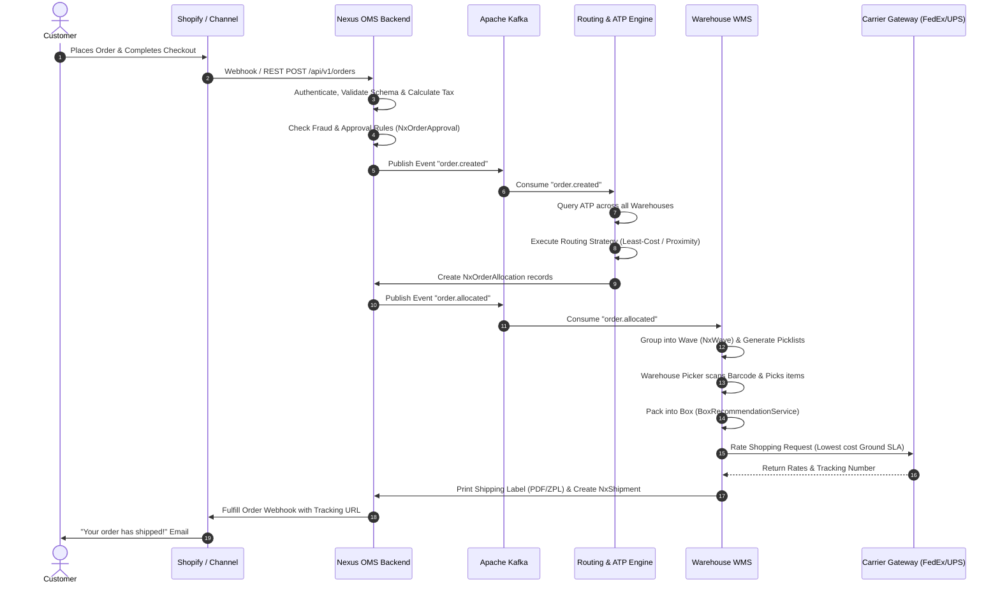

# Nexus OMS & Supply Chain Platform — Master Developer Onboarding & System Guide

> **Target Audience**: New Software Engineers, Interns, and Junior Developers (e.g., 3rd-year Computer Science students with basic Java knowledge).  
> **Goal**: Provide a complete, crystal-clear conceptual foundation of Supply Chain Management (SCM), explain how Nexus OMS works from the inside out, and empower you to write and ship production code immediately.

---

## Table of Contents
1. [Supply Chain Management & OMS Fundamentals 101](#1-supply-chain-management--oms-fundamentals-101)
   - [What is an Order Management System (OMS)?](#what-is-an-order-management-system-oms)
   - [The Enterprise Software Landscape: OMS vs WMS vs TMS vs ERP vs POS](#the-enterprise-software-landscape)
   - [Core Supply Chain Concepts You Must Know](#core-supply-chain-concepts-you-must-know)
2. [Nexus Technology Stack & Architecture Deep-Dive](#2-nexus-technology-stack--architecture-deep-dive)
   - [Backend: Java 17 & Spring Boot 3](#backend-java-17--spring-boot-3)
   - [Database: PostgreSQL 16 & pgvector](#database-postgresql-16--pgvector)
   - [Cache & High-Speed State: Redis 7](#cache--high-speed-state-redis-7)
   - [Event-Driven Streaming: Apache Kafka](#event-driven-streaming-apache-kafka)
   - [Frontend: React 19, Vite, TypeScript & Tailwind CSS](#frontend-react-19-vite-typescript--tailwind-css)
   - [AI & Intelligence Layer: Python, ONNX & MCP](#ai--intelligence-layer-python-onnx--mcp)
3. [End-to-End System & Business Flows](#3-end-to-end-system--business-flows)
   - [Order Ingestion & Channel Normalization](#step-1-order-ingestion--channel-normalization)
   - [Validation, Fraud Check & Approvals](#step-2-validation-fraud-check--approvals)
   - [Distributed Order Management (DOM) & AI Routing](#step-3-distributed-order-management-dom--ai-routing)
   - [Warehouse Fulfillment (Waves, Picking, Packing)](#step-4-warehouse-fulfillment-waves-picking-packing)
   - [Carrier Rate Shopping, Label Printing & Manifesting](#step-5-carrier-rate-shopping-label-printing--manifesting)
   - [BOPIS & Endless Aisle Flow](#step-6-bopis--endless-aisle-flow)
   - [Inbound Logistics: Purchase Orders, ASNs & Slotting](#step-7-inbound-logistics-purchase-orders-asns--slotting)
   - [Reverse Logistics: Returns (RMA) & Financial Reconciliation](#step-8-reverse-logistics-returns-rma--financial-reconciliation)
   - [3PL Multi-Client Billing](#step-9-3pl-multi-client-billing)
4. [Backend Codebase Tour & Key Class Map](#4-backend-codebase-tour--key-class-map)
5. [Frontend Application Architecture](#5-frontend-application-architecture)
6. [Local Development & First Contribution Quickstart](#6-local-development--first-contribution-quickstart)

---

## 1. Supply Chain Management & OMS Fundamentals 101

### What is an Order Management System (OMS)?
Imagine ordering a pair of shoes online from your phone. You see the product, enter your address, pay, and get a tracking link. What happens behind the scenes?

A modern retailer might have:
- **5 Selling Channels**: Shopify website, Amazon Store, Walmart Marketplace, physical retail stores, and wholesale B2B portals.
- **10 Fulfillment Locations**: 3 mega-warehouses, 50 retail store backrooms, and 2 third-party logistics (3PL) partners.
- **6 Shipping Carriers**: FedEx, UPS, USPS, DHL, BlueDart, and local couriers.

Without a central "brain", these systems cannot communicate. A warehouse in California might ship an order to New York while a New Jersey warehouse had the exact same shoes 5 miles away. 

**Nexus OMS is that central brain.** It sits between customer-facing storefronts and physical fulfillment centers, coordinating every single step from order creation to delivery.

```
┌─────────────────────────────────────────────────────────────────────────────────┐
│                           OMNICHANNEL STOREFRONTS                               │
│        Shopify  ·  Amazon  ·  Walmart  ·  EDI 850 PO  ·  CSV Imports            │
└────────────────────────────────────────┬────────────────────────────────────────┘
                                         │ Webhooks / REST / S3
                                         ▼
┌─────────────────────────────────────────────────────────────────────────────────┐
│                                   NEXUS OMS                                     │
│  • Available-to-Promise (ATP) Inventory    • Distributed Order Management (DOM) │
│  • Fraud & Approval Rules                  • Least-Cost Carrier Rate Shopping   │
│  • Returns & Refund Financial Settlement   • 3PL Multi-Client Billing           │
└────────────────────────────────────────┬────────────────────────────────────────┘
                                         │ Kafka / REST / WebSockets
                                         ▼
┌─────────────────────────────────────────────────────────────────────────────────┐
│                              PHYSICAL FULFILLMENT                               │
│      Warehouse WMS (Waves/Picks)  ·  Store BOPIS  ·  Dock & Yard Trailers       │
└─────────────────────────────────────────────────────────────────────────────────┘
```

---

### The Enterprise Software Landscape

| System | Name | Primary Focus | Analogy |
|---|---|---|---|
| **OMS** | Order Management System *(Nexus)* | **Routing & Coordination**: Where should each order be fulfilled from? What is the cheapest shipping carrier? | The Air Traffic Controller |
| **WMS** | Warehouse Management System | **Physical Execution**: Which aisle, rack, and bin is an item located in? Who will walk and pick it? | The Warehouse Floor Supervisor |
| **TMS** | Transportation Management System | **Freight & Transit**: Which trailer truck carries 50 pallets from Dallas to Chicago? | The Fleet Dispatcher |
| **ERP** | Enterprise Resource Planning *(SAP/NetSuite)* | **General Ledger & Accounting**: Company balance sheets, tax filings, payroll, and asset valuation. | The Chief Financial Officer |
| **POS** | Point of Sale | **In-Store Checkout**: The barcode scanner and credit card swipe machine at the retail store counter. | The Cashier Register |

---

### Core Supply Chain Concepts You Must Know

#### 1. Available to Promise (ATP)
Never sell what you don't have.
- **On-Hand Inventory**: Physical units sitting in the warehouse ($100$ shirts).
- **Allocated Inventory**: Units committed to orders currently being picked ($30$ shirts).
- **Reserved / Safety Stock**: Buffer stock set aside for VIPs or damage protection ($10$ shirts).
- $$\text{ATP} = \text{On-Hand} - \text{Allocated} - \text{Reserved} - \text{Safety Stock}$$
- In this example: $\text{ATP} = 100 - 30 - 10 = 60 \text{ shirts available to sell}$.

#### 2. Distributed Order Management (DOM)
When an order arrives, DOM calculates the optimal fulfillment location based on:
1. **Proximity**: How close is the warehouse to the customer? (Fewer shipping zones = cheaper shipping).
2. **Stock Availability**: Can one warehouse fulfill the entire order, or must it be split into two packages? (Splits increase packaging and shipping costs).
3. **Warehouse Workload**: Is Warehouse A overwhelmed with a 4-hour backlog while Warehouse B has idle staff?

#### 3. Wave Planning & Batch Picking
In a warehouse with 50,000 square meters of floor space, walking back and forth for every individual order causes extreme fatigue and inefficiency.
- **Wave**: Grouping 50 similar orders together.
- **Batch Picking**: A picker walks down Aisle 3 once and picks 12 blue shirts into a multi-tote cart, fulfilling 12 different orders in a single trip.

#### 4. BOPIS (Buy Online, Pick Up In Store)
The customer orders online and selects "Pick up at Store #14". The OMS sends a pick task directly to the store associates' mobile RF device. When picked, the customer receives an SMS with a pickup QR code.

#### 5. Inbound Logistics: ASN & Putaway
- **PO (Purchase Order)**: A commercial contract sent to a manufacturer ordering 1,000 units of an item.
- **ASN (Advance Shipping Notice)**: Electronic notification from the manufacturer when goods are shipped, listing pallet barcodes and quantities.
- **Putaway**: Slotting algorithm that calculates where to store incoming inventory (e.g., fast-moving items placed near packing stations, heavy items on bottom racks).

---

## 2. Nexus Technology Stack & Architecture Deep-Dive

```
┌────────────────────────────────────────────────────────────────────────────────┐
│                             REACT 19 FRONTEND (Vite)                           │
│     89 Custom Pages · Tailwind CSS · TanStack Query · WebSocket Live Feeds     │
└───────────────────────────────────────┬────────────────────────────────────────┘
                                        │ HTTPS / WSS (Port 8080)
                                        ▼
┌────────────────────────────────────────────────────────────────────────────────┐
│                        SPRING BOOT 3 (JAVA 17) BACKEND                         │
│  74 REST Controllers  ·  111 Business Services  ·  157 Hibernate Entities      │
├───────────────────────┬────────────────────────┬───────────────────────────────┤
│ PostgreSQL 16 DB      │ Redis 7 Cache          │ Apache Kafka Event Bus        │
│ • Multi-tenant RLS    │ • Distributed Rate-Lim │ • order.created               │
│ • pgvector Embeddings │ • ATP Snapshot Caching │ • order.allocated             │
│ • JSONB Payloads      │ • Session Token Stores │ • order.shipped               │
└───────────────────────┴────────────────────────┴───────────────────────────────┘
```

### Backend: Java 17 & Spring Boot 3
- **Why Java 17?**: Enterprise-grade stability, strongly-typed domain model, modern language features (Pattern Matching, Records, sealed classes, fast Garbage Collection).
- **Spring Boot 3**: High performance, native integration with JPA, built-in validation, declarative transactions (`@Transactional`), and Spring Security 6.
- **Code Directory**: `nexus-oms-backend/src/main/java/com/nexus/oms/`

### Database: PostgreSQL 16 & pgvector
- **Relational Integrity**: Strict foreign key logic across orders, allocations, inventory, and accounting.
- **Row-Level Security (RLS)**: Enforces tenant isolation at the database level (`SET app.current_tenant_id = 'tenant_123'`).
- **pgvector**: Stores high-dimensional vector embeddings (`vector(1536)`) for AI semantic search across documentation, catalog items, and error logs.

### Cache: Redis 7
- Used in `RateCacheService.java` to cache carrier shipping rates (preventing redundant external API charges).
- Stores short-lived ATP calculation locks and user authentication session tokens.

### Event Bus: Apache Kafka
- Decouples high-volume storefront ingestion from downstream warehouse processing.
- Topics include: `order.created`, `order.confirmed`, `order.allocated`, `order.shipped`, and `order.delivered`.

### Frontend: React 19, Vite, TypeScript & Tailwind CSS
- **React 19 & TypeScript**: Provides strict client-side type checking matching backend DTO contracts.
- **Vite**: Ultra-fast build and Hot Module Replacement (HMR).
- **Tailwind CSS**: Custom modern UI styling with responsive layouts, dark mode, and glassmorphism.
- **Mobile RF PWA**: Offline-first warehouse scanning interface (`src/rf`) supporting camera and hardware laser barcode scanners.

---

## 3. End-to-End System & Business Flows

### Comprehensive Order Lifecycle Sequence



---

## 4. Backend Codebase Tour & Key Class Map

### Essential Backend Directories & Responsibilities

| Package Path | Purpose | Key Classes to Inspect |
|---|---|---|
| `com.nexus.oms.controller` | REST API endpoints receiving HTTP requests from frontend & webhooks. | [OrderController.java](file:///Users/mayanksharma/Desktop/nexus/nexus-oms-backend/src/main/java/com/nexus/oms/controller/OrderController.java), [InventoryController.java](file:///Users/mayanksharma/Desktop/nexus/nexus-oms-backend/src/main/java/com/nexus/oms/controller/InventoryController.java) |
| `com.nexus.oms.service` | Core business logic, orchestration, and algorithms. | [OrderService.java](file:///Users/mayanksharma/Desktop/nexus/nexus-oms-backend/src/main/java/com/nexus/oms/service/OrderService.java), [OrderRoutingService.java](file:///Users/mayanksharma/Desktop/nexus/nexus-oms-backend/src/main/java/com/nexus/oms/service/OrderRoutingService.java), [ATPCalculationEngine.java](file:///Users/mayanksharma/Desktop/nexus/nexus-oms-backend/src/main/java/com/nexus/oms/service/ATPCalculationEngine.java) |
| `com.nexus.oms.entity` | JPA Database entities mapping to PostgreSQL tables. | `NxOrder.java`, `NxInventory.java`, `NxShipment.java`, `NxReturn.java` |
| `com.nexus.oms.repository` | Spring Data JPA database query interfaces. | `OrderRepository.java`, `InventoryRepository.java` |
| `com.nexus.oms.security` | JWT token authentication, user claims, and tenant context. | `JwtAuthenticationFilter.java`, `TenantContext.java` |
| `com.nexus.oms.kafka` | Kafka topic producers and consumer listeners. | `OrderEventProducer.java`, `OrderEventConsumer.java` |
| `com.nexus.oms.service.ai` | AI forecasting, model inference, and RAG search. | `AiInferenceService.java`, `DemandForecastService.java` |

---

## 5. Frontend Application Architecture

The frontend is located in `/Users/mayanksharma/Desktop/nexus/nexus-oms-frontend`.

```
nexus-oms-frontend/src/
├── api/             # Typed API clients communicating with backend endpoints
├── components/      # Reusable UI widgets (Tables, Modals, Badges, Charts)
├── context/         # React Context for Auth, Tenant & Notification state
├── hooks/           # Custom React hooks (useOrders, useInventory, useWebSocket)
├── pages/           # 89 Domain Pages (OrdersPage, WavePlanningPage, YardDockPage)
├── rf/              # Mobile Barcode Scanner Progressive Web App (PWA)
└── styles/          # Tailwind styling tokens and CSS classes
```

---

## 6. Local Development & First Contribution Quickstart

### Step 1: Start Docker Infrastructure
```bash
docker compose up -d postgres redis kafka
```

### Step 2: Build & Start Backend
```bash
cd nexus-oms-backend
./mvnw clean spring-boot:run
```
*Backend starts on `http://localhost:8080/api/v1`.*

### Step 3: Start Frontend Dev Server
```bash
cd nexus-oms-frontend
npm install
npm run dev
```
*Frontend interface opens on `http://localhost:5173`.*

### Running Automated Test Suite
- **Backend Unit & Integration Tests**:
  ```bash
  cd nexus-oms-backend
  ./mvnw test
  ```
- **Frontend Unit Tests & Type Check**:
  ```bash
  cd nexus-oms-frontend
  npm run test
  npx tsc --noEmit
  ```

---

### Junior Developer Tips for Writing Code in Nexus
1. **Always Respect Multi-Tenancy**: When writing JPA queries, ensure queries filter by `TenantContext.getCurrentTenantId()` unless accessing global reference tables.
2. **Use `@Transactional` on Modifying Services**: If you modify multiple tables (e.g., creating an order and reducing inventory), ensure the method has `@Transactional` so that any failure automatically rolls back the database.
3. **Never Log Sensitive Data**: Avoid logging customer credit cards, passwords, or raw auth headers.
4. **Follow DTO Contracts**: Never return raw JPA entities directly from REST controllers; always map them to typed DTOs.
