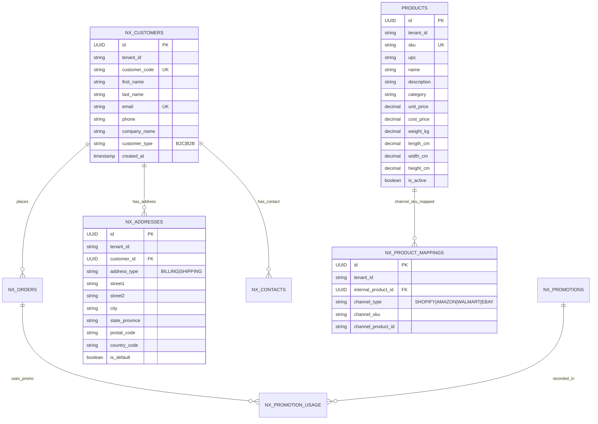
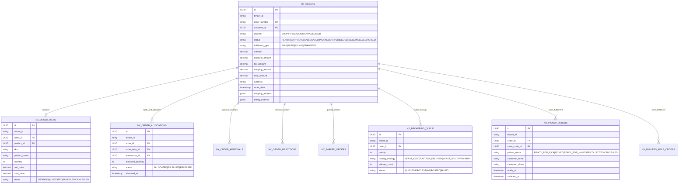
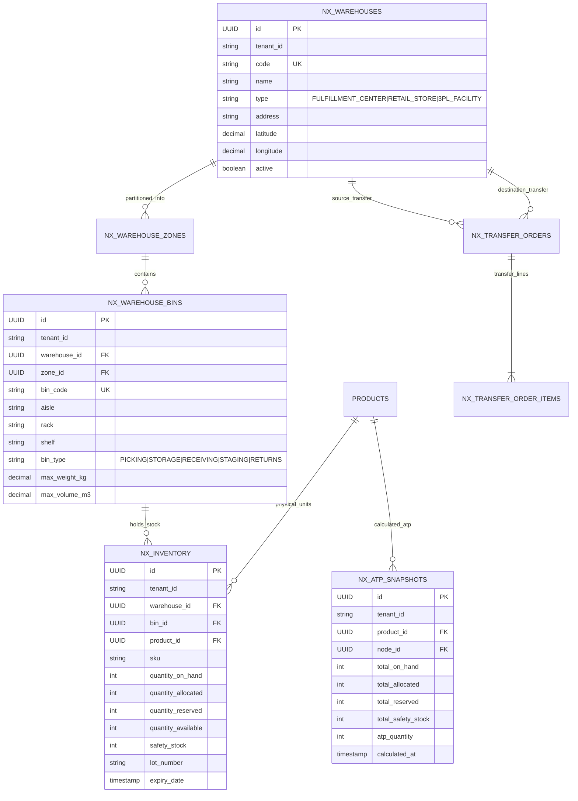
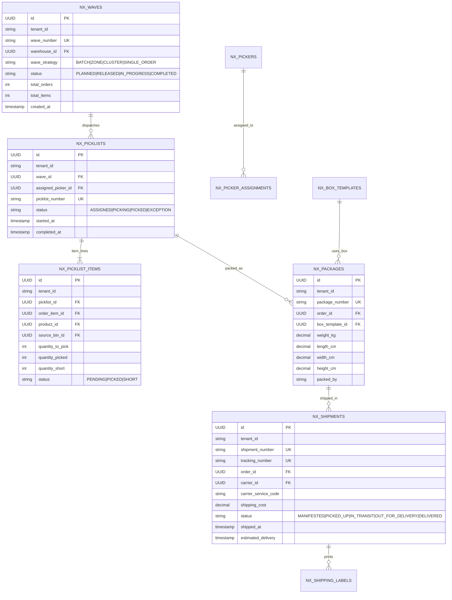
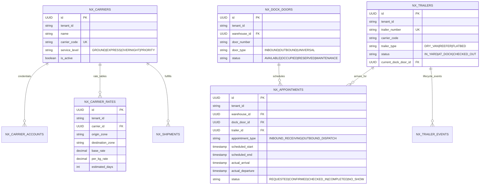
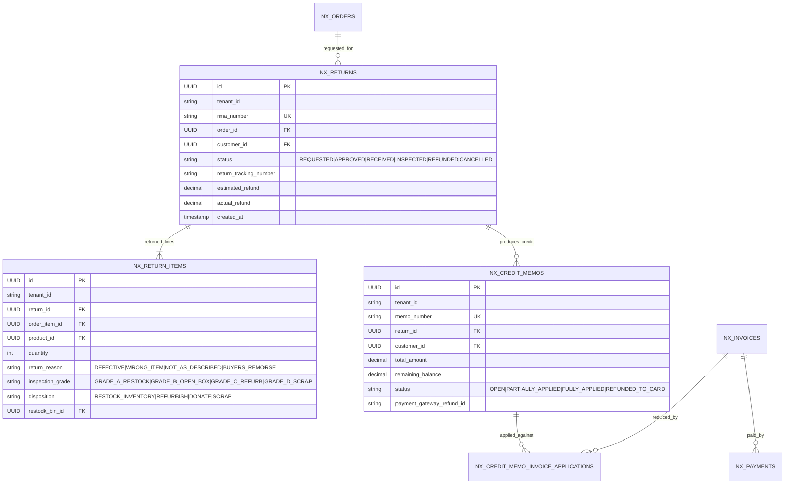
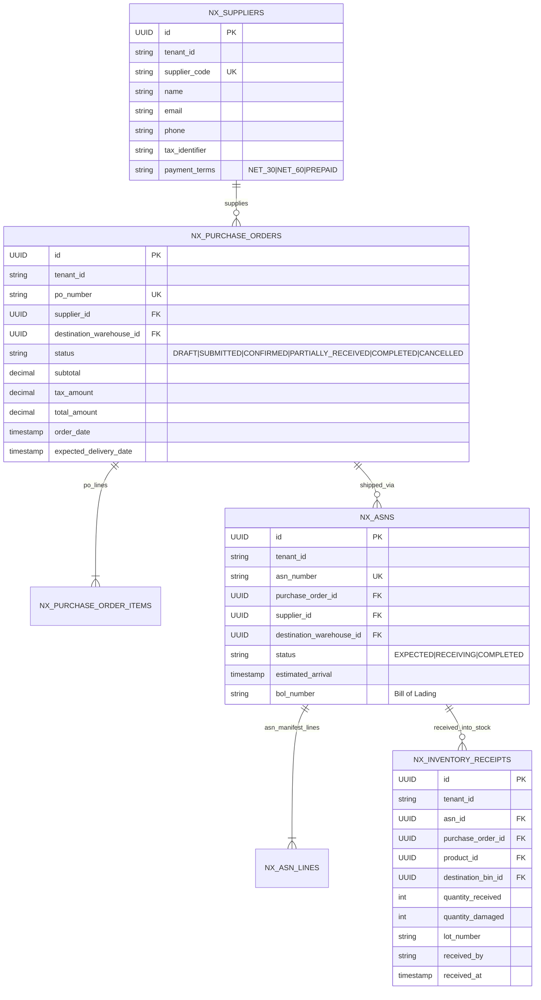
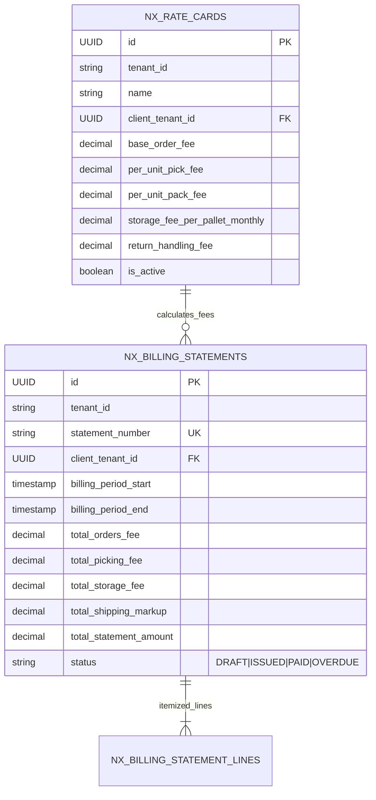
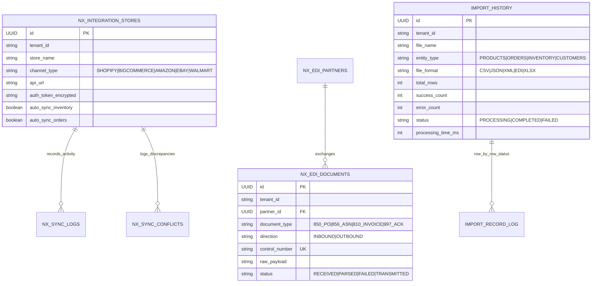
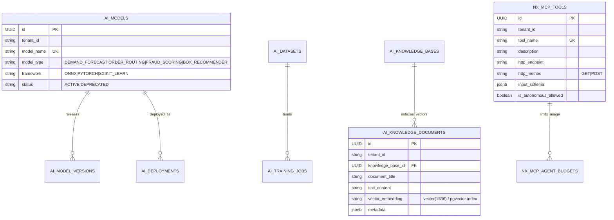

# Nexus OMS & Supply Chain Platform — Master Data Model & ERD Reference

> **The Definitive Data Architecture & Entity Relationship Catalog for Nexus OMS.**  
> Covers all database tables, logical foreign keys, primary keys, schemas, and Mermaid diagrams across all business subsystems.

---

## Table of Contents
1. [Architecture & Database Overview](#1-architecture--database-overview)
2. [Domain Subsystem Architecture](#2-domain-subsystem-architecture)
3. [Subsystem 1: Core Commerce, Customers & Catalog](#3-subsystem-1-core-commerce-customers--catalog)
4. [Subsystem 2: Orders, Brokering & Routing (DOM)](#4-subsystem-2-orders-brokering--routing-dom)
5. [Subsystem 3: Inventory, ATP & Warehouse Network](#5-subsystem-3-inventory-atp--warehouse-network)
6. [Subsystem 4: Fulfillment, WMS, Waves, Picking & Packing](#6-subsystem-4-fulfillment-wms-waves-picking--packing)
7. [Subsystem 5: Carriers, Rate Shopping, Shipping & Yard Management](#7-subsystem-5-carriers-rate-shopping-shipping--yard-management)
8. [Subsystem 6: Reverse Logistics (Returns & RMA) & Financial Reconciliation](#8-subsystem-6-reverse-logistics-returns--rma--financial-reconciliation)
9. [Subsystem 7: Procurement, Suppliers & Inbound ASN](#9-subsystem-7-procurement-suppliers--inbound-asn)
10. [Subsystem 8: 3PL Multi-Client Billing & Rate Cards](#10-subsystem-8-3pl-multi-client-billing--rate-cards)
11. [Subsystem 9: Integration Hub, Marketplaces, EDI & File Ingestion](#11-subsystem-9-integration-hub-marketplaces-edi--file-ingestion)
12. [Subsystem 10: AI Platform, Vector Search & MCP Infrastructure](#12-subsystem-10-ai-platform-vector-search--mcp-infrastructure)

---

## 1. Architecture & Database Overview

The Nexus platform uses **PostgreSQL 16** with the following core architectural standards:
- **Primary Keys**: `UUID` across all tables, generated via Hibernate `GenerationType.UUID` or Postgres `gen_random_uuid()`.
- **Multi-Tenancy Isolation**: Every tenant-scoped entity carries a `tenant_id` (`varchar(64)` or `UUID`), enforced via Spring Security tenant context filters and PostgreSQL Row-Level Security (RLS) policies.
- **Audit Columns**: Standard audit columns `created_at` (`timestamp with time zone`), `updated_at`, and `created_by` / `updated_by`.
- **Flexible Payloads**: Structured business data resides in strict columns; flexible configurations and raw partner payloads utilize PostgreSQL `jsonb` columns.
- **AI Vector Search**: Embeddings stored using the `pgvector` extension (`vector(1536)` / `vector(768)`).

---

## 2. Domain Subsystem Architecture

```
┌────────────────────────────────────────────────────────────────────────────────────────┐
│                                 NEXUS DATA ARCHITECTURE                                │
├─────────────────────────┬───────────────────────────────┬──────────────────────────────┤
│ 🛒 Commerce & Orders    │ 📦 Inventory, Nodes & ATP     │ 🚚 WMS, Waves & Fulfillment  │
│ • nx_customers          │ • nx_inventory                │ • nx_waves                   │
│ • nx_orders             │ • nx_warehouses               │ • nx_picklists & items       │
│ • nx_order_items        │ • nx_warehouse_bins           │ • nx_packages                │
│ • nx_order_allocations  │ • nx_atp_snapshots            │ • nx_shipments               │
│ • nx_pickup_orders      │ • nx_transfer_orders          │ • nx_shipping_labels         │
├─────────────────────────┼───────────────────────────────┼──────────────────────────────┤
│ 🚢 Carriers & Yard      │ 🔄 Returns & Finance          │ 🔌 Hub, EDI & AI Platform    │
│ • nx_carriers & rates   │ • nx_returns & items          │ • nx_integration_stores      │
│ • nx_dock_doors         │ • nx_invoices & payments      │ • nx_edi_documents           │
│ • nx_appointments       │ • nx_credit_memos             │ • ai_models & deployments    │
│ • nx_trailers & events  │ • nx_billing_statements (3PL) │ • nx_mcp_tools               │
└─────────────────────────┴───────────────────────────────┴──────────────────────────────┘
```

---

## 3. Subsystem 1: Core Commerce, Customers & Catalog

### Mermaid ER Diagram



---

## 4. Subsystem 2: Orders, Brokering & Routing (DOM)

### Mermaid ER Diagram



---

## 5. Subsystem 3: Inventory, ATP & Warehouse Network

### Mermaid ER Diagram



---

## 6. Subsystem 4: Fulfillment, WMS, Waves, Picking & Packing

### Mermaid ER Diagram



---

## 7. Subsystem 5: Carriers, Rate Shopping, Shipping & Yard Management

### Mermaid ER Diagram



---

## 8. Subsystem 6: Reverse Logistics (Returns & RMA) & Financial Reconciliation

### Mermaid ER Diagram



---

## 9. Subsystem 7: Procurement, Suppliers & Inbound ASN

### Mermaid ER Diagram



---

## 10. Subsystem 8: 3PL Multi-Client Billing & Rate Cards

### Mermaid ER Diagram



---

## 11. Subsystem 9: Integration Hub, Marketplaces, EDI & File Ingestion

### Mermaid ER Diagram



---

## 12. Subsystem 10: AI Platform, Vector Search & MCP Infrastructure

### Mermaid ER Diagram


