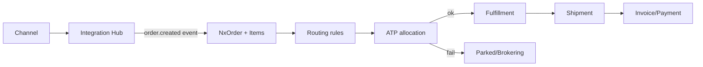
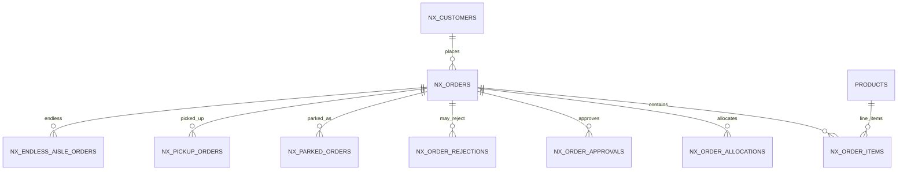

# Feature: Order Management & Omnichannel

> Part of the Nexus OMS documentation set. See [index](../README.md).

## Overview
Single order backbone for every selling surface: Shopify, BigCommerce, Amazon, eBay, Walmart, Magento, manual entry, email, bulk import and BOPIS/endless-aisle. Every order flows through the same pipeline: **intake → normalize → validate → route → allocate → fulfill → settle**.

## Business process
1. Order arrives (webhook/poll/import/email/manual).
2. Normalized to `NxOrder` + `NxOrderItem` (dedup by `channel_order_id`).
3. Routing rules choose fulfillment path (ship-from / store / pickup).
4. ATP check allocates stock or parks/brokers the order.
5. Fulfillment consumes the allocation; status/sub-status advances.
6. Payments/invoices settle; analytics captured.

## Use cases
- **UC-01** Place order via channel connector
- **UC-02** Manual order entry
- **UC-03** Bulk import orders (signed token)
- **UC-04** Email order ingestion & review
- **UC-05** Park/broker unfulfillable orders
- **UC-16** BOPIS pickup order
- **UC-31** EDI order intake (850)

## Data flow

## Key entities (ER subset)

Tables: `nx_orders` · `nx_order_items` · `nx_order_allocations` · `nx_order_approvals` · `nx_order_rejections` · `nx_rejection_reasons` · `nx_parked_orders` · `nx_brokering_queue` · `nx_brokering_runs` · `nx_pickup_orders` · `nx_pickup_order_items` · `nx_endless_aisle_orders` · `nx_routing_config` · `nx_routing_rules` · `nx_routing_log` · `nx_customers` · `nx_addresses`

## Who can access what
| Stage | Roles |
|---|---|
| Order view | OPS_MANAGER, CUSTOMER_SUPPORT, STORE_MANAGER, BOPIS_OWNER, CEO, VIEWER |
| Create/edit orders | OPS_MANAGER, CUSTOMER_SUPPORT, STORE_MANAGER, BOPIS_OWNER |
| Routing rules | OPS_MANAGER (full), LOGISTICS_MANAGER (edit) |
| Parked/brokering queue | OPS_MANAGER, LOGISTICS_MANAGER |
| BOPIS/endless aisle | STORE_MANAGER, BOPIS_OWNER (full) |
| Order import | OPS_MANAGER (full); WAREHOUSE/PROCUREMENT/FINANCE/LOGISTICS (scoped create) |

## State machine (status → sub-status)
`NEW → ROUTED → ALLOCATED → WAVE → PICK → PACK → SHIPPED → DELIVERED` with `PARKED`, `APPROVAL`, `REJECTED`, `CANCELLED` exception paths.
