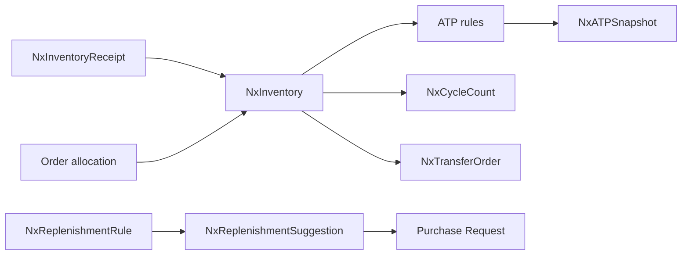
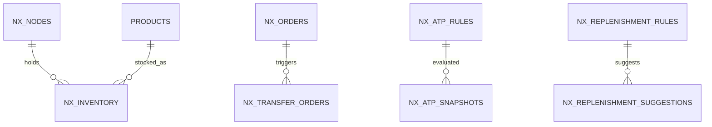

# Feature: Inventory & Available-to-Promise (ATP)

> Part of the Nexus OMS documentation set. See [index](../README.md).

## Start here 📦

**Inventory** is *how many of something you have, and where*. Nexus thinks of your whole network — warehouses AND stores — as "nodes" that hold stock. The star of the show is **ATP (Available-to-Promise)**: *"can you honestly promise me this item by Friday?"*

> 🛍️ **Real life example — the "sold out" lie:**
> A customer on your website sees "Only 3 left — in stock!" But 2 of those are already reserved for other people, and 1 is sitting in a store across town. The web page would be *lying*. Nexus answers with **ATP = on-hand − already-reserved**, so the promise is always honest.

## Overview
Multi-node inventory model (warehouses + stores as nodes) with real-time on-hand, reservations, cycle counts, transfers and **Available-to-Promise** evaluation. Powers promises for orders, BOPIS, endless aisle and replenishment.

## Business process
1. Inventory events update `NxInventory` (receipts, adjustments, transfers, sales allocations).
2. ATP rules evaluate on-hand − reserved across nodes → `NxATPSnapshot`.
3. Orders consume reservations; exceptions surface when promise cannot be met.
4. Replenishment rules generate suggestions; cycle counts correct drift.

## Use cases
- **UC-06** Receive inventory (PO/transfer) → `NxInventoryReceipt`
- **UC-07** ATP check → promise dates
- **UC-08** Cycle count & variance adjustment
- **UC-09** Transfer stock node↔node/store
- **UC-10** Replenishment suggestions

> 🔄 **Real life — the store borrows a hoodie:** Store A runs out of size M. Nexus shows Store B has 3. A transfer order moves one from B to A; ATP updates instantly. The store shelf is honest again.

## Data flow

## Key entities (ER subset)

Tables: `nx_inventory` · `nx_inventory_receipts` · `nx_nodes` · `nx_atp_rules` · `nx_atp_snapshots` · `nx_cycle_counts` · `nx_transfer_orders` · `nx_transfer_order_items` · `nx_replenishment_rules` · `nx_replenishment_suggestions`

## Who can access what
| Stage | Roles |
|---|---|
| Inventory/ATP view | OPS_MANAGER, WAREHOUSE_MANAGER, STORE_MANAGER, BOPIS_OWNER, VIEWER |
| Receiving | WAREHOUSE_MANAGER (full) |
| Cycle counts | WAREHOUSE_MANAGER (full) |
| Transfers | WAREHOUSE_MANAGER, STORE_MANAGER (full) |
| Replenishment approval | PROCUREMENT_MANAGER, WAREHOUSE_MANAGER |
| Inventory import | WAREHOUSE_MANAGER (create) |

## Integrity notes
- Every quantity change is traceable (receipts, counts, adjustments, allocations) — a full "stock diary."
- ATP snapshots give a timestamped promise baseline for audits.

> 🧒 **Kid translation of the stock diary:** Every time the fridge count changes — a box arrives, someone buys milk, a count says "we thought 3, it's actually 2" — the diary page gets a timestamp. No silent changes.
