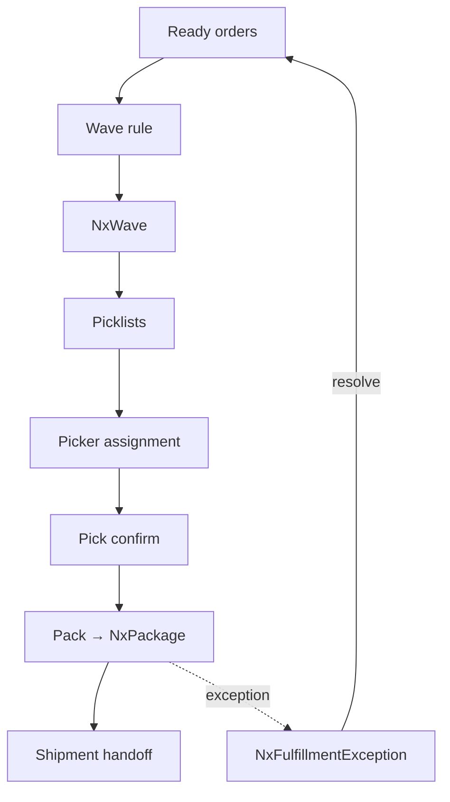
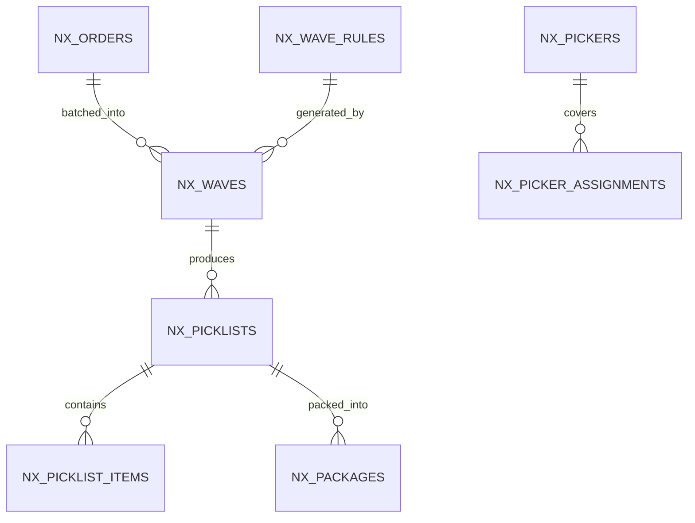

# Feature: Fulfillment — Wave, Pick, Pack, Ship

> Part of the Nexus OMS documentation set. See [index](../README.md).

## Start here 🏭

**Fulfillment** is *the trip your order takes through the warehouse*: it's batched into a wave, picked from shelves, packed into a box, and handed to a carrier. Imagine a busy kitchen cooking for a whole school: you don't make one lunch at a time — you **wave**-cook (batch) so you can move fast.

> 🏭 **Real life example — warehouse morning:**
> - **6:30 am** — Nexus groups 200 orders by aisle → one wave.
> - **7:00** — Pickers get picklists; each walks an aisle *once*.
> - **9:30** — Packers box everything.
> - One box was short — the **exception** path flags it at 9:35, a manager fixes it by 10:00. Nothing gets stuck silently.

## Overview
The execution engine between "order ready" and "out the door": wave planning, picklists, picker assignment, packing, boxing, and handoff to shipping. Driven by `NxWaveRule` strategies and monitored via capacity limits and exception handling.

## Business process
1. Ready orders are grouped into a `NxWave` by strategy (FIFO, priority, ship-by, zone).
2. Wave generates `NxPicklist` + `NxPicklistItem`; pickers assigned.
3. Pick confirm → stage → `NxPackage` (box, weight, dims).
4. Exceptions (`NxFulfillmentException`) re-route or replace lines.
5. Package handoff → shipment + label (see Shipping feature).

## Use cases
- **UC-11** Wave planning
- **UC-12** Pick items
- **UC-13** Pack orders
- **UC-14** Load & ship
- **UC-15** Fulfillment exception handling

## Data flow

## Key entities (ER subset)

Tables: `nx_waves` · `nx_wave_rules` · `nx_picklists` · `nx_picklist_items` · `nx_pickers` · `nx_picker_assignments` · `nx_packages` · `nx_fulfillment_exceptions` · `nx_fulfillment_limits` · `nx_fulfillment_capacity_log`

## Who can access what
| Stage | Roles |
|---|---|
| Wave planning | OPS_MANAGER, WAREHOUSE_MANAGER (full), LOGISTICS_MANAGER (edit) |
| Picklists (manage) | OPS_MANAGER, WAREHOUSE_MANAGER (full) |
| Picking (execute) | PICKER (view/create/edit on picking) |
| Packing (execute) | PACKER (view/create/edit on packing) |
| Shipments (view) | OPS_MANAGER, WAREHOUSE_MANAGER, LOGISTICS_MANAGER, LOADER, CUSTOMER_SUPPORT, VIEWER |
| Exceptions | WAREHOUSE_MANAGER, OPS_MANAGER (edit) |
| Capacity limits | OPS_MANAGER (full) |

## Operational notes
- Wave rules are configurable (no code change) per tenant — change the rule, not the code.
- Capacity limits + logs prevent oversubscribed waves (no 10,000-item wave for 2 pickers).
- Exception resolution can reallocate, replace, or cancel a line — always audited.

> 🧒 **Kid translation of exceptions:** If the shelf promised 10 hoodies but only 9 are there, the "problem bin" lights up: *Hoodie #7 — missing 1.* A manager decides: grab another from store, or cancel that line with a note. Every decision is written in the logbook.
