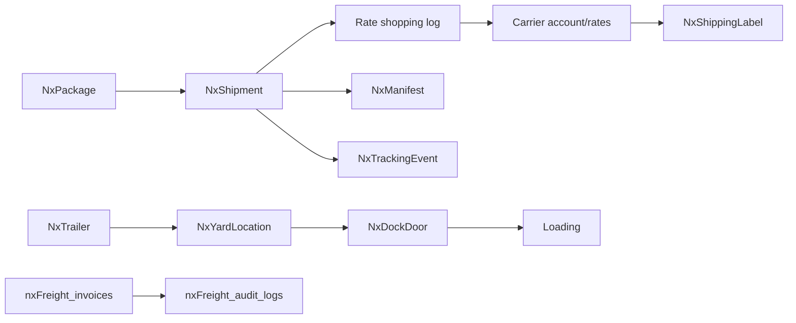
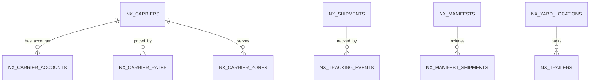

# Feature: Shipping, Carriers & Yard

> Part of the Nexus OMS documentation set. See [index](../README.md).

## Start here 🚚

**Shipping** is *getting the box to the customer*. Nexus plays the role of a picky travel agent for every package: it compares carrier prices and speeds, picks the best deal, prints a label, and tracks the journey — right down to the trailer parked in your yard.

> 🚚 **Real life example — the box's road trip:**
> The packed hoodie box needs to reach Mia in 3 days. Nexus checks: FedEx $9 (2 days) · UPS $12 (1 day) · USPS $6 (4 days). It picks FedEx, prints the label, and the trailer it's loaded on gets a yard spot + dock door. Mia gets a tracking number.

## Overview
Carrier management (accounts, rates, zones), deterministic rate shopping, labels, manifests, tracking, trailer/yard visibility, dock doors and freight invoice auditing. Handles both parcel and freight flows.

## Business process
1. Packaged orders → `NxShipment`; rate shopping compares `NxCarrierRate` across accounts/zones.
2. Best/guaranteed carrier selected; `NxShippingLabel` generated; manifest created.
3. Tracking events (`NxTrackingEvent`) feed status; POD captured.
4. Trailers checked into yard (`NxYardLocation`), dock assigned (`NxDockDoor`), events logged.
5. Carrier invoices (`nxFreight_invoices`) audited against rate card; overcharges flagged.

## Use cases
- **UC-14** Load & ship
- **UC-17** Rate shopping
- **UC-18** Trailer/yard visibility
- **UC-19** Appointment scheduling
- **UC-20** Freight audit

> 💰 **Real life — the inflated bill:** A carrier sends a $1,200 freight invoice. The rate card says this route should be $980. Nexus flags the **$220 overcharge** for the finance team. Nobody pays by accident.

## Data flow

## Key entities (ER subset)

Tables: `nx_carriers` · `nx_carrier_accounts` · `nx_carrier_rates` · `nx_carrier_zones` · `nx_rate_shopping_log` · `nx_shipments` · `nx_shipping_labels` · `nx_manifests` · `nx_manifest_shipments` · `nx_tracking_events` · `nx_proof_of_delivery` · `nx_trailers` · `nx_trailer_events` · `nx_yard_locations` · `nx_dock_doors` · `nx_appointments` · `nxFreight_invoices` · `nxFreight_invoice_lines` · `nxFreight_audit_logs`

## Who can access what
| Stage | Roles |
|---|---|
| Carrier accounts/rates/zones | LOGISTICS_MANAGER (full), OPS_MANAGER (edit) |
| Rate shopping | LOGISTICS_MANAGER (full), OPS_MANAGER (view) |
| Shipments (view) | OPS_MANAGER, WAREHOUSE_MANAGER, LOGISTICS_MANAGER, LOADER, CUSTOMER_SUPPORT, VIEWER |
| Loading | LOADER (create/edit), LOGISTICS_MANAGER (full) |
| Trailers/yard/dock | LOGISTICS_MANAGER (full), LOADER (edit) |
| Freight audit | FINANCE (create/edit), LOGISTICS_MANAGER (view) |

## Integrity notes
- Rate shopping is **deterministic** — no hidden randomness in carrier selection (Phase 2.5).
- Freight audit pairs carrier invoices with the quoted rate card for overcharge detection.
- Trailer dwell is observable end-to-end from check-in to check-out.

> 🧒 **Kid translation of deterministic:** The carrier choice is not a coin toss — the same package on the same day always picks the same best carrier. No surprises, no "why did it pick that one?"
