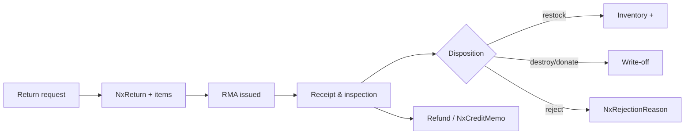
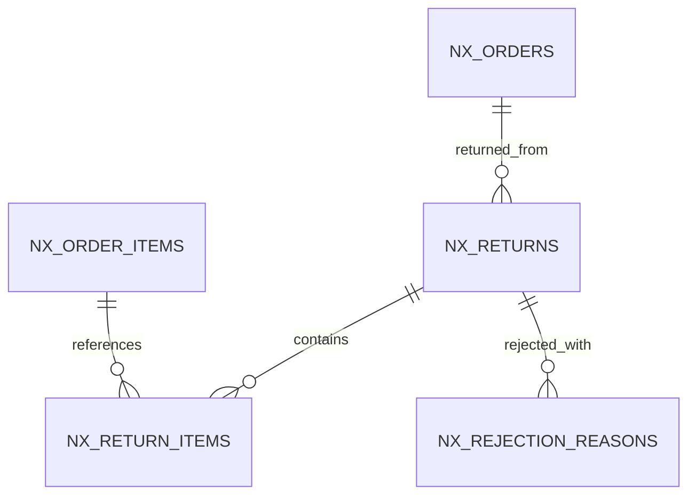

# Feature: Returns & Refunds (RMA)

> Part of the Nexus OMS documentation set. See [index](../README.md).

## Start here ↩️

**Returns** are *shopping in reverse*. Nexus walks every return through the same honest path: **request → RMA number → receive & inspect → decide what happens to it → refund or credit**. Nothing disappears, nothing is silently thrown away.

> 🎁 **Real life example — the stained hoodie:**
> Mia's hoodie doesn't fit → support creates a return → Mia gets **RMA #88** → warehouse receives it and inspects. The inspection finds a stain, so the disposition is **destroy** (not restock). Nexus posts a write-off and Finance issues a *partial* refund. Every step is recorded and visible.

## Overview
Reverse-logistics lifecycle: return request → authorization (RMA) → receipt & inspection → disposition → refund/credit. Every return is traceable to the originating order and line items.

## Business process
1. Customer/support creates `NxReturn` + `NxReturnItem` from an order.
2. RMA number issued; return authorized.
3. Warehouse receives and inspects; condition recorded.
4. Disposition chosen: restock / destroy / donate / reject.
5. Refund or credit memo posted by Finance; inventory or write-off updated.

## Use cases
- **UC-21** Create return request (support)
- **UC-22** Inspect & dispose (warehouse)
- Refund/credit memo (finance)

## Data flow

## Key entities (ER subset)

Tables: `nx_returns` · `nx_return_items` · `nx_rejection_reasons` · `nx_credit_memos`

## Who can access what
| Stage | Roles |
|---|---|
| Return requests | CUSTOMER_SUPPORT (create/edit), OPS_MANAGER (edit) |
| Inspection & disposition | WAREHOUSE_MANAGER, OPS_MANAGER |
| Refunds / credit memos | FINANCE (create/edit) |
| Return analytics | CEO, OPS_MANAGER |
| Return view | WAREHOUSE_MANAGER (shipments), STORE_MANAGER (full), FINANCE (edit) |

## Integrity notes
- Dispositions and rejection reasons are audited (no silent write-offs) — "throw it away" always needs a recorded reason.
- Refund amounts tie back to inspected return items (the refund math starts from what the inspector actually saw).

> 🧒 **Kid translation of the "no silent write-off" rule:** When a toy comes back and must be tossed, the logbook says WHY — "broken arm, can't resell." You can't make inventory vanish without a note.
