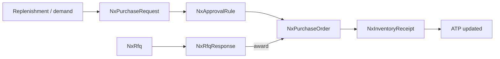
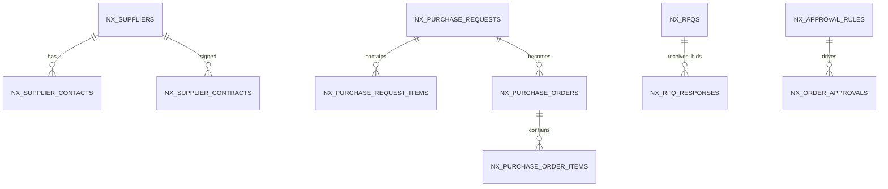

# Feature: Procurement & Supplier Management

> Part of the Nexus OMS documentation set. See [index](../README.md).

## Overview
Plan-to-pay sourcing: purchase requests, approval rules, RFQs, purchase orders, supplier master (contacts/contracts) and inbound receiving. Integrates with replenishment suggestions and receiving.

## Business process
1. Demand source (replenishment suggestion / manual / forecast) → `NxPurchaseRequest` + items.
2. `NxApprovalRule` gate → approved request.
3. Optionally run `NxRfq` + `NxRfqResponse` bidding to select supplier.
4. Convert to `NxPurchaseOrder` (+ items) against `NxSupplier`.
5. Receiving posts to inventory (see Inventory feature).

## Use cases
- **UC-23** Purchase request → approval → PO
- **UC-24** RFQ / bidding
- **UC-25** Supplier management
- **UC-10** Replenishment suggestion → procurement

## Data flow

## Key entities (ER subset)

Tables: `nx_purchase_requests` · `nx_purchase_request_items` · `nx_purchase_orders` · `nx_purchase_order_items` · `nx_rfqs` · `nx_rfq_responses` · `nx_suppliers` · `nx_supplier_contacts` · `nx_supplier_contracts` · `nx_approval_rules` · `nx_order_approvals`

## Who can access what
| Stage | Roles |
|---|---|
| Purchase requests/approvals | PROCUREMENT_MANAGER (full), OPS_MANAGER (edit) |
| Purchase orders | PROCUREMENT_MANAGER (full) |
| RFQ & bids | PROCUREMENT_MANAGER (full) |
| Suppliers/contacts/contracts | PROCUREMENT_MANAGER (full) |
| Receiving (inventory) | WAREHOUSE_MANAGER (full) |
| Procurement analytics | CEO, OPS_MANAGER, VIEWER |
| Import PO/products | PROCUREMENT_MANAGER (create) |

## Integrity notes
- Approval rules are deterministic and auditable — no secret approvals.
- RFQ comparison produces a documented award decision.
