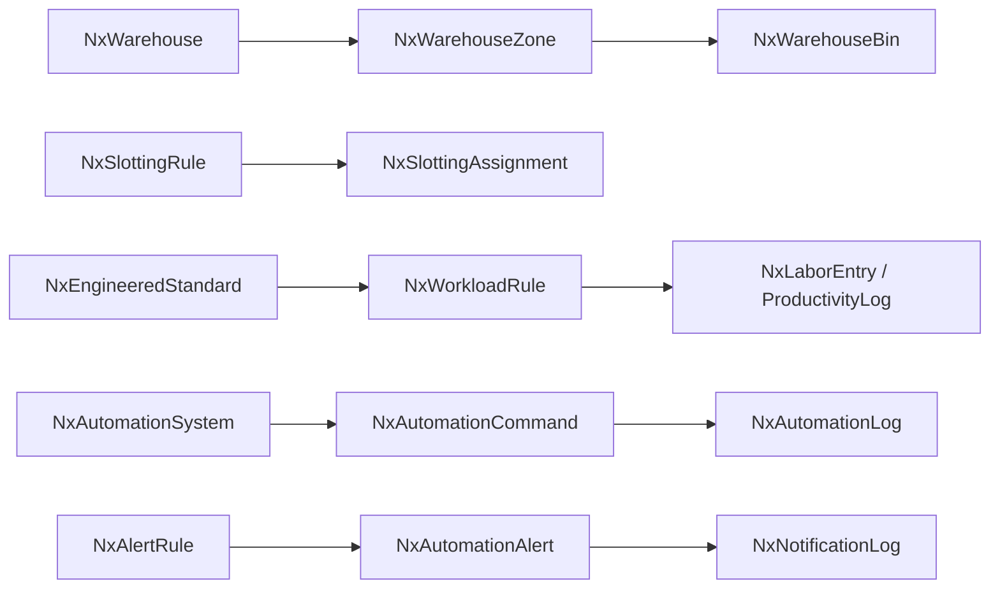
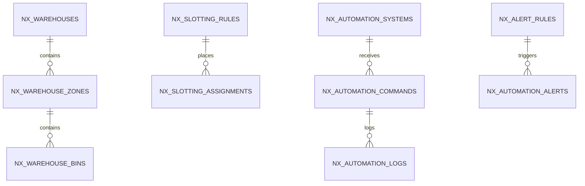

# Feature: Warehouse & Automation (Labor, Slotting, Equipment)

> Part of the Nexus OMS documentation set. See [index](../README.md).

## Overview
Warehouse master data (zones, bins, equipment, staff), engineered labor standards, slotting, workload rules, productivity logging and command/control of automation systems (conveyor, AGV, ASRS). Also covers alerts and notifications.

## Business process
1. Warehouse structure modeled (`NxWarehouse` → zones → bins; nodes; equipment).
2. `NxSlottingRule` recommends product placement; assignments + audits tracked.
3. `NxWorkloadRule`/`NxEngineeredStandard` forecast labor; shifts & staff scheduled.
4. Automation: `NxAutomationSystem` receives `NxAutomationCommand` (real `elapsed_ms`, explicit `simulated` flag); logs + alerts.
5. Productivity (`NxProductivityLog`, `NxLaborEntry`) feeds analytics.

## Use cases
- **UC-18/19** Yard/dock automation tie-in
- **UC-26** Command warehouse automation
- **UC-27** Alerting on thresholds
- Slotting & labor planning (analytics)
- Shift scheduling

## Data flow

## Key entities (ER subset)

Tables: `nx_warehouses` · `nx_warehouse_zones` · `nx_warehouse_bins` · `nx_warehouse_equipment` · `nx_warehouse_staff` · `nx_nodes` · `nx_slotting_rules` · `nx_slotting_assignments` · `nx_slotting_audits` · `nx_engineered_standards` · `nx_workload_rules` · `nx_shift_schedules` · `nx_labor_entries` · `nx_productivity_log` · `nx_automation_systems` · `nx_automation_commands` · `nx_automation_logs` · `nx_automation_alerts` · `nx_alert_rules`

## Who can access what
| Stage | Roles |
|---|---|
| Warehouse structure | WAREHOUSE_MANAGER, OPS_MANAGER (full) |
| Automation systems/commands | WAREHOUSE_MANAGER (full), OPS_MANAGER (edit) |
| Alert rules | OPS_MANAGER, WAREHOUSE_MANAGER (full) |
| Notifications | OPS_MANAGER, WAREHOUSE_MANAGER, STORE_MANAGER, BOPIS_OWNER, LOGISTICS_MANAGER, FINANCE, CUSTOMER_SUPPORT, VIEWER (view) |
| Productivity/analytics | WAREHOUSE_MANAGER, OPS_MANAGER (analytics) |

## Integrity notes
- Automation commands record **real elapsed time** and an explicit **`simulated`** flag — no fabricated execution metrics (Phase 2.5).
- Slotting changes are audited (`NxSlottingAudit`) for traceability.
