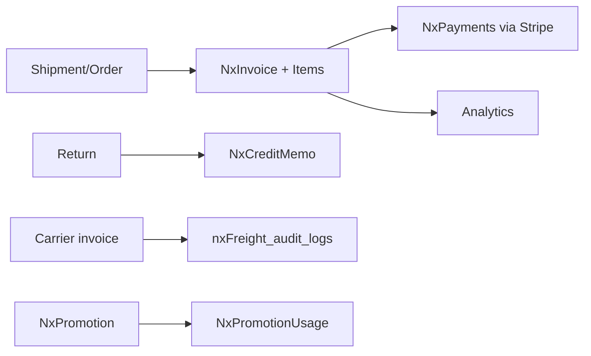
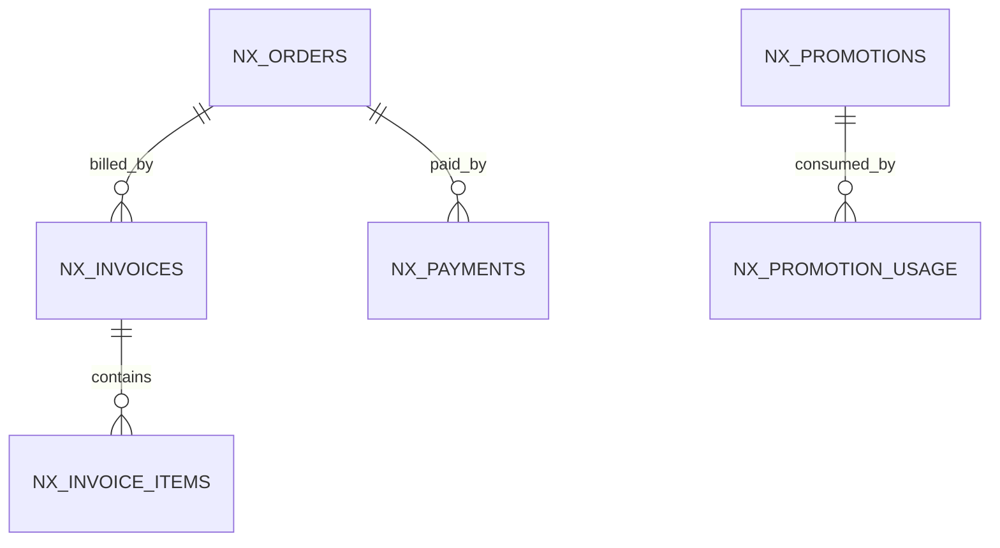

# Feature: Finance, Billing & Payments

> Part of the Nexus OMS documentation set. See [index](../README.md).

## Start here 💰

**Finance** is *the money story of every order*: the bill goes out (invoice), the money comes in (payment), and when things go wrong the money goes back (credit memo). Nexus keeps that story complete and honest — you can **edit** the books, but you can never just **delete** a record.

> 💳 **Real life example — the hoodie's money trip:**
> Mia's hoodie ships → Nexus creates an invoice for $49 → Stripe charges her card → payment recorded. She returns it? A **credit memo** appears. A carrier bills you $1,200 for a $980 route? Freight audit flags the **$220 overcharge**.

## Overview
Order-to-cash and procure-to-pay support: invoices, invoice items, payments (Stripe connector), credit memos, freight invoice auditing and financial analytics.

## Business process
1. Shipment/order completion → `NxInvoice` + `NxInvoiceItem`.
2. Customer payment via Stripe → `NxPayments`.
3. Disputes/returns → `NxCreditMemo`.
4. Carrier invoices → freight audit against rate card (see Shipping feature).
5. Analytics aggregate AR, COGS, freight cost, promotion ROI.

## Use cases
- **UC-20** Freight audit
- **UC-28** Invoice & payments
- **UC-29** Promotion usage / ROI
- Credit memos & reconciliation

## Data flow

## Key entities (ER subset)

Tables: `nx_invoices` · `nx_invoice_items` · `nx_payments` · `nx_credit_memos` · `nx_promotions` · `nx_promotion_usage` · `nxFreight_invoices` · `nxFreight_invoice_lines` · `nxFreight_audit_logs`

## Who can access what
| Stage | Roles |
|---|---|
| Invoices | FINANCE (create/edit), PROCUREMENT_MANAGER (PO-linked), OPS_MANAGER (view), CEO (view) |
| Payments | FINANCE (create/edit) |
| Credit memos | FINANCE (create/edit) |
| Freight audit | FINANCE (create/edit), LOGISTICS_MANAGER (view) |
| Financial analytics | FINANCE, CEO, VIEWER |
| Import invoices | FINANCE (create) |

## Integrity notes
- Invoice/payment edit is allowed but **delete is not** for FINANCE — a control lineage.
- Freight overcharge detection pairs carrier invoices with the rate card.

> 🧒 **Kid translation of the no-delete rule:** The finance team can fix a typo (edit) but can never make a record vanish (delete). Money stories have a "white-out forbidden" rule — the diary stays complete.
