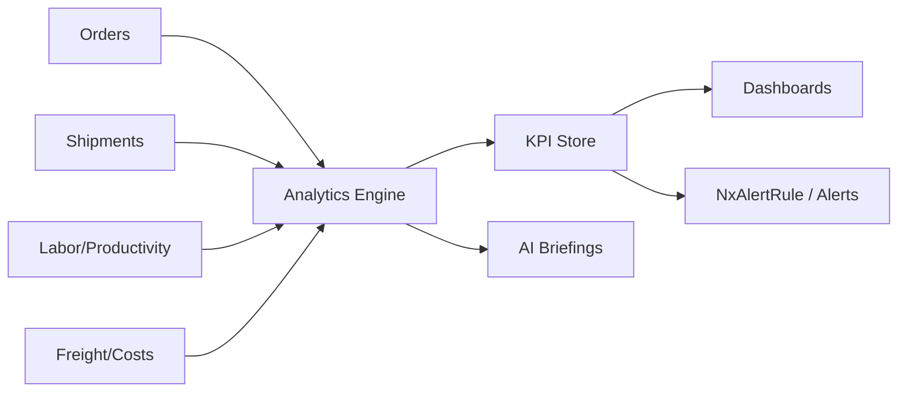
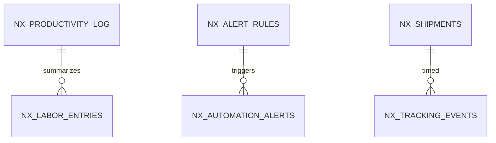

# Feature: Analytics & Reporting

> Part of the Nexus OMS documentation set. See [index](../README.md).

## Overview
Operational and strategic analytics across orders, inventory, fulfillment, labor, freight and finance, surfaced in dashboards with real-time (WebSocket) refresh and drill-downs.

## Business process
1. Source data streams from every module (orders, shipments, labor, costs).
2. KPI computation (OTIF, cost/order, productivity, ATP coverage, freight overcharge, promotion ROI).
3. Dashboards grouped by role (LaunchPad) with `analytics` permission.
4. AI briefings enrich with forecasts and anomaly explanations (see AI feature).

## Use cases
- **UC-27** Threshold alerting (operational)
- **UC-35** Demand forecast & briefing
- KPI dashboards per role
- Drill-down from metric to source record

## Data flow

## Key entities (ER subset)

Tables: `nx_productivity_log` · `nx_labor_entries` · `nx_rate_shopping_log` · `nx_fulfillment_capacity_log` · `nxFreight_audit_logs` · `nx_alert_rules` · `nx_automation_alerts`

## Who can access what
| Stage | Roles |
|---|---|
| Analytics view | CEO, OPS_MANAGER, WAREHOUSE_MANAGER, PROCUREMENT_MANAGER, FINANCE, LOGISTICS_MANAGER, VIEWER |
| Analytics full CRUD | OPS_MANAGER, WAREHOUSE_MANAGER, PROCUREMENT_MANAGER, LOGISTICS_MANAGER |
| Alert rules | OPS_MANAGER, WAREHOUSE_MANAGER (full) |
| AI briefings | CEO, OPS_MANAGER, LOGISTICS_MANAGER, FINANCE |

## Integrity notes
- Metrics are computed from real recorded events; simulated paths are explicitly flagged.
- Every alert/exception has a drill-down trail to the source records.
