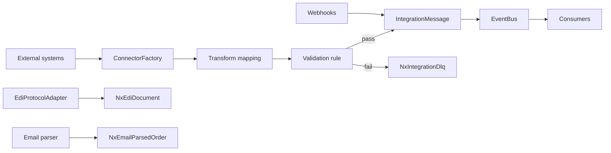
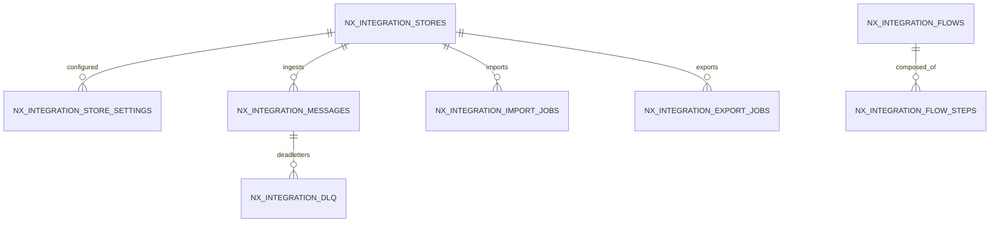

# Feature: Integrations Hub, EDI & iPaaS

> Part of the Nexus OMS documentation set. See [index](../README.md).

## Overview
The connectivity layer: store connectors, protocol adapters (REST/SOAP/GraphQL/EDI), webhooks, batch jobs, transform/validation flows, sync configs and a DLQ. Also email order ingestion and change-data-capture.

## Business process
1. Connector (Shopify, BigCommerce, Amazon, Magento, FedEx, Stripe, QuickBooks, Salesforce, SAP, Twilio, Okta, OpenAI, generic HTTP) pulls/pushes via `ConnectorFactory`.
2. Messages normalized → transformed (`IntegrationTransformMapping`) → validated (`IntegrationValidationRule`) → published on `EventBus`.
3. Failures land in `NxIntegrationDlq` — never silently lost.
4. EDI partners exchange 850/856/810 via `EdiProtocolAdapter`.
5. Email orders parsed (`NxEmailParsedOrder`); webhooks received; exports scheduled.

## Use cases
- **UC-01** Channel order sync
- **UC-30** Configure store connector
- **UC-31** EDI partner exchange
- **UC-32** Transform & validate messages
- **UC-37/38** Import/export jobs

## Data flow

## Key entities (ER subset)

Tables: `nx_integration_stores` · `nx_integration_store_settings` · `nx_integration_flows` · `nx_integration_flow_steps` · `nx_integration_messages` · `nx_integration_endpoints` · `nx_integration_import_jobs` · `nx_integration_export_jobs` · `nx_integration_sync_configs` · `nx_integration_dlq` · `nx_integration_cdc_events` · `nx_integration_audit_log` · `nx_integration_transform_mappings` · `nx_integration_validation_rules` · `nx_sync_logs` · `nx_shopify_webhooks` · `nx_bigcommerce_config` · `nx_bigcommerce_webhooks` · `nx_edi_partners` · `nx_edi_documents` · `nx_email_ingestion_config` · `nx_email_parsed_orders`

## Who can access what
| Stage | Roles |
|---|---|
| Integration hub / stores / flows | OPS_MANAGER (full), ADMIN (edit) |
| Webhooks & sync configs | OPS_MANAGER (full), ADMIN (edit) |
| EDI partners & documents | LOGISTICS_MANAGER (full), ADMIN (edit) |
| Import/export jobs | OPS_MANAGER (full); scoped create for WAREHOUSE/PROCUREMENT/FINANCE/LOGISTICS |
| Integration view | CEO (view) |

## Integrity notes
- Credentials live in the encrypted `CredentialVault`, never in config/DTOs.
- Idempotent sync keyed by `channel_order_id`; DLQ + retries prevent data loss.
- CDC events enable change capture for downstream analytics.
