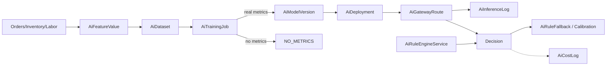
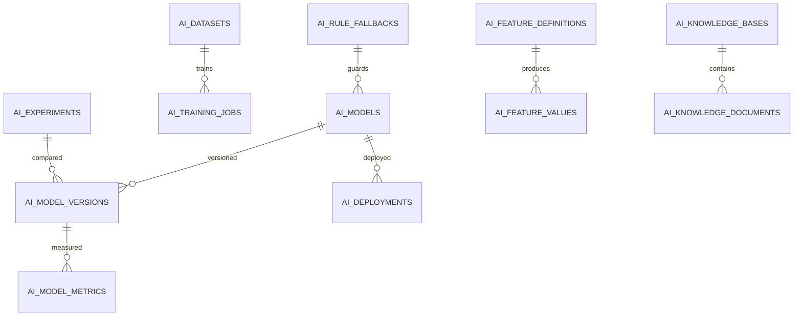

# Feature: AI Platform (Forecast, Rules, Training, Briefings)

> Part of the Nexus OMS documentation set. See [index](../README.md). Also see `docs/ai-business-process.md` and `docs/ENTERPRISE-AI-ARCHITECTURE.md` (existing deep dives).

## Start here 🤖

**AI** is the *smart assistant* that learns from your real data (forecasting, suggestions, briefings) — but Nexus has a strict honesty policy: **no made-up grades**. If the robot has no real test scores, we write `NO_METRICS` on its report card instead of inventing a grade. And when it can't decide, deterministic rules take over.

> 🎓 **Real life example — the robot's report card:**
> The robot studies 12 months of sales (`AiDataset`), then trains (`AiTrainingJob`). We grade it on data we held back. Real test scores → `REAL` metrics, and a model version is born. No held-back data → the card honestly says **`NO_METRICS`**. The robot only gets a diploma (`AiModelVersion`) when the card is real. If the robot gets confused later, **rules** (not guesses) take over automatically.

## Overview
A governed ML lifecycle (datasets → training → registry → deployment → inference → drift → fallback) **plus** a deterministic rule engine for decisions that must be auditable. Two dedicated compose services: `ai-ops` (operational intelligence) and `ai-intel` (strategic briefing).

## Business process
1. Signals (orders, inventory, labor, shipments) → feature values (`AiFeatureValue`).
2. `AiDataset` assembled → `AiTrainingJob` runs.
3. Job stores **real** metrics (`metricsSource=REAL`) or honestly marks **`NO_METRICS`** (null metrics) — a model version is created only with real metrics.
4. Registry (`AiModel`/`AiModelVersion`) + deployment (`AiDeployment`/`AiGatewayRoute`); inference logged.
5. `DriftDetectionService` monitors; `AiRuleFallback`/`AiCalibration` guard.
6. Rule engine evaluates formulas/thresholds **deterministically** from config + order input.

## Use cases
- **UC-33** Train model with real metrics
- **UC-34** Deterministic rule evaluation
- **UC-35** Demand forecast & briefing
- **UC-36** Experiments & drift monitoring

## Data flow

## Key entities (ER subset)

Tables: `ai_models` · `ai_model_versions` · `ai_model_metrics` · `ai_training_jobs` · `ai_datasets` · `ai_feature_definitions` · `ai_feature_values` · `ai_experiments` · `ai_deployments` · `ai_gateway_routes` · `ai_inference_logs` · `ai_prompts` · `ai_knowledge_bases` · `ai_knowledge_documents` · `ai_rule_fallbacks` · `ai_calibrations` · `ai_cost_logs` · `ai_compute_resources`

## Who can access what
| Stage | Roles |
|---|---|
| AI training/datasets/experiments | OPS_MANAGER (full), ADMIN |
| Model registry & deployments | ADMIN, OPS_MANAGER (edit) |
| Rules & fallbacks | OPS_MANAGER (full) |
| Briefings/forecasts (view) | CEO, OPS_MANAGER, LOGISTICS_MANAGER, FINANCE |
| AI health & cost logs | ADMIN |

## Honesty & integrity guarantees (Phase 2.5)
1. **No fabricated metrics.** Training metrics are `REAL` or absent (`NO_METRICS`) — `AiTrainingJob.metricsSource` (migration `V52`).
2. **No hidden randomness.** `AiRuleEngineService` is deterministic (config multiplier/base/feature → order input → documented defaults).
3. **No fake automation times.** Real `elapsed_ms`; simulated paths carry `"simulated":true`.
4. **Rules are the floor, ML is the ceiling** — drift falls back to deterministic rules automatically.

> 🧒 **Kid translation of "rules are the floor":** The robot is great, but the school still has fixed rules. If the robot gets confused, the rules — not a wild guess — make the call. Robot upstairs, rules downstairs.
