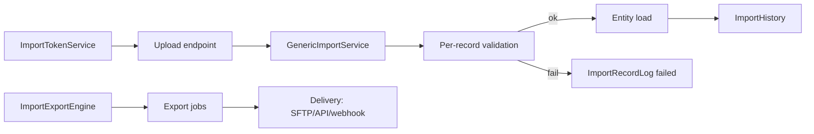
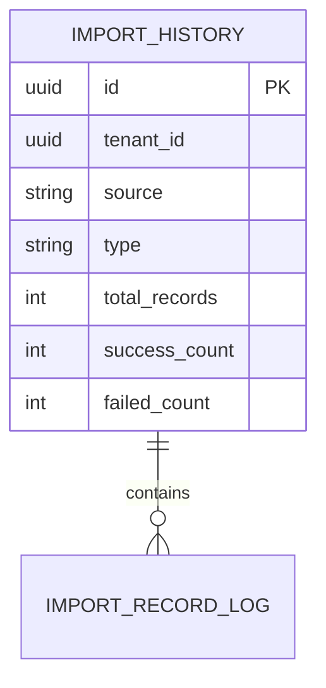

# Feature: Import / Export Engine & Signed Bulk Data

> Part of the Nexus OMS documentation set. See [index](../README.md).

## Overview
Bulk data movement into and out of the platform: CSV/Excel/JSON imports (orders, products, inventory, invoices, shipments, carriers) and scheduled exports — all gated by **signed import tokens** and fully audited per record.

## Business process
1. `ImportTokenService` issues a signed, expiring token (or ADMIN/OPS uses role-scoped permission).
2. `GenericImportService` validates headers/records → `ImportRecordLog` per row.
3. Loaded records become entities; failures are reported, not swallowed.
4. `ImportExportEngine` also drives exports / scheduled batch delivery (SFTP/API).

## Use cases
- **UC-03** Bulk import orders
- **UC-37** Signed bulk import
- **UC-38** Scheduled export / batch

## Data flow

## Key entities (ER subset)

Tables: `import_history` · `import_record_log` · `nx_integration_import_jobs` · `nx_integration_export_jobs`

## Who can access what
| Role | Access |
|---|---|
| OPS_MANAGER | Full import (create/edit/delete) |
| WAREHOUSE_MANAGER | Import inventory (view/create) |
| PROCUREMENT_MANAGER | Import products/POs (view/create) |
| FINANCE | Import invoices (view/create) |
| LOGISTICS_MANAGER | Import shipments/carriers (view/create) |
| STORE_MANAGER | View import history |
| CEO | View import history/results |
| VIEWER | View import results |
| ADMIN | Wildcard (everything) |

## Integrity notes
- Tokens are **signed + expiring** — bulk endpoints are not anonymous.
- Idempotency keys prevent double-loading the same file.
- Every record has a status row in `ImportRecordLog` for reconciliation.
