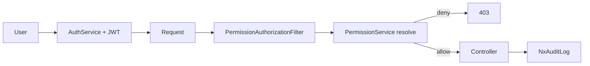
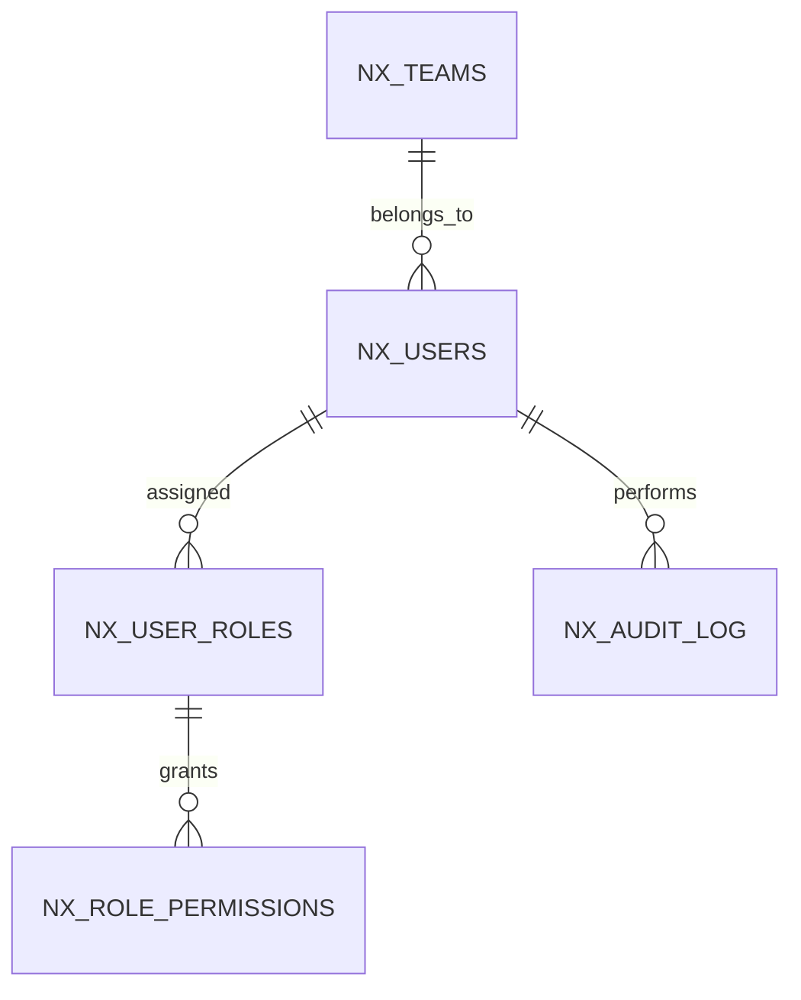

# Feature: Authentication, RBAC & Security

> Part of the Nexus OMS documentation set. See [index](../README.md). Authoritative access matrix: [`06-BUSINESS-FLOW-RBAC.md`](../06-BUSINESS-FLOW-RBAC.md).

## Start here 🔐

**Security** is the *locks and guards* of Nexus. The core rule is RBAC: **the badge you wear decides the doors you can open.** Everyone logs in with a badge (JWT), a guard checks the badge on every single request, and sensitive actions are written into the logbook.

> 🏫 **Real life analogy — the school:**
> The Principal (ADMIN) opens everything. A student (VIEWER) can only watch. A janitor (PICKER) can enter storage but not the money room. Nexus checks the badge at **every door, every time** — not just at the front gate.

## Overview
JWT-based authentication, 14-role RBAC enforced server-side via a path→resource→permission filter, tenant scoping on all data, signed import tokens, encrypted credential vault and **SSO/MFA shipped** (unit + integration tested).

## Business process
1. User logs in (`AuthService`) → JWT issued (jjwt). **SSO** (`POST /auth/sso/{provider}` + provider authorize/callback, Okta-style) and **MFA** (`POST /auth/mfa/verify`, TOTP-style) are live endpoints, unit + integration tested.
2. Every request passes `PermissionAuthorizationFilter` → `PermissionService` resolves path → resource → permission (73 mappings, first-prefix-match).
3. Role permissions resolved from `nx_role_permissions` (tenant override → global default; 60s cache).
4. Frontend `ProtectedRoute` + `PermissionGate` mirror the same model for UI.
5. Sensitive actions write `NxAuditLog`.

## Use cases
- **UC-39** User & role management (ADMIN)
- **UC-40** Audit trail
- **UC-41** View-only access (VIEWER)

## Data flow

## Key entities (ER subset)

Tables: `nx_users` · `nx_user_roles` · `nx_role_permissions` · `nx_teams` · `nx_company_settings` · `nx_audit_log`

## Who can access what
| Stage | Roles |
|---|---|
| Login / profile | All 14 roles |
| RBAC management | **ADMIN only** (`rbac` resource) |
| Settings / company config | ADMIN (full), CEO (view) |
| User management | ADMIN |
| Audit log | ADMIN, CEO, OPS_MANAGER (view) |
| View-only dashboards | VIEWER |

## The 14 roles (summary)
`ADMIN` (wildcard) · `CEO` (strategic view) · `OPS_MANAGER` (broad ops CRUD) · `WAREHOUSE_MANAGER` · `PICKER` · `PACKER` · `LOADER` · `STORE_MANAGER` · `BOPIS_OWNER` · `CUSTOMER_SUPPORT` · `PROCUREMENT_MANAGER` · `FINANCE` · `LOGISTICS_MANAGER` · `VIEWER` (read-only).

## Known security items (must address)
1. **Allow-by-default** when a path matches no `PATH_TO_RESOURCE` entry — invert to deny-by-default before GA.
2. **Gap G2:** 6 frontend pages pass a non-functional `permission` prop to `PermissionGate` (only `resource`/`action` honored) — server remains authoritative; fix UI gates.
3. Legacy unused `RoleProtectedRoute` guard should be removed.
4. Missing seed rows (e.g. `edi` beyond LOGISTICS/ADMIN) — confirm intent so "no row = denied" is respected.

## Integrity notes
- Credentials hashed (bcrypt-style via `PasswordEncoder`); JWT stateless; external keys in encrypted vault.
- 60s permission cache is tenant-scoped — role changes propagate within a minute.

> 🧒 **Kid translation of the "allow-by-default" warning:** Today, if a brand-new door has no name in the guard's book, the guard lets people through. That's fast for building, but before the big launch we flip it to: **no name in the book = nobody enters.**
