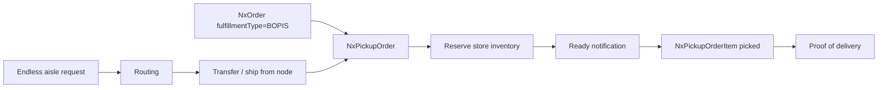
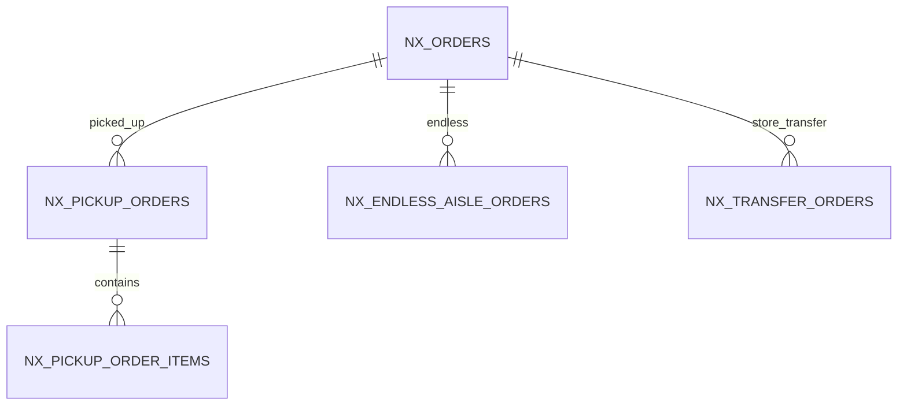

# Feature: Omnichannel — BOPIS, Pickup & Endless Aisle

> Part of the Nexus OMS documentation set. See [index](../README.md).

## Overview
Store-centric fulfillment: **BOPIS** (buy online, pick up in store), **pickup orders**, **endless aisle** (order out-of-stock-in-store items from warehouse/other nodes) and store-to-store operations. Makes the store a first-class fulfillment node, not a bolt-on.

## Business process
1. Order arrives tagged `fulfillmentType = BOPIS` (or manual pickup).
2. `NxPickupOrder` created; store inventory reserved; ready-for-pickup notification sent.
3. Store picks `NxPickupOrderItem`; customer collects; proof-of-delivery recorded.
4. Endless aisle: product out of stock at store → route/transfer from another node with honest promise.
5. Store transfers and cycle counts reconcile store inventory.

## Use cases
- **UC-07** ATP check for store promises
- **UC-09** Transfer stock between nodes/stores
- **UC-16** Pickup order (BOPIS)
- Endless-aisle order placement
- Store pickup notifications

## Data flow

## Key entities (ER subset)

Tables: `nx_pickup_orders` · `nx_pickup_order_items` · `nx_endless_aisle_orders` · `nx_transfer_orders` · `nx_transfer_order_items` · `nx_orders` · `nx_inventory`

## Who can access what
| Stage | Roles |
|---|---|
| BOPIS/pickup management | BOPIS_OWNER (full), STORE_MANAGER (full) |
| Store orders/inventory | STORE_MANAGER (full) |
| Endless aisle/transfer | STORE_MANAGER, WAREHOUSE_MANAGER (full) |
| Order edits (support) | CUSTOMER_SUPPORT (edit) |
| Notifications | STORE_MANAGER, BOPIS_OWNER (full) |

## Integrity notes
- Store promises are ATP-backed (`NxATPSnapshot`) — no over-promising shelf stock.
- Pickup confirmation closes the loop with a proof-of-delivery event.
